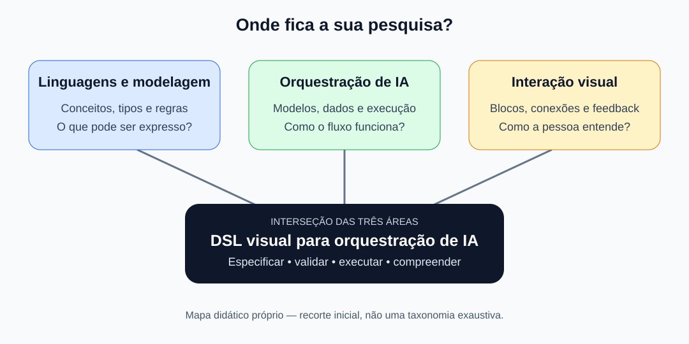
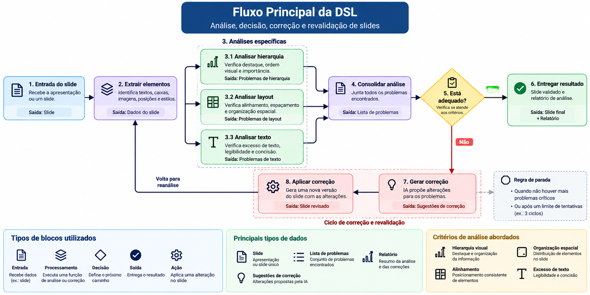

# DSL visual para orquestração de IA aplicada à análise e melhoria de slides

Este guia apresenta os fundamentos do projeto a partir de um caso concreto: receber um slide, analisar seus elementos, decidir se ele atende a critérios definidos e, quando necessário, corrigir e analisar novamente. Comece pelas seções 1 a 4 e percorra o fluxo da seção 7 antes de escolher ferramentas.

**A proposta em uma frase:** definir e prototipar uma DSL visual para representar e executar fluxos de análise e melhoria de slides com IA, utilizando blocos tipados, regras de conexão, decisões e um ciclo controlado de correção e revalidação.

O objeto principal de estudo é a linguagem e sua execução. A análise de slides é o domínio concreto usado para experimentar a proposta. Os blocos e regras descritos aqui são um desenho inicial, ainda sujeito a implementação e avaliação.

Atualizado em 01/10/2026 com base no texto e na imagem fornecidos pelo estudante. [Fontes conceituais, materiais recebidos e limites](refs/FONTES.md).

## 1. O que é DSL e qual é o domínio do projeto?

**DSL** significa *Domain-Specific Language*: linguagem específica de domínio. Ela oferece conceitos voltados a uma classe delimitada de problemas. SQL, por exemplo, expressa consultas a dados; Python é uma linguagem de propósito geral. [Fowler — definição de DSL](https://www.martinfowler.com/bliki/DomainSpecificLanguage.html).

Neste projeto, o domínio proposto é a **análise e melhoria de slides com apoio de IA**. O vocabulário da linguagem pode incluir `Entrada do Slide`, `Extrair Elementos`, `Analisar Layout`, `Analisar Texto`, `Gerar Correção` e `Entregar Resultado`.

Um exemplo textual inventado ajuda a entender a ideia antes de desenhar os blocos:

```text
fluxo revisar_slide:
    receber slide
    extrair elementos do slide
    analisar hierarquia, layout e texto
    consolidar problemas
    se atender aos critérios:
        entregar slide e relatório
    senão:
        tentar corrigir e analisar novamente, respeitando o limite
```

Para esse exemplo virar uma linguagem executável, precisamos definir o significado das operações, os dados aceitos, as combinações válidas e a regra de repetição. A redução de esforço ou de erros seria algo a avaliar, não um resultado já demonstrado.

## 2. O que torna essa DSL visual?

O usuário construiria o fluxo com blocos e conexões. Cada bloco representa uma operação ou uma decisão; suas portas indicam as entradas e saídas disponíveis.

```text
[Entrada do Slide] ──Slide──> [Extrair Elementos] ──DadosDoSlide──> [Analisar Layout]
```

**Caixas e setas precisam ter significado definido.** No exemplo proposto, `Analisar Layout` recebe `DadosDoSlide` e produz uma `ListaDeProblemas`. Uma saída do tipo `Texto` não pode ser conectada diretamente a uma entrada que exige `Slide`.

| Aspecto da linguagem | Pergunta para nosso projeto |
| --- | --- |
| Vocabulário | Quais blocos de análise, decisão e correção existem? |
| Sintaxe concreta | Como blocos, portas e conexões aparecem na tela? |
| Sintaxe abstrata | Como o fluxo é representado independentemente do desenho? |
| Semântica | O que cada bloco faz e quando pode executar? |
| Restrições | Quais tipos podem ser conectados e quais entradas são obrigatórias? |

Essa organização é uma aplicação didática da discussão sobre linguagem, modelo e ferramentas de [Fowler — Language Workbenches](https://martinfowler.com/articles/languageWorkbench.html). DSLs podem ter notação textual ou gráfica; isso é uma dimensão diferente da distinção entre DSL interna e externa. [Fowler — DSL](https://www.martinfowler.com/bliki/DomainSpecificLanguage.html).

## 3. Linguagem, editor e motor de execução

**A linguagem define, o editor permite montar e o motor executa.** Para organizar o protótipo, podemos separar as responsabilidades assim:

| Parte | Responsabilidade proposta |
| --- | --- |
| Linguagem | Define blocos, tipos, conexões permitidas e regras de execução. |
| Editor visual | Permite posicionar, conectar e configurar os blocos. |
| Modelo do fluxo | Guarda nós, portas, conexões e parâmetros. |
| Validador | Verifica tipos, entradas obrigatórias e regras dos ciclos antes da execução. |
| Motor de execução | Executa os blocos, transporta dados, escolhe caminhos e controla repetições. |

Essa é uma arquitetura inicial, não uma implementação já existente. Um ambiente pode reunir várias dessas funções. O conceito de ferramentas para criar e utilizar linguagens aparece em [Fowler — Using Language Workbenches](https://www.informit.com/articles/article.aspx?p=1592379&seqNum=6).

No exemplo, o editor permite ligar `Extrair Elementos` a `Analisar Layout`; o validador confere a compatibilidade das portas; o motor só executa a análise quando os dados necessários estiverem disponíveis.

## 4. O que significa orquestrar IA neste projeto?

Aqui, **orquestração** significa coordenar operações: quais executam primeiro, quais dados recebem, quais dependências precisam esperar, qual caminho uma decisão seleciona e quando o processo termina.

```text
Slide → Extração → Análises → Decisão → Correção → Nova análise
```

A IA pode participar das análises e da geração de sugestões. Extração, contagem de tentativas e aplicação de alterações podem ser operações convencionais. A escolha de quais blocos usarão IA permanece aberta.

As perguntas de execução são concretas:

- As análises de hierarquia, layout e texto podem executar de forma independente?
- A consolidação espera os três resultados da mesma versão do slide?
- Quais problemas impedem a aprovação?
- Como a versão revisada chega à próxima análise?
- O que acontece se uma operação falhar ou o limite de correções for atingido?

Na distinção adotada pela [Anthropic](https://www.anthropic.com/engineering/building-effective-agents), workflows seguem caminhos previamente definidos, enquanto agentes dão mais controle ao modelo sobre a condução do processo. A proposta inicial é um workflow com decisões e repetição controlada; ela não exige agentes autônomos complexos.

## 5. Recorte, escopo e contribuição esperada

**Pergunta inicial de pesquisa:** como uma DSL visual pode representar e orquestrar fluxos de análise e melhoria de slides utilizando inteligência artificial?

O trabalho pretende definir um metamodelo, blocos com portas tipadas, regras de conexão, representação visual e execução de fluxos. O protótipo pode começar com sequência, acrescentar decisão e depois incorporar um ciclo de correção e revalidação.

Os critérios candidatos para os slides são hierarquia visual, alinhamento, organização espacial, excesso de texto e legibilidade. Ainda será necessário transformá-los em critérios verificáveis, com exemplos, medidas ou rubricas apoiadas em referências específicas. Não há aqui um padrão de qualidade visual já validado.

Ficam fora do recorte inicial: treinar um novo LLM, criar um editor completo de apresentações, cobrir todo o design gráfico, corrigir qualquer slide automaticamente ou realizar um estudo de usabilidade de grande escala.

A contribuição esperada é a definição e demonstração da linguagem para esse domínio. A qualidade das análises e correções também precisa ser avaliada, mas não substitui a avaliação das regras e da execução da DSL.

**Duas organizações visuais diferentes:** o layout dos blocos no editor afeta a leitura do fluxo; o layout dos elementos no slide é um objeto da análise. O projeto deve distinguir essas duas questões ao escolher suas tarefas e avaliações.



*Mapa didático do contexto mais amplo, preservado do guia original. O recorte atual usa a análise de slides dentro dessa interseção; o mapa não representa o fluxo do protótipo.*

## 6. Elementos básicos da linguagem

As definições abaixo orientam o desenho inicial, com apoio conceitual em [Fowler](https://martinfowler.com/articles/languageWorkbench.html). Os exemplos de slides são propostas deste projeto.

| Termo | Em palavras simples | Exemplo proposto |
| --- | --- | --- |
| Nó | Um bloco do fluxo. | `Analisar Layout`. |
| Porta | Ponto de entrada ou saída de um bloco. | `dados: DadosDoSlide`. |
| Aresta ou conexão | Ligação entre portas. | Leva os dados extraídos até a análise. |
| Tipo | Categoria de informação aceita ou produzida. | `Slide`, `DadosDoSlide`, `ListaDeProblemas`. |
| Fluxo de dados | Caminho percorrido pelas informações. | Slide → dados extraídos → problemas → sugestões. |
| Fluxo de controle | Ordem e condições de execução. | Corrigir se houver problemas impeditivos. |
| Estado | Informações mantidas durante uma execução. | Slide original, versão atual, histórico e contador. |
| DAG | Grafo dirigido sem ciclos. | Entrada → análise → resultado, sem retorno. |
| Ciclo | Caminho que retorna a uma etapa anterior. | Correção → extração → análise → decisão. |
| Metamodelo | Estrutura dos elementos e relações admitidos pela DSL. | Fluxos contêm nós; nós têm portas; conexões ligam portas. |

### Tipos de dados propostos

| Tipo | Conteúdo esperado |
| --- | --- |
| `Slide` | Um slide e sua versão editável no formato escolhido para o protótipo. |
| `DadosDoSlide` | Textos, imagens, posições, dimensões e estilos extraídos de uma versão. |
| `ListaDeProblemas` | Problemas com categoria, localização, justificativa e gravidade. |
| `SugestoesDeCorrecao` | Alterações propostas, associadas aos problemas identificados. |
| `Relatorio` | Análises, alterações realizadas, pendências e motivo do encerramento. |

O exemplo detalhado trabalha com **um slide por execução**. Receber uma apresentação inteira exigiria definir também como percorrer os slides e reunir seus resultados. O formato do arquivo e a forma de edição ainda precisam ser escolhidos.

### Metamodelo e regras iniciais

Um `Fluxo` contém `Nós` e `Conexões`. Cada `Nó` possui `Portas` de entrada ou saída; cada porta declara um `Tipo`. Uma conexão liga uma saída a uma entrada compatível. Nós de decisão possuem caminhos condicionais, e ciclos devem declarar uma regra de parada.

No protótipo, o validador deverá rejeitar conexões incompatíveis e entradas obrigatórias ausentes. Já o motor deverá garantir que apenas o caminho selecionado seja executado e que o ciclo respeite seu limite. Salvar essas informações em JSON é uma possibilidade de representação; o formato sozinho não define o comportamento.

### Estado e componentes de IA

O estado proposto guarda o slide original, a versão atual, os dados extraídos, os problemas, as sugestões, o histórico e o número de correções aplicadas. Cada nova versão deve ter seus próprios resultados de análise.

**LLM** é um modelo de linguagem de grande porte; **prompt** é a entrada com instruções e contexto; **inferência** é o uso do modelo treinado para produzir uma saída. Neste projeto, uma chamada poderia receber problemas e dados do slide para propor uma correção. O acesso a imagens dependerá do modelo e da representação escolhidos.

RAG, embeddings e recuperação de documentos podem ser estudados como assuntos complementares, mas não são requisitos deste fluxo inicial. Os materiais de RAG preservados abaixo ilustram outro domínio de orquestração.

## 7. Fluxo principal: analisar, decidir, corrigir e revalidar



*Imagem fornecida pelo estudante, preservada como referência da proposta. O desenho resume etapas; a tabela e as regras abaixo detalham dados adicionais e o encerramento por limite de tentativas.*

### Passo a passo e contratos dos blocos

| Bloco | Recebe | Produz ou encaminha |
| --- | --- | --- |
| 1. Entrada do Slide | Slide no formato aceito. | `Slide` original e versão inicial. |
| 2. Extrair Elementos | Versão atual do `Slide`. | `DadosDoSlide`: textos, caixas, imagens, posições e estilos. |
| 3.1 Analisar Hierarquia | `DadosDoSlide` e critérios configurados. | `ListaDeProblemas` sobre destaque e ordem visual. |
| 3.2 Analisar Layout | `DadosDoSlide` e critérios configurados. | `ListaDeProblemas` sobre alinhamento, espaçamento e distribuição. |
| 3.3 Analisar Texto | `DadosDoSlide` e critérios configurados. | `ListaDeProblemas` sobre excesso de texto, legibilidade e concisão. |
| 4. Consolidar Análise | As três listas referentes à mesma versão. | Uma `ListaDeProblemas` consolidada. |
| 5. Está adequado? | Lista consolidada e critérios de aceitação. | Caminho de aprovação ou caminho de correção, sujeito ao limite. |
| 6. Entregar Resultado | Versão atual, histórico, problemas e motivo de encerramento. | `Slide` final e `Relatorio`. |
| 7. Gerar Correção | Problemas e contexto da versão atual. | `SugestoesDeCorrecao` produzidas com apoio de IA. |
| 8. Aplicar Correção | Versão atual do `Slide` e sugestões aplicáveis. | Nova versão do `Slide`; incremento do contador. |

A extração disponibiliza os mesmos dados às três análises. Elas podem ser executadas sequencialmente na primeira implementação; execução paralela é uma possibilidade, não uma exigência. A consolidação deve esperar todos os resultados esperados daquela rodada.

As setas da figura simplificam a passagem de dados. `Aplicar Correção` precisa receber também o slide, não apenas sugestões. Da mesma forma, a entrega precisa acessar a versão atual e o histórico. Esses valores devem estar disponíveis por portas explícitas ou pelo estado definido pela linguagem; o desenho detalhado do protótipo deverá registrar essa escolha.

### Decisão e regra de parada

Como exemplo inicial, podemos definir “adequado” como ausência de problemas classificados como críticos. Essa classificação precisa ser especificada e justificada; a ausência de problemas detectados não garante que o slide seja perfeito.

O fluxo proposto funciona assim:

1. Extrair e analisar a versão atual, começando pelo slide original.
2. Se atender aos critérios, entregar a versão atual e o relatório com aprovação nesses critérios.
3. Se não atender e já houver três correções aplicadas, entregar a última versão e um relatório com as pendências e o motivo “limite de tentativas”.
4. Caso contrário, gerar e aplicar uma correção, incrementar o contador e voltar à extração.

**Três correções permitem até quatro rodadas de análise:** uma inicial e uma após cada alteração. O número três é um parâmetro ilustrativo da proposta, não um valor validado por experimento. O limite encerra a execução, mas não aprova o slide.

Se a extração, a chamada de IA ou a aplicação falhar, o comportamento inicial proposto é encerrar com um relatório de erro e preservar a última versão disponível. Tentativas de recuperação de falhas exigiriam uma política própria.

### Um exemplo para percorrer no papel

Considere um slide fictício com título pouco destacado, caixas desalinhadas e um parágrafo longo. As três análises produzem problemas que a consolidação reúne. A decisão identifica pendências impeditivas; a IA sugere destacar o título, alinhar caixas e condensar o texto. O bloco de aplicação cria uma nova versão, que passa novamente pela extração e pelas análises.

Se a nova análise ainda apontar um problema crítico, o fluxo tenta outra correção enquanto houver tentativas disponíveis. Se o texto proposto alterar o sentido do original, isso também deverá ser detectado na avaliação das correções; uma conexão bem tipada não garante conteúdo correto.

**Exercício de tipos:** tente ligar `ListaDeProblemas` à entrada `Slide` de `Extrair Elementos`. A ligação deve ser rejeitada. Depois explique por que uma ligação válida ainda pode produzir uma análise equivocada.

### Desenvolvimento incremental

| Etapa | Fluxo a demonstrar | O que verificar |
| --- | --- | --- |
| 1. Sequência | Entrada → extração → análise → resultado. | Blocos, portas, tipos e execução básica. |
| 2. Decisão | Análise → decisão → resultados distintos. | Condição explícita e execução apenas do caminho escolhido. |
| 3. Correção e revalidação | Análise → decisão → correção → nova análise. | Estado, versões, contador e encerramento com ou sem pendências. |

O editor inicial pode oferecer categorias de entrada, processamento, decisão, ação e saída, como na imagem. `Gerar Relatório` e `Limite de Tentativas` podem virar blocos próprios ou responsabilidades configuradas no fluxo. A escolha deve aparecer na especificação da linguagem.

Para avaliar a proposta, planeje exemplos de fluxos válidos e inválidos, confira a ordem de execução e simule aprovação inicial, aprovação após correção e esgotamento do limite. A avaliação da qualidade visual dos slides precisará de critérios e referências próprios.

## 8. Vídeos: por onde começar

Os materiais abaixo foram selecionados por pertinência e autoria. Consultei páginas e descrições, mas não assisti integralmente aos vídeos. Não confirmei legendas ou duração. Os recursos selecionados são em inglês; se disponível, ative legendas e tradução automática. Como apoio complementar sobre RAG, há uma [explicação em português da IBM](https://www.ibm.com/br-pt/think/topics/retrieval-augmented-generation).

| Ordem | Material | Formato e nível | O que observar | Exercício depois |
| --- | --- | --- | --- | --- |
| 1 | [Domain-Specific Languages with Martin Fowler — OnSoftware](https://www.youtube.com/watch?v=ZfdAwV0HlEU) | Vídeo direto; introdução conceitual. | A ideia de uma linguagem voltada a um problema. | Explique DSL em duas frases e dê um exemplo. |
| 2 | [Introduction — Node-RED Essentials](https://www.youtube.com/watch?v=ksGeUD26Mw0) | Vídeo direto; entrada para a série. | A proposta de programar com fluxos. | Desenhe três blocos e diga o que passa entre eles. |
| 3 | [Node-RED — canal oficial](https://www.youtube.com/channel/UCQaB8NXBEPod7Ab8PPCLLAA) | Canal/série, não vídeo único; básico. | Procure a série **Essentials**, indicada pela [documentação oficial](https://nodered.org/docs/tutorials/). Observe editor, nós e mensagens. | Distinga a configuração de um nó do dado recebido durante a execução. |
| 4 | [What is Retrieval-Augmented Generation (RAG)? — IBM Technology](https://www.youtube.com/watch?v=T-D1OfcDW1M) | Vídeo direto; introdução a IA aplicada. | A relação entre recuperação e geração. | Explique por que a busca ocorre antes da resposta. |
| 5 | [Langflow — canal oficial](https://www.youtube.com/@Langflow) | Canal, não vídeo único; aplicação prática. | Escolha uma introdução a fluxos ou chatbots. Identifique entrada, modelo, prompt e saída. | Refaça o desenho e anote o tipo de dado em cada conexão. |

Os dois primeiros vídeos foram localizados pela busca, mas sua abertura direta falhou nesta consulta. Para Node-RED, a [página oficial de tutoriais](https://nodered.org/docs/tutorials/) oferece o caminho alternativo para o canal. Não há timestamps inventados neste roteiro.

O canal do Langflow está vinculado pelo [site oficial](https://www.langflow.org/blog/langflow-micro-tutorials-multiple-sources/). Tutoriais antigos podem mostrar telas diferentes; compare com a [documentação atual](https://docs.langflow.org/).

**Como assistir:** pause sempre que aparecer uma seta nova. Escreva: “sai ___ do bloco ___ e entra em ___”. Se não conseguir preencher, volte ao trecho antes de continuar.

## 9. Uma trilha curta de estudo

Os tempos abaixo são sugestões de dedicação, não a duração dos vídeos.

| Sessão | Dedicação sugerida | Atividade | Entrega pessoal |
| --- | --- | --- | --- |
| 1 — entender a linguagem | 30–45 min | Seções 1–3 e vídeo de Fowler. | Definição própria de DSL e dois exemplos. |
| 2 — entender os fluxos | 45–60 min | Node-RED Essentials e glossário de nós/conexões. | Fluxo no papel com entradas e saídas. |
| 3 — conectar com IA | 45–60 min | Percorrer o fluxo de slides da seção 7. | Explicação dos blocos, da decisão e do limite de correções. |
| 4 — observar uma ferramenta | 45–60 min | Demonstração no canal do Langflow. | Comparação entre o fluxo visto e seu desenho. |
| 5 — formular uma dúvida de pesquisa | 30–45 min | Revisar o mapa e listar dificuldades. | Um problema específico que uma DSL poderia ajudar a resolver. |

Você não precisa começar por instalação, compiladores, cálculo de redes neurais ou sistemas multiagentes. Primeiro consiga explicar o comportamento de um fluxo pequeno.

## 10. Palavras-chave para a pesquisa posterior

Comece com expressões existentes nas fontes deste guia: `domain-specific language`, `graphical DSL`, `language workbench`, `workflow`, `LLM` e `workflow orchestration`. Os links conceituais estão nas seções anteriores.

Consultas candidatas — combinações propostas para testar nas bases, ainda sem contagem de resultados:

```text
"domain-specific language" AND "artificial intelligence"
"graphical DSL" AND workflow
"visual programming" AND "large language models"
"workflow orchestration" AND "machine learning"
"domain-specific modeling" AND "AI"
```

Para explorar o recorte de slides, teste também combinações com `slide analysis`, `presentation design` e `visual hierarchy`. São consultas candidatas, ainda não validadas. As duas últimas consultas acima também ajudam a explorar termos vizinhos. Registre base, consulta exata, filtros, data e total encontrado. **Ainda não foi verificado o requisito de pelo menos 20 resultados por palavra-chave em uma base de literatura revisada por pares.**

## 11. Como destravar um termo, figura ou tabela

Use este procedimento de estudo:

1. Copie o termo e registre página, seção ou número da figura.
2. Leia a legenda e procure a definição no próprio artigo.
3. Para figuras, identifique entradas, saídas, setas e legenda visual; simule um exemplo pequeno.
4. Para tabelas, identifique linhas, colunas, unidade, métrica e se maior ou menor é melhor.
5. Se continuar confuso, consulte a referência citada pelos autores ou documentação primária. Use vídeos como apoio à compreensão.
6. Registre a dúvida, a fonte que ajudou e sua explicação com palavras próprias. Mantenha como pendente o que não conseguiu confirmar.

Modelo de anotação:

```text
Artigo/material:
Página e figura/tabela:
Termo ou seta que não entendi:
Minha hipótese inicial:
Fonte consultada:
Explicação após a consulta:
Exemplo que consigo percorrer:
O que ainda falta entender:
```

## 12. Quando avançar para os artigos e veículos

- [ ] Consigo definir DSL e domínio sem consultar o guia.
- [ ] Sei distinguir linguagem, editor e motor de execução.
- [ ] Consigo explicar cada seta do exemplo.
- [ ] Sei diferenciar um erro de ligação de um erro na resposta do modelo.
- [ ] Consigo distinguir aprovação pelos critérios de encerramento por limite de tentativas.
- [ ] Consigo dizer o que minha pesquisa pretende estudar e o que fica fora.
- [ ] Tenho uma dúvida concreta, como: “tipos nas conexões ajudam usuários a detectar fluxos inválidos?”.

Depois dessa base, retome a entrega maior: consolidar o diagrama; levantar os principais veículos com fonte, período e contexto da classificação Qualis, incluindo BRACIS; e selecionar três artigos desses veículos para estudar profundamente suas figuras e tabelas. A lista de veículos e a análise dos artigos **ainda não foram realizadas nesta etapa introdutória**.

O roteiro de continuidade está no [ROADMAP.md](../../ROADMAP.md). A leitura aprofundada do PDF de Oakes et al. está no [guia detalhado](../02-workflows-ml/GUIA-DETALHADO.md).
