# Entendendo o artigo sobre workflows de machine learning específicos de domínio

**A mensagem principal:** uma pessoa que conhece um domínio precisa transformar sua intenção em um processo computacional executável. O artigo organiza essa passagem em três camadas — **problema, workflow e implementação** — e investiga que tipos de transformação e ferramenta podem ajudar. Para sua pesquisa, ele oferece uma maneira de explicar **onde uma DSL visual entra e qual dificuldade ela pretende resolver**.

Este guia acompanha **o PDF de 50 páginas que você enviou**, não o manuscrito anterior de 49 páginas. Explica as oito seções, as doze figuras e as sete tabelas, com exemplos e uma leitura crítica. Os exemplos sobre a sua DSL são propostas didáticas; não são experimentos do artigo.

**Referência:** Oakes, Bentley James; Famelis, Michalis; Sahraoui, Houari. *Building Domain-Specific Machine Learning Workflows: A Conceptual Framework for the State of the Practice*. ACM Transactions on Software Engineering and Methodology, 33(4), artigo 91, abril de 2024, 50 páginas. [DOI](https://doi.org/10.1145/3638243) · [Abrir o PDF local](refs/3638243.pdf) · [Fontes e verificação](refs/FONTES.md).

**Como encontrar as páginas:** “p. 11” significa a 11ª página do PDF, identificada como `91:11` no cabeçalho. `91` é o número do artigo. As imagens abaixo foram extraídas do próprio arquivo e conservam as legendas; clique nelas para ampliar, conforme o visualizador.

## Como usar este guia

Se estiver começando, leia primeiro as partes 1–4 e a explicação da Figura 4. Na segunda sessão, percorra as demais figuras. Na terceira, estude as tabelas e a leitura crítica. Não precisa dominar neurociência ou química para compreender a contribuição de engenharia de software.

- [1. O que os autores estão tentando resolver](#1-o-que-os-autores-estão-tentando-resolver)
- [2. Vocabulário para não se perder](#2-vocabulário-para-não-se-perder)
- [3. As três camadas e as quatro regiões](#3-as-três-camadas-e-as-quatro-regiões)
- [4. Os seis desafios](#4-os-seis-desafios)
- [5. O artigo seção por seção](#5-o-artigo-seção-por-seção)
- [6. As doze figuras explicadas](#6-as-doze-figuras-explicadas)
- [7. As sete tabelas explicadas](#7-as-sete-tabelas-explicadas)
- [8. Como interpretar as métricas](#8-como-interpretar-as-métricas)
- [9. O que o artigo sustenta e seus limites](#9-o-que-o-artigo-sustenta-e-seus-limites)
- [10. Aplicação à sua DSL visual](#10-aplicação-à-sua-dsl-visual)
- [11. Dúvidas destravadas e materiais](#11-dúvidas-destravadas-e-materiais)
- [12. Exercícios e roteiro para explicar o artigo](#12-exercícios-e-roteiro-para-explicar-o-artigo)

## 1. O que os autores estão tentando resolver

Imagine uma pesquisadora que conhece muito de rochas, mas pouco de programação. Ela quer descobrir a origem de uma amostra a partir da composição química. Seu problema envolve conceitos como composição, origem sedimentar e transformação geológica. Uma biblioteca de ML oferece conceitos como matriz de atributos, classificador, treinamento e hiperparâmetros.

**Existe uma distância entre a linguagem do problema e a linguagem da solução computacional.** O artigo pergunta como apoiar a pessoa nessa passagem, usando workflows. O exemplo das rochas vem do estudo ES2; a personagem é apenas uma forma didática de apresentá-lo. [Artigo, pp. 2–3 e 26–27.](refs/3638243.pdf#page=2)

Os autores propõem um **framework conceitual**. Aqui, *framework* não é uma biblioteca que você instala. É uma estrutura de conceitos para classificar problemas, soluções, implementações e transformações entre eles.

Sua contribuição tem quatro partes principais:

1. Organizar o percurso em três camadas e duas dimensões.
2. Identificar seis desafios enfrentados pelo especialista.
3. Examinar ferramentas e seis estudos da literatura usando essa organização.
4. Discutir oportunidades de pesquisa, um cenário ilustrativo de ferramenta e possíveis métricas de avaliação.

O artigo **não apresenta uma nova DSL visual completa, implementada e validada por um experimento controlado**. Seu valor para você está principalmente na fundamentação, na análise do problema e no desenho de uma agenda de pesquisa. [Artigo, pp. 3 e 43.](refs/3638243.pdf#page=43)

## 2. Vocabulário para não se perder

Estas definições simplificam os conceitos das seções 2–5; as fontes complementares aparecem quando necessário.

| Termo | Explicação | Exemplo para guardar |
| --- | --- | --- |
| **Domínio** | Área de conhecimento ou atividade cujos conceitos importam para resolver o problema. | Geologia, ensino, biologia. |
| **Domain expert** | Pessoa que conhece esse domínio. Isso não implica conhecer ML ou programação. | Geóloga que interpreta uma composição mineral. |
| **DS / domain-specific** | Específico de um domínio. No artigo, o domínio de aplicação é distinguido do domínio de ML. | Componente que trata um formato de imagem de neurociência. |
| **ML / machine learning** | Aprendizado de máquina: construção de modelos a partir de dados ou experiência. | Aprender um classificador usando exemplos rotulados. |
| **Artefato** | Algo produzido ou manipulado no processo. | Enunciado do problema, grafo de workflow ou código. |
| **Abstração** | Escolha do que mostrar e do que esconder. | Mostrar `CorrigirMovimento` sem expor todas as operações numéricas. |
| **Workflow** | Organização das etapas computacionais e suas dependências. | Carregar → transformar → treinar → avaliar. |
| **Pipeline** | Neste artigo, é usado de maneira equivalente ao workflow computacional. | Sequência de processamento de dados. |
| **Componente / nó** | Unidade de operação na composição. | Ler dados, executar um classificador ou visualizar resultados. |
| **Aresta / conexão** | Relação de dependência de dados ou de controle. | O avaliador depende das previsões e dos rótulos corretos. |
| **Porta** | Entrada ou saída específica de um componente. | Entrada `dados`, saída `modelo`. |
| **DAG** | Grafo dirigido sem ciclos: não existe caminho que retorne ao mesmo nó. | Preparar → treinar → testar, sem retorno. |
| **Sub-workflow** | Workflow usado como parte de outro. | Bloco de preparação que internamente executa várias etapas. |
| **Transformação** | Alteração de um artefato ou produção de outro a partir dele. Pode ser manual ou automática. | Transformar uma pergunta de domínio em uma tarefa de classificação. |
| **Blended** | Misto: combina conceitos de domínio e de ML. Não significa necessariamente misturar dois modelos. | Fluxo com tratamento químico e treinamento de classificador. |
| **DSL** | Linguagem específica de domínio. | Notação que oferece conceitos adequados ao problema. |
| **API / biblioteca** | Interface ou conjunto de funcionalidades reutilizáveis no código. | Função de um pacote para ler um formato científico. |
| **Runtime / motor** | Software que executa as operações descritas pelo workflow. | Interpretar o grafo e chamar as operações dos nós. |
| **Deploy / implantação** | Preparar e disponibilizar a solução no ambiente em que rodará. | Executar em um servidor com as dependências corretas. |
| **Proveniência** | Registro de origem e histórico de dados e operações. | Qual arquivo, versão de ferramenta e parâmetro produziu uma saída. |

### Três distinções que evitam muitos erros

**Treinar versus usar um modelo.** Treinar ajusta o modelo a partir de dados. Inferência usa um modelo treinado para gerar uma previsão ou saída. Um fluxo pode incluir treinamento, inferência ou ambos. “Orquestrar IA” não obriga sua proposta a treinar modelos. [Artigo, seção 2.2, pp. 4–5.](refs/3638243.pdf#page=4)

**Modelo de ML versus modelo de software.** No primeiro caso, “modelo” pode ser um classificador aprendido. Na engenharia dirigida por modelos, pode ser uma representação estruturada de um sistema, como o grafo que descreve um workflow. Eles não são o mesmo objeto. [Artigo, seções 2.2, 3 e 5.2.](refs/3638243.pdf#page=22)

**Visual versus explícito.** Um workflow textual pode ser explícito se suas etapas e dependências estiverem representadas em uma linguagem ou sistema de workflows. Uma aplicação com botões pode conter um workflow implícito se a sequência estiver apenas codificada na implementação. Portanto, a existência de uma interface gráfica não resolve essa classificação. [Artigo, seções 6 e 7.1.1.](refs/3638243.pdf#page=23)

### Vocabulário técnico das aplicações

| Termo | Significado suficiente para acompanhar o artigo |
| --- | --- |
| Feature / atributo | Informação usada pelo modelo, original ou calculada a partir dos dados. |
| Feature engineering | Construir ou transformar atributos usando conhecimento sobre dados e problema. |
| Classificação | Prever uma categoria, como classe A ou B. |
| Regressão | Prever um valor numérico contínuo. |
| Clustering / agrupamento | Formar grupos de exemplos semelhantes sem depender de classes fornecidas como alvo. |
| CNN | Rede neural convolucional; aparece nos exemplos de imagens e sinais. |
| PCA | Técnica de transformação/redução de dimensionalidade; aqui basta reconhecer que é uma etapa de preparação de dados. |
| Hiperparâmetro | Configuração do processo de aprendizagem, distinta dos parâmetros aprendidos. |
| MRI / MR | Ressonância magnética, fonte de imagens em alguns estudos. |
| fMRI | Ressonância magnética funcional; o processamento envolve questões específicas de aquisição e sinal. |
| Voxel | Elemento volumétrico, análogo tridimensional de um pixel. |
| LC-MS | Cromatografia líquida acoplada à espectrometria de massas. |
| MSI | Imagem por espectrometria de massas: combina localização espacial com informação de espectro. |
| ROI | Região de interesse selecionada para análise. |
| Protolith / protólito | Rocha original da qual uma rocha metamórfica se formou. |
| Ontologia | Representação explícita de conceitos e relações que pode apoiar inferências. |
| AutoML | Automação de partes da construção/seleção de soluções de ML. |

Os termos de aplicação são contextualizados nos estudos ES1–ES6, não apresentados aqui como orientação clínica. Para ontologias, consulte a explicação primária de [OWL no W3C](https://www.w3.org/OWL/); para agrupamento, a [documentação de scikit-learn](https://scikit-learn.org/stable/modules/clustering.html).

## 3. As três camadas e as quatro regiões

### 3.1 As camadas respondem a perguntas diferentes

| Camada | Pergunta | Artefato | Exemplo didático sobre documentos acadêmicos |
| --- | --- | --- | --- |
| **Problem space** | O que queremos resolver? | Descrição do problema. | Ajudar um estudante a encontrar o prazo de uma entrega no regulamento. |
| **Solution workflow space** | Quais operações e dependências resolvem isso? | Workflow. | Receber pergunta → recuperar trechos → gerar resposta → apresentar fontes. |
| **Implementation space** | Como isso roda de fato? | Código e execução por ferramentas. | Chamadas às bibliotecas de busca e modelo, transporte de dados e tratamento de falhas. |

Esse exemplo adapta a organização dos autores para aproximá-la do seu tema. Ele não consta no artigo. A separação de camadas está na seção 3 e na Figura 4. [Artigo, pp. 11–13.](refs/3638243.pdf#page=11)

**Mudar o problema não é a mesma coisa que mudar o workflow.** “Quero também indicar em qual artigo do regulamento está o prazo” altera requisitos da tarefa. Adicionar uma etapa para recuperar a localização da informação altera a solução. Implementar essa etapa usando uma biblioteca específica altera a implementação.

### 3.2 As duas dimensões

Em cada camada, os autores perguntam:

1. **Quanto o artefato expressa conceitos específicos do domínio?**
2. **Quanto conhecimento/complexidade de ML ele envolve?**

“Complexidade de ML” aqui se relaciona à quantidade e dificuldade dos conceitos que precisam ser compreendidos/configurados. Não é sinônimo de tempo computacional, número de parâmetros do modelo ou tamanho do grafo. [Artigo, seção 3.1.](refs/3638243.pdf#page=12)

Com isso, surgem quatro regiões aproximadas:

| Região | Conhecimento de domínio | Conhecimento de ML | Exemplo didático de operação |
| --- | --- | --- | --- |
| **General** | Pouco explícito. | Pouco explícito. | Salvar um CSV. |
| **DS** | Evidente. | Pouco exigido na interface relevante. | Interpretar a estrutura de um regulamento acadêmico. |
| **ML** | Pouco evidente. | Evidente. | Comparar classificadores por validação cruzada. |
| **Blended** | Evidente. | Evidente. | Comparar técnicas de extração de prazos usando categorias próprias do regulamento. |

**Não são caixas com fronteiras matemáticas.** Os autores reconhecem limites imprecisos e dimensões que se sobrepõem. ML também é um domínio, mas o artigo reserva “DS” para o domínio de aplicação externo a ML. [Artigo, p. 13.](refs/3638243.pdf#page=13)

### 3.3 Por que um workflow “DS” pode usar ML?

Porque a classificação depende também do nível de abstração exposto. Um bloco chamado `ClassificarTecidoMSI` pode encapsular ML e apresentar ao especialista uma operação do domínio. Isso difere de obrigá-lo a montar manualmente cada detalhe de um algoritmo genérico. Esse ponto aparece de modo especialmente claro no estudo Galaxy. [Artigo, pp. 32 e 34–35.](refs/3638243.pdf#page=32)

**Aumento de especificidade também não garante melhora.** Um componente mais especializado pode favorecer compreensão naquele domínio e reduzir reutilização em outros. A região “blended” não é um troféu: a escolha depende do usuário, do problema e do quanto de ML ele precisa controlar.

### 3.4 Transformações dentro de uma camada e entre camadas

- **Intra-layer:** altera o artefato dentro de sua camada. Acrescentar conhecimento de domínio ao workflow é um exemplo.
- **Inter-layer:** produz um artefato em outra camada. Traduzir um workflow para execução é um exemplo.

Uma seta no framework pode representar o trabalho humano de construir uma solução; não é necessariamente uma chamada automática. E uma seta entre camadas não representa dados circulando entre nós em tempo de execução. Essas duas leituras de seta são diferentes. [Artigo, seções 3–5.](refs/3638243.pdf#page=12)

## 4. Os seis desafios

O artigo os apresenta na introdução, relaciona-os ao framework na seção 3.2 e retoma-os na discussão. [Artigo, pp. 2–3, 13 e 35–38.](refs/3638243.pdf#page=13)

| Desafio | Tradução prática | Exemplo didático no seu tema |
| --- | --- | --- |
| **1. Mapear problema DS para ML** | Descobrir como formular a intenção usando técnicas de ML. | Decidir se encontrar prazos exige busca, extração ou classificação. |
| **2. Obter um workflow** | Encontrar, construir ou gerar uma sequência adequada. | Selecionar blocos de consulta ao regulamento e apresentação de fontes. |
| **3. Experimentar ML no workflow** | Trocar/configurar operações de ML e observar efeitos. | Comparar modelos ou formas de recuperação. |
| **4. Adicionar conhecimento de domínio** | Incorporar conceitos, regras, dados ou componentes especializados. | Representar disciplinas, semestres, requisitos e validade do regulamento. |
| **5. Produzir implementação apropriada** | Fazer o fluxo executar no ambiente necessário. | Interpretar os blocos num motor e registrar seus resultados. |
| **6. Recuperar workflow de implementação** | Extrair etapas e dependências de código existente. | Transformar um notebook de protótipo em um fluxo editável. |

Sua pesquisa pode escolher **um** desses desafios como foco. Tentar solucionar os seis de uma vez produziria um projeto muito mais amplo do que apenas criar um primeiro protótipo de DSL visual.

## 5. O artigo seção por seção

| Parte do artigo | Páginas | O que entender antes de seguir |
| --- | --- | --- |
| Resumo e identificação | 1 | O alvo é apoiar especialistas de domínio usando workflows com ML. |
| **1. Introduction** | 2–3 | Problema, seis desafios, contribuição e público de engenharia de software. |
| **2. Background** | 4–10, com ilustrações também na 11 | Domínio, ML, workflows, execução e ferramentas textuais/gráficas. |
| **3. Overview of Our Framework** | 11–14 | Três camadas, duas dimensões, quatro regiões por camada. |
| **4. Layers and Intra-Layer Transformations** | 14–19 | Como cada artefato incorpora mais conceitos de domínio ou ML. |
| **5. Inter-Layer Transformations** | 19–22 | Como obter workflows, executá-los e recuperar fluxos a partir de código. |
| **6. Example Studies** | 23–32 | Como os autores aplicam sua classificação a seis exemplos da literatura. |
| **7. Discussion** | 33–43 | Benefícios, limites, suporte das ferramentas, comunidade, cenário futuro e métricas. |
| **8. Conclusion** | 43 | Retomada da proposta e avaliação futura de uma ferramenta alinhada ao framework. |
| Referências | 44–50 | Fontes dos casos, ferramentas e fundamentos; não constituem sete páginas adicionais de resultados. |

### 5.1 O que retirar da fundamentação

A seção 2 evita restringir o tema a “arrastar blocos”. Ela inclui linguagens e padrões de descrição, motores, gerenciamento de dependências, reprodutibilidade e conhecimento de domínio. Uma descrição textual pode oferecer boa composição e reutilização; uma interface gráfica pode facilitar algumas tarefas e continuar exigindo conhecimento técnico. [Artigo, pp. 4–10.](refs/3638243.pdf#page=4)

Os nomes de ferramentas ilustram escolhas arquiteturais no contexto do artigo:

| Grupo | Exemplos discutidos | O que observar |
| --- | --- | --- |
| Bibliotecas em linguagens hospedeiras | Luigi, SciLuigi, SciPipe, nipype | Como declarar tarefas e dependências usando uma linguagem conhecida. |
| Descrição textual própria ou estruturada | Nextflow, Compi, CWL | Como separar o programa do motor que o executa. |
| Edição gráfica | Node-RED, Orange, KNIME, Galaxy | Como configurar, conectar e inspecionar componentes. |
| Conhecimento semântico | WINGS | Como conceitos e relações ajudam a escolher componentes e parâmetros. |

Essas categorias podem se sobrepor. O texto do artigo é um retrato de sua época; não é documentação atualizada de todas as funcionalidades dessas ferramentas.

### 5.2 Como o artigo passa do problema ao fluxo

A seção 5.1 apresenta alternativas: bibliotecas de componentes, exemplos do domínio, repositórios, recomendações e composição automática. Elas podem ser combinadas. A pessoa pode encontrar um fluxo pronto, trocar um componente e receber uma sugestão para corrigir uma incompatibilidade. [Artigo, pp. 20–21.](refs/3638243.pdf#page=20)

Há três abordagens destacadas para mapear uma intenção de domínio para conceitos de ML: conhecimento de especialistas, raciocínio com ontologias e abordagens orientadas a dados. Os autores mencionam LLMs como possibilidade de assistência, não como uma solução universal já validada no artigo. [Artigo, p. 16.](refs/3638243.pdf#page=16)

### 5.3 Como o fluxo vira execução

A seção 5.2 distingue geração de código e execução direta pelo sistema de workflows. Gerar Python é uma opção; interpretar o modelo do workflow também é. Executar pode exigir bibliotecas de domínio, recursos computacionais e ambientes especializados. [Artigo, p. 22.](refs/3638243.pdf#page=22)

O caminho inverso é uma oportunidade: ler código existente e recuperar sua estrutura como workflow. Isso não se reduz a transformar cada linha num retângulo; seria necessário recuperar dependências e unidades de operação significativas.

### 5.4 O papel dos estudos e da discussão

A seção 6 **ilustra** a organização proposta com casos existentes. A seção 7 discute o que essa leitura sugere para ferramentas futuras. A seleção de casos é explicitamente ad hoc e não sistemática. Portanto, não transforme a frequência dos seis casos em uma estimativa sobre toda a comunidade. [Artigo, p. 23.](refs/3638243.pdf#page=23)

Na seção 7.4, os autores imaginam uma ferramenta orientando um pesquisador em classificação de imagens de lesões de pele: formular o problema, sugerir técnicas, montar o workflow, refiná-lo e executar. Trata-se de uma **história ilustrativa de uso futuro**, não de resultados de um estudo com usuários realizado nessa seção. [Artigo, pp. 39–41.](refs/3638243.pdf#page=39)

## 6. As doze figuras explicadas

As imagens nesta seção são recortes do [PDF fornecido](refs/3638243.pdf), com suas legendas e atribuições originais. As explicações são paráfrases e comentários didáticos.

### Figura 1 — Node-RED: começar pela ideia de fluxo (p. 9)

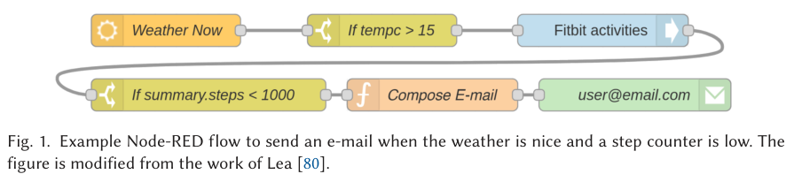

Leia o caminho: `Weather Now` obtém o clima; a condição verifica `tempc > 15`; `Fitbit activities` consulta atividades; outra condição verifica `summarysteps < 1000`; o fluxo compõe e envia um e-mail.

A linha que contorna o desenho apenas conecta o final da primeira linha ao começo da segunda. **Ela não representa, por si, um laço de repetição.** Para haver ciclo, seria necessário um caminho dirigido de retorno a um nó anterior.

As condições controlam se o dado continua pelo caminho. A figura exemplifica dependências e coordenação de serviços. Nenhum bloco exige necessariamente aprendizado de máquina.

**Relação com sua DSL:** você provavelmente precisará de operações comuns de controle e dados, além de operações de IA. **Pergunta de leitura:** se a temperatura não satisfizer a condição, quais etapas deixam de ocorrer nesse caminho?

### Figura 2 — Orange: dados, configuração e resultado (p. 10)

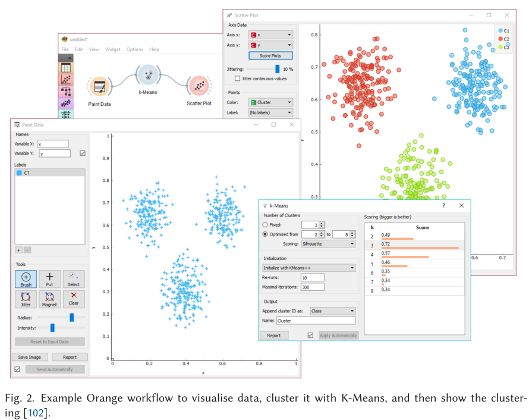

O pequeno grafo conecta `Paint Data`, `k-Means` e `Scatter Plot`. As janelas maiores mostram dados, configurações do agrupamento e a visualização resultante. O usuário pode alterar parâmetros do nó, sem escrever a implementação inteira do algoritmo.

No gráfico, as coordenadas são atributos dos pontos; as cores indicam grupos. As cores não demonstram classes corretas conhecidas de antemão. O painel de configuração mostra alternativas para o número de grupos e uma pontuação de *silhouette*.

**Silhouette** compara a proximidade de um ponto ao seu grupo com a proximidade a outro grupo. É uma avaliação da estrutura do agrupamento; não é a proporção de acertos de uma classificação supervisionada. [Documentação de scikit-learn.](https://scikit-learn.org/stable/modules/clustering.html#silhouette-coefficient)

**Relação com sua DSL:** há pelo menos três vistas distintas: estrutura do fluxo, configuração de uma etapa e saída dessa etapa. **Pergunta:** em qual delas você mudaria o número de grupos, e em qual observaria a consequência?

### Figura 3 — Galaxy: componentes especializados e múltiplas portas (p. 11)

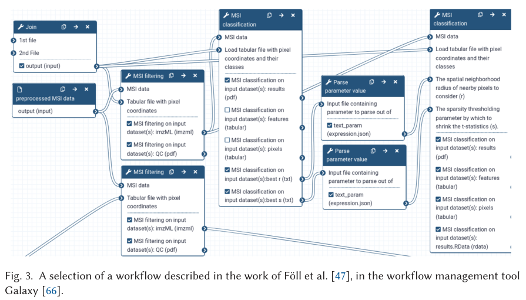

É um **trecho** de um workflow, não o processo científico inteiro. Observe entradas de dados MSI, junção de arquivos, filtragem, classificação e extração de parâmetros. Os componentes apresentam várias entradas e saídas.

As conexões levam dados e valores entre portas específicas. Um mesmo resultado pode alimentar diferentes etapas, e uma etapa pode exigir várias entradas. `Parse parameter value` extrai um parâmetro de um resultado para alimentar outro processamento.

Para ler, escolha uma porta de entrada do componente à direita e siga seu fio para trás. Depois pergunte o que aquele valor representa. Isso é mais seguro do que tentar compreender todas as linhas simultaneamente.

O nome `MSI classification` reúne conhecimento da aplicação e uma operação computacional. **Relação com sua DSL:** tipos e nomes de portas podem expressar mais significado do que um bloco genérico chamado `IA`. A interface precisa tornar essa composição compreensível.

### Figura 4 — O coração do artigo (p. 11)

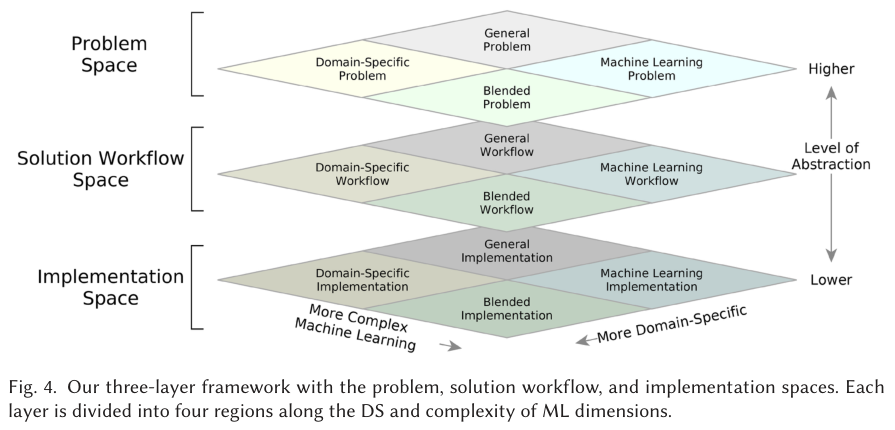

Comece pelos rótulos da esquerda: problema, workflow e implementação. A indicação da direita marca o nível de abstração: mais alto no problema, mais baixo na implementação. Isso não significa que uma camada seja “melhor” do que a outra.

Cada plano tem quatro regiões: geral, específica de domínio, de ML e mista. As setas inclinadas na base indicam as dimensões de conhecimento de domínio e complexidade de ML. O desenho em perspectiva não deve ser lido como um gráfico com valores numéricos mensuráveis.

**Exemplo didático:** uma professora pede “encontrar prazos no regulamento”. Ao formular “recuperar trechos e extrair datas”, ela passa a explicitar operações de IA e dados no problema. Ao escolher e conectar componentes, produz o workflow. Ao executar esse workflow num motor, chega à implementação.

Existe outra trajetória possível: escrever código diretamente. Nesse caso, a estrutura do workflow pode existir apenas implicitamente. Os autores defendem tornar a camada intermediária explícita para apoiar compreensão, reuso e transformações.

**Duas coisas para não confundir:** mover-se dentro de um plano significa mudar a combinação de conceitos; passar entre planos significa mudar o tipo de artefato. E esses movimentos podem resultar de trabalho humano, não só de automação.

### Figura 5 — Traduzir o domínio para uma representação de ML (p. 14)

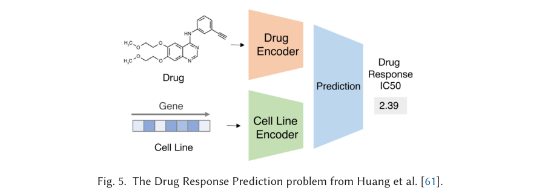

A figura recebe duas fontes de informação: a representação de um fármaco e a de uma linhagem celular. Cada uma passa por um *encoder*, isto é, uma transformação para uma representação que o sistema consegue combinar. Depois, a etapa de predição produz uma resposta numérica rotulada `IC50`.

Para entender a contribuição do artigo, basta perceber a ponte: estruturas do domínio → representações computacionais → previsão sobre uma propriedade de interesse. O número `2.39` é uma saída ilustrada, não a acurácia do sistema. A unidade e a transformação desse alvo não são suficientemente detalhadas nesta figura para interpretá-lo isoladamente.

É um exemplo de problema **blended**, pois combina entidades do domínio com decisões de representação e predição de ML. **Pergunta:** quais partes exigem conhecimento do domínio e quais exigem conhecimento de ML?

### Figura 6 — Transformações do problema (p. 15)

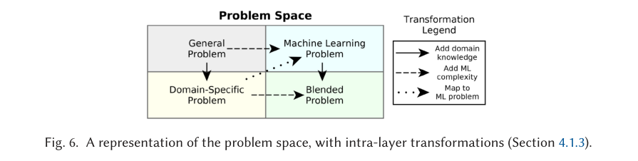

Há quatro regiões. Na legenda, a seta contínua acrescenta conhecimento de domínio; a tracejada acrescenta complexidade de ML; a pontilhada indica mapeamento para um problema de ML.

**Exemplo didático:** “separar documentos em grupos” é uma formulação geral. “Separar normas acadêmicas por assunto” explicita domínio. “Comparar classificadores de texto” explicita ML. “Comparar classificadores para distinguir regras de matrícula e avaliação” combina ambos.

A seta diagonal DS → ML merece atenção: o problema pode ser reformulado em termos de ML, com parte do significado do domínio deixando de aparecer explicitamente. Isso pode facilitar o tratamento computacional, mas exige verificar se a nova tarefa ainda atende à intenção original.

**Não há dados sendo processados nessa figura.** As setas alteram a formulação do problema.

### Figura 7 — Transformações do workflow (p. 17)

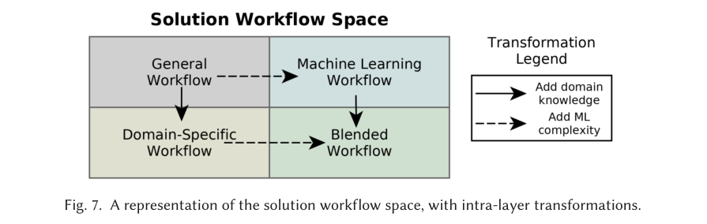

O raciocínio é semelhante ao da Figura 6, mas agora o artefato é um fluxo. Adicionar um componente específico do domínio move o workflow na dimensão DS. Incorporar operações ou configurações mais complexas de ML move-o na outra dimensão.

**Exemplo didático:** trocar `LerTexto` por `LerRegulamentoPorArtigos` acrescenta estrutura do domínio. Adicionar comparação de estratégias de recuperação acrescenta experimentação em ML/IA. Juntas, as mudanças tornam o fluxo misto.

Isso não obriga a adicionar mais blocos: substituir um bloco ou encapsular um sub-workflow também altera o nível de abstração. O ganho precisa ser avaliado no contexto do usuário.

### Figura 8 — Transformações da implementação (p. 19)

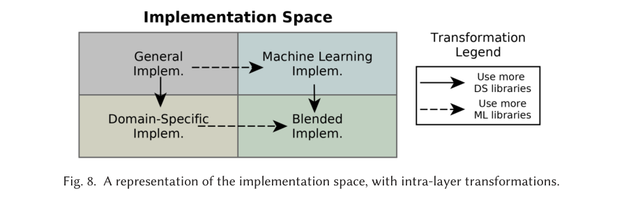

Aqui, as setas indicam maior uso de bibliotecas DS ou ML. Um programa genérico pode passar a chamar uma biblioteca especializada; outro pode combinar essa biblioteca com uma de aprendizado de máquina.

O desenho não diz que todo programa precisa passar pelas quatro regiões. É uma organização de possibilidades. Um mesmo sistema pode esconder várias camadas de bibliotecas sob uma interface simples.

**Relação com sua DSL:** o usuário pode configurar conceitos do domínio, enquanto a implementação chama bibliotecas genéricas. A interface e o código subjacente não precisam expor o mesmo nível de detalhe.

### Figura 9 — Recomendar o próximo componente (p. 21)

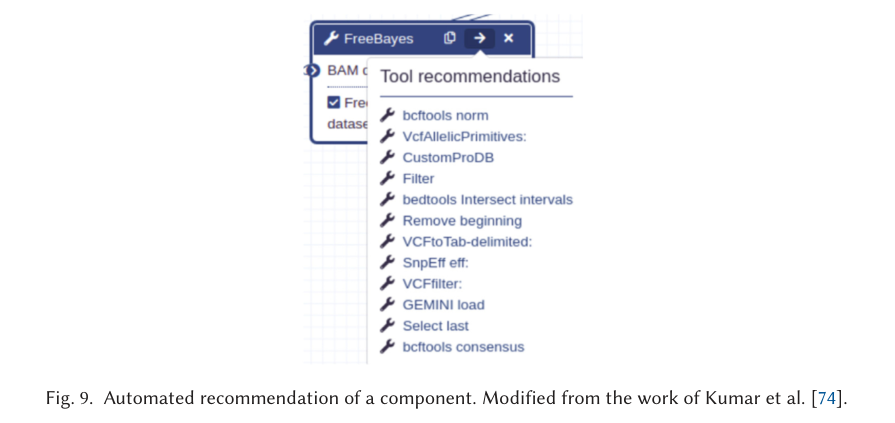

A captura mostra uma lista de operações sugeridas a partir do contexto de um componente. O usuário recebe candidatos para continuar a composição. Essa assistência reduz a busca manual, mas a captura não mede, sozinha, a relevância das sugestões.

**Recomendação não é execução automática:** apresentar opções é diferente de escolher e executar uma delas. Também é diferente de sintetizar o workflow inteiro.

**Relação com sua DSL:** tipos de portas, objetivo da tarefa e componentes existentes podem orientar sugestões. Isso é uma possível decisão de projeto; o artigo não especifica uma solução pronta para seu domínio.

### Figura 10 — Passar de problema a workflow e implementação (p. 22)

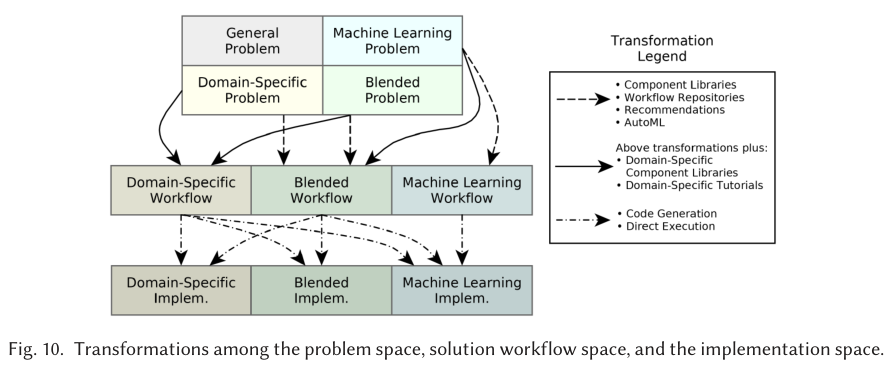

Na parte superior estão as formulações do problema. No meio estão os workflows. Embaixo estão as implementações. As setas entre topo e meio correspondem a técnicas que ajudam a obter o fluxo; as do meio para baixo correspondem à geração de código ou execução direta.

**Siga a legenda gráfica desta versão:** setas tracejadas ligam obtenção do fluxo a bibliotecas, repositórios, recomendações e AutoML; setas contínuas acrescentam bibliotecas e tutoriais específicos de domínio; as de traço e ponto representam geração de código/execução direta.

**Inconsistência editorial:** a prosa da seção 5.1.1, na página 21, descreve contínuo e tracejado em ordem diferente da legenda visual. A distinção conceitual permanece: apoio geral à construção versus apoio adicional específico de domínio. Não tente resolver essa divergência decorando o estilo da linha.

**Exemplo didático:** a descrição de uma tarefa conduz à escolha de um template; o usuário adapta o fluxo; um motor interpreta seus nós. São duas transformações entre camadas, com técnicas diferentes. A figura não mostra um único algoritmo universal que faz tudo.

### Figura 11 — Duas redes neurais dentro de um problema químico (p. 25)

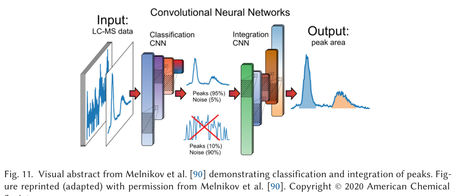

O processamento recebe dados LC-MS. Uma CNN distingue regiões com picos de regiões dominadas por ruído. Uma segunda CNN ajuda a determinar limites para integrar picos. A saída visualiza a área correspondente.

“Integrar” aqui se refere à integração do sinal, como área de um pico; não significa integração entre sistemas. Os percentuais ilustrados para pico/ruído não devem ser tratados como acurácia global do artigo de Oakes et al.

Há uma sequência clara de operações mesmo que a ferramenta não exponha um modelo de workflow independente. Isso prepara a discussão do workflow **implícito** na Tabela 2.

**Pergunta:** onde termina a responsabilidade da primeira CNN e começa a da segunda? Uma falha em distinguir ruído pode afetar as etapas seguintes, mesmo que elas executem normalmente.

### Figura 12 — Comparar algoritmos sem colocá-los em série (p. 31)

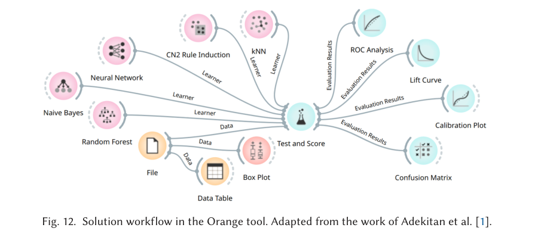

Observe três conjuntos:

1. **Dados:** `File` alimenta a avaliação e as visualizações `Data Table` e `Box Plot`.
2. **Algoritmos candidatos:** Naive Bayes, Neural Network, Random Forest, CN2 Rule Induction e kNN enviam entradas `Learner` a `Test and Score`.
3. **Análise dos resultados:** ROC, Lift Curve, Calibration Plot e Confusion Matrix recebem resultados de avaliação.

Os algoritmos são alternativas comparadas pelo mesmo componente. **A saída de um classificador não está alimentando o próximo em uma cadeia.** As conexões `Learner` levam algoritmos/configurações; as conexões `Data` levam dados. A documentação do [Test and Score](https://orange3.readthedocs.io/projects/orange-visual-programming/en/latest/widgets/evaluate/testandscore.html) confirma essa distinção.

Os quatro componentes à direita mostram aspectos diferentes da avaliação: discriminação por limiares, ganho de seleção, calibração de probabilidades e contagens de erros/acertos. A imagem não contém valores suficientes para escolher um vencedor.

O artigo relata acurácias de 55%–63% no estudo original e sugere investigar mais conhecimento de domínio. Isso não demonstra, por si, que acrescentar atributos resolveria o problema. **Relação com sua DSL:** conexões visualmente parecidas podem transportar tipos e significados muito diferentes.

## 7. As sete tabelas explicadas

Antes de ler os valores, identifique o tipo de tabela. Neste artigo, há **classificações de casos**, **decomposições de workflows**, **contagem de componentes** e **avaliação qualitativa de suporte**. Não são sete benchmarks de desempenho.

### Tabela 1 — O mapa dos seis estudos (p. 23)

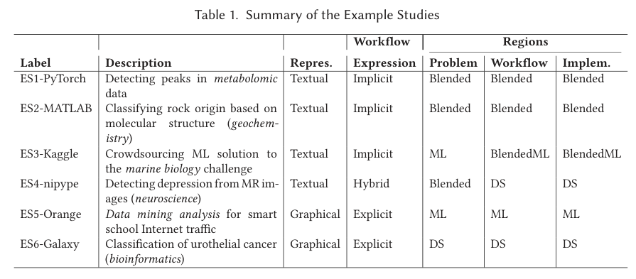

As colunas significam:

- **Label:** identificador do estudo, ES1 a ES6.
- **Description:** problema que ele aborda.
- **Repres.:** representação textual ou gráfica.
- **Expression:** workflow implícito, híbrido ou explícito.
- **Problem / Workflow / Implem.:** região atribuída ao artefato em cada camada.

Há uma pequena inversão na descrição em prosa da ordem das subcolunas; leia os cabeçalhos da tabela. **“Textual/gráfico” e “implícito/explícito” são eixos distintos.**

| Caso | O que o caso mostra | Caminho classificado pelos autores |
| --- | --- | --- |
| **ES1 — PyTorch/peakonly** | Uso de CNNs para tratar picos em dados químicos, com workflow reconstruído a partir da ferramenta. | Blended → Blended → Blended. |
| **ES2 — MATLAB** | Classificar origem de rochas; combina preparação química e seleção de algoritmos. | Blended → Blended → Blended. |
| **ES3 — Kaggle** | Problema de presença de espécie invasora convertido em tarefa preditiva; solução acrescenta atributos de domínio. | ML → Blended com predominância ML → mesma predominância na implementação. |
| **ES4 — nipype** | Código orquestra um sub-workflow explícito de preparação de imagens. | Blended → DS → DS. |
| **ES5 — Orange** | Comparação de classificadores para tráfego de rede de uma escola. | ML → ML → ML. |
| **ES6 — Galaxy** | Workflow de análise de dados MSI com componentes especializados. | DS → DS → DS. |

**Exemplo de leitura:** ES4 ter problema misto e workflow DS não indica contradição. O problema discute escolhas de ML, enquanto muitas etapas expostas no fluxo são de preparação especializada do domínio.

**O que concluir:** diferentes trajetórias e representações coexistem. **O que não concluir:** que uma categoria é mais precisa, mais usada ou superior. Os seis estudos foram escolhidos informalmente, não amostrados para estimar prevalência. [Artigo, seção 6.](refs/3638243.pdf#page=23)

### Tabela 2 — Abrir a “caixa” do peakonly (p. 25)

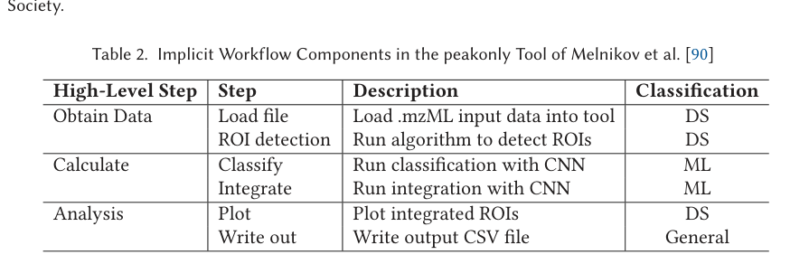

Os autores reconstruíram seis etapas e atribuíram categorias:

| Etapa | Categoria no artigo | Por que essa classificação faz sentido na análise |
| --- | --- | --- |
| Carregar `.mzML` | DS | O formato e sua interpretação pertencem ao contexto científico. |
| Detectar ROIs | DS | Seleciona regiões relevantes no sinal do domínio. |
| Classificar com CNN | ML | Expõe uma operação de aprendizagem/predição. |
| Integrar com CNN | ML | Emprega outra operação baseada em rede neural. |
| Plotar ROIs integradas | DS | Visualiza o resultado com significado para a análise química. |
| Escrever CSV | Geral | A operação de saída não exige, nessa abstração, conceitos especializados. |

A coluna `High-Level Step` agrupa tarefas em obtenção de dados, cálculo e análise. Ela não representa uma métrica. A última coluna expressa julgamento de classificação.

**Aprendizado:** uma aplicação pode misturar operações gerais, DS e ML. E “plotar” não é sempre geral: visualizar um sinal especializado é diferente de desenhar um gráfico genérico.

O workflow é chamado implícito porque foi inferido a partir da publicação/ferramenta. A existência de uma interface gráfica no peakonly não cria automaticamente um artefato de workflow explícito. [Artigo, pp. 24–26.](refs/3638243.pdf#page=24)

### Tabela 3 — Separar treinamento e previsão no MATLAB (p. 27)

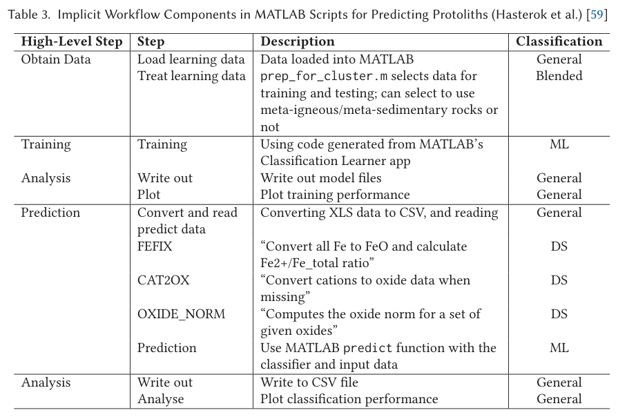

A tabela abrange **dois momentos**: produzir um modelo e utilizá-lo em dados de previsão. Não leia tudo como uma rotina que precisa retreinar o modelo a cada nova amostra.

Na preparação, os dados são carregados e selecionados; a seleção é classificada como mista porque combina contexto das rochas e organização para ML. O treinamento usa código associado ao Classification Learner. Depois há gravação e visualização dos resultados.

Na previsão, aparecem operações químicas:

- **FEFIX:** trata a representação do ferro e calcula uma razão relacionada à sua composição.
- **CAT2OX:** converte dados de cátions para representação em óxidos quando necessário.
- **OXIDE_NORM:** normaliza a representação dos óxidos.

Esses nomes importam porque mostram que preparar os dados pode exigir conhecimento de domínio. A chamada final a `predict` é ML; ela não substitui essas decisões químicas.

**Relação com a sua DSL:** permita distinguir a criação/configuração de um modelo de seu uso. Se um componente precisa de dados transformados de certa maneira, essa dependência deve ficar explícita. A tabela descreve a composição, não informa qual classificador teve melhor resultado. [Artigo, pp. 26–27.](refs/3638243.pdf#page=26)

### Tabela 4 — Conhecimento de domínio dentro de uma solução Kaggle (p. 28)

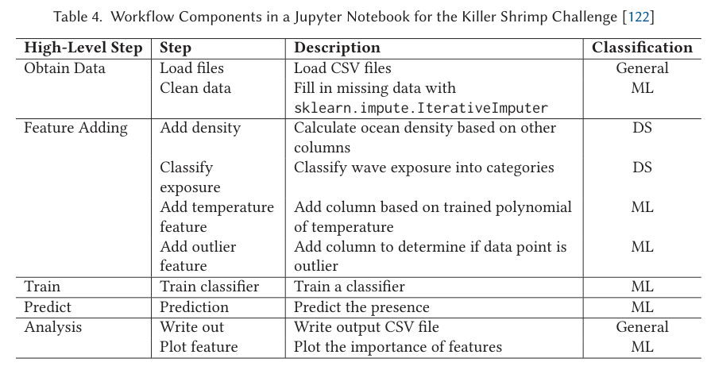

O workflow reconstruído lê dados, preenche faltantes, acrescenta atributos, treina, prevê e analisa resultados. Dois atributos são classificados como DS: densidade da água e categorização da exposição a ondas. Outros passos, como imputação e treinamento, têm foco em ML.

Por isso, a solução é classificada como **blended com predominância de ML**, e não puramente ML. O conhecimento da aplicação aparece em decisões de representação dos dados.

O texto adjacente relata um problema revelador: a ordenação/identificação das amostras permitia uma solução trivial baseada no índice. Isso ilustra que pontuar bem numa tarefa pode explorar um artefato dos dados, sem resolver adequadamente o fenômeno científico desejado. **Não atribua automaticamente esse atalho ao notebook analisado:** o texto discute o problema do desafio e apresenta separadamente a solução reconstruída na tabela.

**Relação com a sua DSL:** uma avaliação visualmente bem montada ainda pode medir a coisa errada. A linguagem pode facilitar rastreabilidade e inspeção, mas não torna uma formulação científica válida por si só. [Artigo, pp. 27–29.](refs/3638243.pdf#page=28)

### Tabela 5 — Muito trabalho de domínio antes da classificação (p. 30)

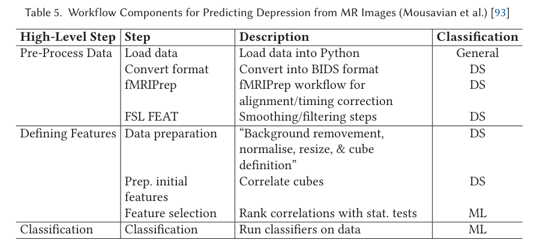

Leia em três grupos:

1. **Preparação:** carregar, converter para BIDS, executar fMRIPrep e aplicar operações FSL FEAT.
2. **Definição de atributos:** preparar dados, definir partes do volume, calcular correlações e selecionar atributos.
3. **Classificação:** aplicar os classificadores.

O estudo classifica a maior parte das etapas como DS. Seleção de atributos e classificação são as etapas ML destacadas. A tabela ajuda a perceber que “usar IA” pode envolver muito mais preparação especializada do que chamadas a modelos.

**BIDS** é uma organização padronizada de dados usada nesse contexto; **fMRIPrep** encapsula preparação de fMRI; **FSL FEAT** refere-se a ferramentas de processamento/análise desse domínio. Para acompanhar o argumento, concentre-se na responsabilidade desses componentes, sem tentar aprender todo o procedimento científico.

O workflow total é **híbrido**: a orquestração externa está em scripts, mas chama um sub-workflow explicitamente representado. Isso é diferente de “blended”: *híbrido* aqui descreve expressão do workflow; *blended* descreve combinação de conceitos. [Artigo, pp. 29–30.](refs/3638243.pdf#page=29)

### Tabela 6 — Como calcular e interpretar a porcentagem DS (p. 32)

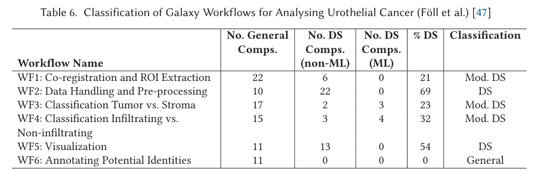

Essa tabela conta componentes em seis workflows de uma mesma aplicação. Separe as colunas:

- **General Comps.:** operações gerais.
- **DS Comps. (non-ML):** operações especializadas sem ML na categoria usada.
- **DS Comps. (ML):** operações especializadas que incorporam ML.
- **% DS:** participação de componentes DS no conjunto contado.
- **Classification:** caracterização geral do workflow.

**Fórmula reconstruída a partir dos valores da tabela:**

```text
% DS = 100 × (DS sem ML + DS com ML)
             / (gerais + DS sem ML + DS com ML)
```

| Workflow | Gerais | DS sem ML | DS com ML | Recalculando | Valor publicado |
| --- | ---: | ---: | ---: | --- | ---: |
| WF1 — co-registro e extração de ROI | 22 | 6 | 0 | 6/28 ≈ 21,4% | 21% |
| WF2 — tratamento e preparação | 10 | 22 | 0 | 22/32 ≈ 68,8% | 69% |
| WF3 — classificação tumor/estroma | 17 | 2 | 3 | 5/22 ≈ 22,7% | 23% |
| WF4 — classificação de infiltração | 15 | 3 | 4 | 7/22 ≈ 31,8% | 32% |
| WF5 — visualização | 11 | 13 | 0 | 13/24 ≈ 54,2% | 54% |
| WF6 — anotação de identidades potenciais | 11 | 0 | 0 | 0/11 = 0% | 0% |

**Esses percentuais não são acurácia.** WF2 ter 69% DS não significa acertar 69% das previsões, nem ser melhor do que WF3. Tampouco mede diretamente dificuldade, duração ou esforço cognitivo.

O caso WF3 é importante: pode haver poucos componentes especializados em quantidade, mas eles realizarem a parte substantiva da análise. Contar componentes atribui o mesmo peso a unidades que podem diferir muito em responsabilidade.

As escolhas de contagem também interferem. A nota de rodapé diz que leitura/escrita foi contada como geral e que componentes repetidos de divisão de dados em WF3 e WF4 foram contados uma vez para evitar sobrerrepresentação.

**Pergunta crítica:** se um sub-workflow de dez etapas for encapsulado em um único nó, a contagem muda sem necessariamente mudar o trabalho realizado. Portanto, uma comparação desse tipo exige manter o nível de decomposição compatível. Esta última observação é uma inferência metodológica a partir da tabela e da discussão de abstração. [Artigo, pp. 32 e 34–35.](refs/3638243.pdf#page=32)

### Tabela 7 — Onde há suporte e onde há espaço para pesquisa (p. 35)

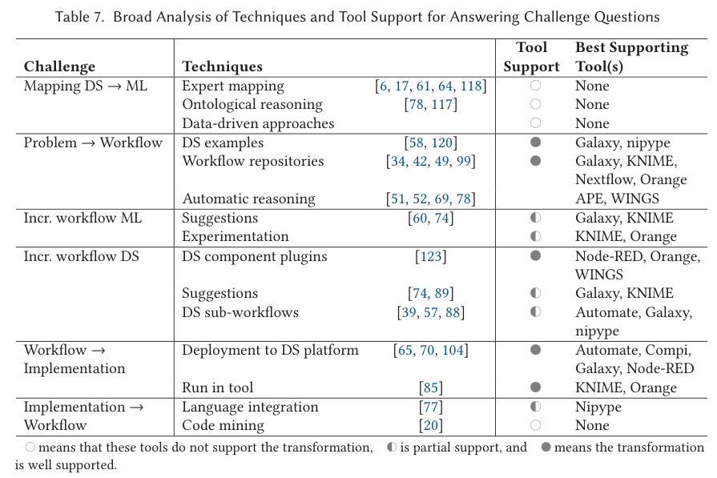

Esta é uma das tabelas mais úteis para justificar seu projeto. Cada grupo de linhas corresponde a um desafio; cada linha associa uma técnica, exemplos da literatura, uma avaliação de suporte e ferramentas destacadas.

**Legenda conferida na imagem:** círculo vazio = sem suporte; meio preenchido = suporte parcial; preenchido = bom suporte. São categorias qualitativas dos autores, não notas numéricas, testes estatísticos ou percentuais de funcionalidades.

| Técnica na tabela | Avaliação no artigo | Leitura prática |
| --- | --- | --- |
| Mapear DS → ML por especialistas, ontologias ou dados | Sem suporte nas três linhas | Os sistemas examinados não integram bem essa passagem inicial. |
| Exemplos DS e repositórios para obter workflows | Bom suporte | É possível partir de exemplos e composições existentes. |
| Raciocínio automático para obter workflows | Sem símbolo legível nessa linha | APE/WINGS são citados como exemplos; não atribua uma categoria apenas pela posição da linha. |
| Sugestões e experimentação para ampliar ML | Parcial | Ferramentas ajudam, mas há espaço para assistência mais integrada. |
| Plugins de componentes DS | Bom suporte | É uma maneira estabelecida de acrescentar especialização. |
| Sugestões DS e sub-workflows DS | Parcial | O reuso existe, com oportunidades de melhor integração. |
| Implantação e execução no próprio sistema | Bom suporte | Fazer o workflow rodar já é uma capacidade central de vários sistemas. |
| Integrar código à linguagem de workflows | Parcial | Pode facilitar elevar código ao nível de um workflow explícito. |
| Extrair workflow por análise/mineração de código | Sem suporte | A recuperação automática é apontada como desafio. |

**Como ler uma linha:** “há um artigo sobre uma técnica” não equivale a “a técnica está integrada nas ferramentas”. Por isso, uma linha pode listar referências e ainda apresentar círculo vazio.

Na linha `Automatic reasoning`, a cópia fornecida não mostra um símbolo de suporte claramente identificável. A tabela acima conserva essa indeterminação, em vez de completar a célula por suposição.

A última coluna é a seleção dos autores de ferramentas que exemplificam aquele suporte. Não é um ranking geral entre Galaxy, Orange, KNIME ou Node-RED.

**Uso correto na sua pesquisa:** formular uma hipótese de contribuição, por exemplo, melhorar uma transformação pouco apoiada. **Uso incorreto:** afirmar que nenhuma ferramenta disponível hoje resolve o problema. A análise tem escopo e data; a lacuna precisa ser reavaliada em literatura e ferramentas posteriores. [Artigo, seções 7.2.1–7.2.6.](refs/3638243.pdf#page=36)

## 8. Como interpretar as métricas

A seção 7.5, pp. 41–43, **propõe métricas para futuras avaliações**. Ela não apresenta um experimento que mede todas elas. Os autores organizam as métricas em quatro grupos. [Artigo, seção 7.5.](refs/3638243.pdf#page=41)

| Grupo | O que os autores querem observar | Exemplo de pergunta |
| --- | --- | --- |
| **Framework** | Como os artefatos se distribuem entre domínio e ML. | Que conceitos especializados aparecem? |
| **Uso da ferramenta** | Esforço e experiência da pessoa. | Consegue concluir a tarefa? Com quanto esforço? |
| **Recomendação/orientação** | Utilidade, desempenho e compreensão das sugestões. | As sugestões ajudam a construir uma solução válida? |
| **Workflow produzido** | Características e resultados do próprio fluxo. | É compreensível, eficiente e adequado ao problema? |

### 8.1 Não misture propriedades do editor, do fluxo e do modelo

Uma pessoa pode montar rapidamente um fluxo que produz respostas ruins. Um modelo pode acertar muito, mas estar dentro de uma interface difícil de usar. Um fluxo pode executar sem erros e ainda representar uma tarefa inadequada.

Para a sua pesquisa, explicite o objeto avaliado:

- **Editor/linguagem:** tempo de edição, erros de composição e compreensão.
- **Execução do workflow:** sucesso de execução, custo, tempo e rastreabilidade.
- **Resultado da aplicação de IA:** qualidade da saída segundo critérios da tarefa.

Essa separação é uma recomendação metodológica derivada das categorias do artigo. Ela evita alegar melhoria de “IA” quando se mediu apenas facilidade de uso da interface.

### 8.2 Métricas objetivas e relatos subjetivos

Tempo de tarefa e cliques podem ser registrados. Entrevistas ajudam a explicar por que a pessoa tomou certas decisões. Questionários como SUS e UEQ capturam percepções de usabilidade/experiência; não substituem observar se a tarefa foi concluída corretamente.

O artigo agrupa SUS e UEQ sob “qualitativas”, mas instrumentos de autorrelato também podem produzir escores numéricos. **Subjetivo não significa necessariamente não numérico.** A documentação oficial do [UEQ](https://www.ueq-online.org/) descreve seis dimensões e disponibiliza materiais em português. Use o instrumento apropriado se futuramente houver um estudo, sem criar uma pontuação improvisada a partir das frases mencionadas no artigo.

Também não use “menos cliques” como sinônimo automático de “menos esforço”: uma interação pode exigir uma decisão muito difícil. Os autores listam várias possibilidades de mensuração; não exigem que seu projeto empregue todas, nem que comece com sensores fisiológicos.

### 8.3 Avaliar recomendações

Os autores sugerem aceitação das recomendações, eficiência e, quando existe uma referência correta, precisão e revocação. [Artigo, p. 42.](refs/3638243.pdf#page=42)

**Exemplo didático:** um sistema recomenda cinco componentes. Três são considerados adequados por um critério previamente definido, e havia seis adequados no conjunto de referência.

```text
Precisão = adequados recomendados / total recomendado = 3/5 = 60%
Revocação = adequados recomendados / total adequado existente = 3/6 = 50%
```

Esse cálculo só é interpretável se “adequado” e o universo comparado estiverem definidos. Aceitar uma sugestão não demonstra que ela seja correta; pode refletir confiança, falta de experiência ou conveniência. Portanto, aceitação, correção e satisfação são medidas diferentes.

### 8.4 Avaliar workflows

O artigo discute contagem de componentes, recursos computacionais, correção preditiva, fairness, privacidade e interpretabilidade. Isso é um conjunto de possibilidades, não uma métrica composta pronta.

**Exemplo para sua DSL:** em uma tarefa de correção de fluxo, conte ligações inválidas identificadas e erros introduzidos durante a correção. Em uma tarefa de autoria, verifique se o fluxo final satisfaz requisitos definidos. Em ambos, registre a experiência prévia do usuário para não atribuir à linguagem uma diferença causada apenas por treinamento anterior. São propostas de avaliação, ainda sem resultados.

## 9. O que o artigo sustenta e seus limites

### 9.1 O que ele entrega

O trabalho oferece uma organização explícita das decisões e transformações; demonstra que ela pode ser usada para descrever casos diferentes; identifica técnicas e suporte nas ferramentas examinadas; e discute onde desenvolver assistência adicional. [Artigo, seções 6–8.](refs/3638243.pdf#page=33)

Isso é útil para construir uma argumentação do tipo: “minha contribuição atua na passagem X → Y, para um usuário Z, com uma operação de domínio W”. É muito mais específico do que “um sistema que conecta ferramentas de IA”.

### 9.2 O que ele não demonstra

- Não mede ganho universal de produtividade provocado pelo framework.
- Não testa uma nova DSL visual completa contra todas as alternativas.
- Não apresenta uma amostra representativa de todos os domínios e ferramentas.
- Não prova que aumentar a porcentagem DS melhora a qualidade de um modelo.
- Não transforma as métricas propostas em resultados obtidos.
- Não estabelece que geração de código seja obrigatória ou sempre superior à interpretação.

Essas limitações decorrem do desenho do estudo e são compatíveis com as restrições reconhecidas pelos autores nas pp. 34–35 e com o trabalho futuro da p. 43.

### 9.3 Limites que você deve saber explicar

**Classificação aproximada.** “DS”, “ML” e “blended” dependem de interpretação e nível de abstração. Sem um protocolo mais detalhado, avaliadores podem discordar.

**Dimensões sobrepostas.** ML é também um domínio e pode estar encapsulado em operações especializadas. Os eixos são instrumentos de reflexão, não variáveis perfeitamente independentes.

**Três camadas simplificam sistemas reais.** A implementação pode incluir muitas camadas internas. Um wrapper específico de domínio pode chamar uma biblioteca de ML, que chama operações gerais.

**Seleção não sistemática.** Os seis exemplos ilustram heterogeneidade; não permitem estimar popularidade de ferramentas ou prevalência de técnicas.

**Parte da experiência humana fica fora do framework.** O artigo reconhece que orientar o usuário, oferecer feedback e definir como ele interage com transformações exige trabalho adicional.

**Fronteira dos workflows.** O artigo delimita workflows computacionais e deixa tarefas humanas fora de sua equivalência com pipelines. Se sua DSL incluir aprovação humana durante a execução, será uma extensão do recorte. Isso não contradiz haver uma pessoa editando o workflow.

### 9.4 Pequenos problemas editoriais que podem travar a leitura

| Local | O que foi observado | Como ler |
| --- | --- | --- |
| Abertura da seção 4, p. 14 | Remete à Figura 3 ao falar das três camadas. | A figura das três camadas é a **Figura 4**. |
| Seção 5.1.1, p. 21 | Prosa e legenda da Figura 10 divergem na associação de contínuo/tracejado. | Use a legenda do desenho e retenha a distinção conceitual, registrada acima. |
| Seção 6.1, p. 23 | Descrição textual troca a ordem de representação e expressão. | Siga os cabeçalhos `Repres.` e `Expression` da Tabela 1. |
| Abertura da seção 6.2, p. 24 | Menciona “primeiros quatro” estudos implícitos. | Os três casos ES1–ES3 são os implícitos; ES4 é híbrido e aparece na seção 6.3. |

Essas observações são da leitura desta versão do PDF. Não invalidam automaticamente a proposta, mas justificam conferir figuras, tabelas e exemplos em vez de assumir que toda frase está perfeitamente alinhada.

## 10. Aplicação à sua DSL visual

Esta seção é **uma proposta de interpretação para seu tema**, não uma descrição de uma ferramenta implementada pelos autores.

### 10.1 Primeiro defina o domínio da linguagem

Seu tema pode ter pelo menos dois recortes:

| Recorte | Usuário e vocabulário | Implicação |
| --- | --- | --- |
| **DSL para desenvolvedores de aplicações de IA** | Pessoas que manipulam prompts, modelos, fontes de dados, condições e ferramentas. | O domínio específico é a composição de aplicações de IA. |
| **DSL para especialistas de uma aplicação** | Pessoas que manipulam conceitos como regulamento, matrícula, requisito e prazo. | A IA pode ficar parcialmente encapsulada em operações do domínio. |

O artigo enfatiza o segundo cenário: especialistas de domínios externos a ML. Ele ainda pode fundamentar o primeiro, mas você precisa explicar a adaptação. Não assuma que “domínio” sempre significa a mesma coisa em todos os trabalhos de DSL.

### 10.2 Onde a linguagem poderia atuar

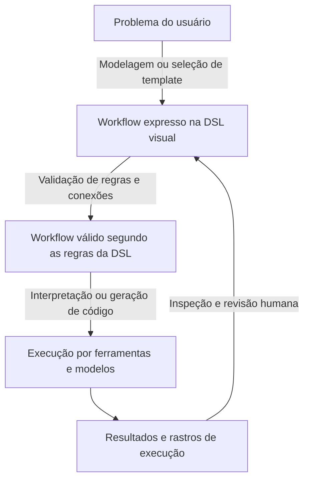

Diagrama didático próprio inspirado nas camadas dos autores. “Válido segundo as regras” não significa que a resposta da IA será factual ou que o problema científico foi bem formulado.

### 10.3 Um exemplo completo sem precisar programar

**Problema:** um estudante pergunta pelo prazo de uma entrega no regulamento correto de sua disciplina.

**Vocabulário proposto:** `SelecionarRegulamento`, `ReceberPergunta`, `RecuperarTrechos`, `GerarResposta`, `MostrarFontes`.

**Fluxo proposto:** a pergunta e o regulamento selecionado alimentam a recuperação; os trechos e a pergunta alimentam a geração; a resposta e os identificadores dos trechos alimentam a apresentação.

**Regras possíveis da linguagem:** a recuperação exige uma fonte selecionada; a geração exige pergunta; a apresentação de fontes exige identificadores associados aos trechos. Essas regras precisariam ser especificadas e justificadas no seu projeto.

**Implementação:** um motor percorre dependências, executa os componentes e mantém um registro de entrada/saída. Um provedor de busca e um modelo são escolhas de implementação; os conceitos exibidos ao usuário podem permanecer mais abstratos.

**Classificação no framework:** um bloco genérico de chamada a modelo tende ao eixo ML/IA; um bloco que conhece artigos e vigência de regulamentos acrescenta conhecimento de domínio. O fluxo pode ser misto, dependendo da representação efetiva.

**O que avaliar:** se usuários conseguem compor e corrigir esse fluxo; se entendem suas dependências; e, separadamente, se a aplicação responde adequadamente. Nada disso foi medido neste exemplo.

### 10.4 Possíveis recortes de pesquisa

| Recorte candidato | Relação com o artigo | Evidência que você precisaria produzir |
| --- | --- | --- |
| **Validação de conexões** | Representação e composição de workflows; discussão de tipos. | Casos inválidos detectados, falsos alarmes e impacto nas tarefas dos usuários. |
| **Sugestão de componentes** | Problema → workflow e orientação do especialista. | Adequação das sugestões e efeito na construção de fluxos. |
| **Visualização de resultados intermediários** | Abstração, compreensão e refinamento. | Capacidade de localizar e explicar falhas. |
| **Blocos de domínio reutilizáveis** | Aumentar DS por plugins/sub-workflows. | Expressividade e reuso em tarefas reais daquele domínio. |
| **Importar código como workflow** | Implementação → workflow. | Fidelidade da recuperação de etapas e dependências. |

**Hipótese inicial possível:** “Uma DSL visual com portas tipadas e mensagens de erro ligadas ao domínio ajuda usuários a identificar incompatibilidades de composição”. É uma hipótese a investigar, não uma lacuna já confirmada nem uma conclusão do artigo.

Para escolher, descreva uma tarefa concreta, um público e uma comparação. A novidade precisa ser conferida com os trabalhos da [seleção de artigos](../01-fundamentos/ARTIGOS-PARA-LER.md) e literatura posterior.

## 11. Dúvidas destravadas e materiais

### “Por que o artigo fala em ontologia?”

Porque conhecer apenas o tipo técnico `texto` ou `imagem` pode ser insuficiente. Também pode importar saber que a imagem é de um domínio específico, que uma operação exige determinada preparação e que certa saída representa uma entidade daquele domínio. Ontologias representam conceitos e relações que podem apoiar esse raciocínio. A definição formal e a possibilidade de inferência lógica são explicadas pelo [W3C — OWL](https://www.w3.org/OWL/).

### “JSON ou YAML são a DSL?”

Podem ser a forma de escrever uma descrição, mas o significado vem do vocabulário e das regras interpretadas por um sistema. CWL é um exemplo de padrão que descreve ferramentas de linha de comando e suas conexões em workflows. O [site oficial do CWL](https://www.commonwl.org/) também oferece vídeo introdutório. Isso ajuda a separar formato de arquivo, linguagem e motor.

### “Uma seta garante ordem de execução?”

Ela precisa de uma semântica definida. Num workflow de dados, uma dependência pode exigir que uma entrada esteja disponível; isso não estabelece necessariamente uma ordem total entre todas as etapas. No framework conceitual, a seta pode significar transformação entre artefatos, não ordem temporal da execução. [Artigo, seções 2.3 e 3.](refs/3638243.pdf#page=5)

### “Workflow tem que ser DAG?”

Os autores apresentam DAGs como representação comum, mas reconhecem que sistemas podem relaxar a restrição para incluir ciclos, como iterações sobre arquivos. Se sua linguagem permitir ciclos, será necessário definir seu comportamento. A curva do fio no desenho não determina se existe um ciclo. [Artigo, p. 5.](refs/3638243.pdf#page=5)

### “Petri nets, BPMN, YAWL e soundness: preciso aprender tudo agora?”

Para esta leitura, reconheça a função: são formalismos/linguagens que ajudam a representar processos e discutir propriedades de execução. O artigo usa *soundness* para se referir à possibilidade de completar adequadamente um workflow e à ausência de transições mortas no sentido do formalismo discutido. Isso é diferente de garantir que o conteúdo gerado por IA esteja correto. Aprofundar a formalização pode ficar para quando o recorte da sua DSL exigir essa garantia. [Artigo, seção 2.3.1, p. 6.](refs/3638243.pdf#page=6)

### “FAIR é a mesma coisa que fairness?”

Não. **FAIR** se refere a encontrabilidade, acessibilidade, interoperabilidade e reutilização dos recursos. **Fairness**, na discussão de ML, se refere a evitar vieses/prejuízos indevidos nos resultados. O artigo usa os conceitos em contextos diferentes. [Artigo, pp. 6 e 43.](refs/3638243.pdf#page=6)

### “Mais IA sempre ajuda?”

O framework organiza complexidade e especialização; não estabelece uma regra de maximizar ML. A discussão sobre orientação do especialista considera expor mais ou menos detalhes conforme seu conhecimento. Seu projeto pode inclusive ter valor por permitir usar IA sem obrigar o usuário a operar todos os detalhes internos. [Artigo, seção 7.3.2.](refs/3638243.pdf#page=39)

### “Como citar essa discussão no meu texto?”

Exemplo de paráfrase baseada no artigo, a adaptar ao seu argumento:

> Oakes, Famelis e Sahraoui (2024) organizam o desenvolvimento de workflows de ML específicos de domínio em três camadas: problema, solução em workflow e implementação. Essa organização permite situar as transformações apoiadas por uma ferramenta e distinguir conhecimento de domínio de complexidade de ML.

Isso é uma **paráfrase**, não uma tradução literal. Cite o artigo original. Se falar sobre um resultado específico de ES1–ES6, consulte também a publicação primária do caso; Oakes et al. a analisam sob outro objetivo.

### Materiais de apoio, por dúvida

| Para entender | Material |
| --- | --- |
| DSL, editor e motor, desde o começo | [Nosso guia inicial](../01-fundamentos/GUIA-INICIAL.md). |
| Padrão de descrição de workflows, com vídeo | [Common Workflow Language](https://www.commonwl.org/). |
| Ontologias e inferência | [W3C — OWL](https://www.w3.org/OWL/). |
| Entrada `Learner` versus dados na Figura 12 | [Orange — Test and Score](https://orange3.readthedocs.io/projects/orange-visual-programming/en/latest/widgets/evaluate/testandscore.html). |
| Agrupamento e silhouette na Figura 2 | [scikit-learn — Clustering](https://scikit-learn.org/stable/modules/clustering.html#silhouette-coefficient). |
| Experiência do usuário e questionários | [UEQ — materiais oficiais](https://www.ueq-online.org/). |
| Aproximação com fluxos de LLMs | [ChainForge, InstructPipe e demais artigos selecionados](../01-fundamentos/ARTIGOS-PARA-LER.md). |

## 12. Exercícios e roteiro para explicar o artigo

### 12.1 Verifique sua compreensão

1. Explique as três camadas usando um exemplo seu, sem repetir um exemplo médico do artigo.
2. Dê um exemplo de transformação dentro de uma camada e outro entre camadas.
3. Explique por que um workflow DS pode usar ML internamente.
4. Na Figura 12, diferencie `Data`, `Learner` e `Evaluation Results`.
5. Recalcule o percentual DS do WF4 da Tabela 6.
6. Explique por que esse percentual não é acurácia nem evidência de produtividade.
7. Escolha uma linha da Tabela 7 e diga o que precisaria pesquisar para saber se a lacuna ainda existe.
8. Diga qual dos seis desafios você gostaria que sua DSL abordasse primeiro.

**Respostas-chave:** para a questão 5, `(3 + 4)/(15 + 3 + 4) × 100 ≈ 31,8%`, arredondado para 32%. Na questão 4, dados são exemplos; *learners* são algoritmos/configurações de aprendizagem; resultados de avaliação são o que as análises posteriores consomem. Nas demais, importa sustentar a distinção com um exemplo coerente.

### 12.2 Roteiro curto para apresentar ao orientador

1. **Problema:** o especialista conhece a aplicação, mas precisa de apoio para formular e executar uma solução com ML.
2. **Proposta:** explicar a Figura 4 com um exemplo em três camadas.
3. **Funcionamento:** usar a Figura 10 para explicar transformações, sem confundir suas setas com fluxo de dados.
4. **Aplicação:** escolher um estudo e mostrar como uma tabela classifica seus componentes.
5. **Discussão:** usar a Tabela 7 para mostrar oportunidades, reconhecendo seu escopo temporal.
6. **Limites:** seleção de casos não sistemática, classificação aproximada e ausência de experimento completo de uma nova ferramenta.
7. **Seu tema:** situar uma transformação que sua DSL poderia apoiar e qual evidência mostraria sua utilidade.

### 12.3 Um fichamento já iniciado

| Campo | Registro desta leitura |
| --- | --- |
| Pergunta central | Como apoiar especialistas de domínio na obtenção de workflows executáveis que utilizam ML? |
| Tipo de contribuição | Framework conceitual, análise de ferramentas/casos e agenda de pesquisa. |
| Unidade de organização | Artefatos e transformações em três camadas, com dimensões DS e complexidade de ML. |
| Evidência mobilizada | Literatura, ferramentas e seis exemplos escolhidos informalmente. |
| Figura central | Figura 4; Figura 10 complementa os caminhos entre camadas. |
| Tabela central para oportunidades | Tabela 7. |
| Principal cuidado metodológico | Não tratar ilustrações, classificações e métricas propostas como resultados de experimento de eficácia. |
| Uso no seu projeto | Fundamentar o recorte da DSL, seu público, o nível de abstração e a transformação apoiada. |
| Próximo passo | Formular uma tarefa e comparar o recorte com artigos mais diretamente ligados a LLMs e programação visual. |

**Você entendeu o essencial quando consegue explicar a Figura 4 com um exemplo próprio e ler uma linha das Tabelas 6 e 7 sem confundir composição, suporte e desempenho.**
