# Entendendo o InstructPipe: da intenção ao fluxo visual que a pessoa pode compreender, corrigir e completar

**A mensagem principal:** gerar automaticamente os blocos de um programa pode reduzir o trabalho de montagem, mas a pessoa ainda precisa entender o resultado, reconhecer erros e terminar a configuração. O InstructPipe estuda essa colaboração: uma descrição em linguagem natural vira um fluxo visual editável, dentro de um ambiente chamado Visual Blocks.

**Rumo desta leitura, conforme solicitado:** **como transformar a intenção do usuário em um fluxo visual que ele consiga compreender, corrigir e completar?** Essa pergunta é uma formulação orientadora para sua pesquisa. Não é uma citação literal nem uma conclusão já demonstrada pelos autores.

Este guia acompanha **o PDF de 22 páginas que você forneceu**, com explicação das nove seções, quatro apêndices, quinze figuras, quatro tabelas e do Algoritmo 1. A leitura dá atenção especial à organização dos blocos na tela, sem confundir rapidez de montagem com compreensão.

**Referência:** Zhou, Zhongyi et al. *InstructPipe: Generating Visual Blocks Pipelines with Human Instructions and LLMs*. CHI 2025, 22 páginas. [DOI](https://doi.org/10.1145/3706598.3713905) · [PDF local](refs/3706598.3713905.pdf) · [Fontes e limites da leitura](refs/FONTES.md).

**Paginação:** “p. 8” significa a oitava página física do PDF, também numerada 8 no rodapé. O corpo termina na p. 13; as referências ocupam partes das pp. 13–15; os apêndices ficam nas pp. 16–22. Nomes de modelos, serviços e valores padrão descrevem a versão estudada, não o estado atual das ferramentas.

## Como estudar

Na primeira passagem, leia as seções 1–4 deste guia e as Figuras 1, 4 e 11. Na segunda, examine as Tabelas 1–2 e a Figura 8, distinguindo o que foi estimado do que foi medido com usuários. Na terceira, percorra as figuras dos apêndices e transforme a discussão da seção 10 em uma pergunta delimitada para sua DSL.

- [1. Problema, proposta e ligação com as leituras anteriores](#1-problema-proposta-e-ligação-com-as-leituras-anteriores)
- [2. Vocabulário essencial](#2-vocabulário-essencial)
- [3. Um exemplo percorrido do começo ao fim](#3-um-exemplo-percorrido-do-começo-ao-fim)
- [4. Arquitetura, pseudocódigo e layout](#4-arquitetura-pseudocódigo-e-layout)
- [5. O artigo seção por seção](#5-o-artigo-seção-por-seção)
- [6. As quinze figuras explicadas](#6-as-quinze-figuras-explicadas)
- [7. As quatro tabelas explicadas](#7-as-quatro-tabelas-explicadas)
- [8. O Algoritmo 1 explicado](#8-o-algoritmo-1-explicado)
- [9. Como interpretar métricas e resultados](#9-como-interpretar-métricas-e-resultados)
- [10. O rumo para sua DSL visual](#10-o-rumo-para-sua-dsl-visual)
- [11. Limites, dúvidas e inconsistências](#11-limites-dúvidas-e-inconsistências)
- [12. Exercícios, roteiro e fichamento](#12-exercícios-roteiro-e-fichamento)

## 1. Problema, proposta e ligação com as leituras anteriores

### 1.1 O problema da tela vazia

Mesmo em um editor visual, uma pessoa iniciante precisa descobrir quais nós existem, escolher os adequados, imaginar a estrutura e conectá-los. Ter blocos disponíveis não garante saber montar uma solução. O artigo parte dessa dificuldade para investigar um assistente que produza uma primeira estrutura a partir de instruções. [Artigo, seção 1, p. 2.](refs/3706598.3713905.pdf#page=2)

**Exemplo didático:** “Quero buscar uma notícia e apresentar um resumo”. A intenção não informa, necessariamente, todos os passos técnicos: buscar URLs, escolher uma, obter a página, montar a entrada do modelo, gerar o resumo e exibir o resultado. A pessoa pode saber o objetivo sem conhecer essas operações.

### 1.2 O que o InstructPipe faz?

O sistema recebe uma descrição e uma categoria — linguagem, visual ou multimodal —, seleciona tipos de nós, gera pseudocódigo e o converte em um grafo. A pessoa recebe esse grafo no Visual Blocks e pode ajustar conexões e parâmetros. O foco é produzir a estrutura; não é automatizar toda a criação e avaliação da aplicação. [Artigo, seções 3.1 e 4, pp. 3–7.](refs/3706598.3713905.pdf#page=3)

As contribuições são um assistente implementado, sua arquitetura de geração e avaliações técnica e com usuários. Uma geração parcialmente correta pode ter valor se reduzir trabalho e for compreensível o suficiente para ser completada. Essa possibilidade é central à proposta. [Artigo, seções 1–2, pp. 2–3.](refs/3706598.3713905.pdf#page=2)

### 1.3 Como os três artigos se complementam?

| Trabalho | Pergunta que ajuda a responder | Papel na sua pesquisa |
| --- | --- | --- |
| Oakes et al. | Como passar de um problema de domínio a workflow e implementação? | Situar a transformação apoiada pela DSL. |
| ChainForge | Como organizar experimentos, inspecionar e avaliar respostas de LLMs? | Examinar representação visual e práticas de investigação. |
| InstructPipe | Como ajudar a construir um fluxo a partir da intenção do usuário? | Estudar geração assistida, revisão humana e dificuldades de compreensão. |

Essa tabela é uma **síntese do guia**, não uma comparação experimental entre sistemas. [Guia de Oakes](../02-workflows-ml/GUIA-DETALHADO.md) · [Guia do ChainForge](../03-chainforge/GUIA-DETALHADO.md).

## 2. Vocabulário essencial

As definições abaixo explicam os termos conforme usados no sistema. [Artigo, seções 3–4 e apêndice B.](refs/3706598.3713905.pdf#page=3)

| Termo | Explicação | Exemplo |
| --- | --- | --- |
| **Visual Blocks** | Ambiente de programação visual no qual o assistente foi integrado. | Tela para editar nós, conexões e parâmetros. |
| **InstructPipe** | Assistente que gera a estrutura de um pipeline a partir de instruções. | Produzir uma primeira versão de um fluxo de notícias. |
| **Pipeline / workflow** | Operações e relações que compõem um processamento. | Buscar → obter conteúdo → resumir → mostrar. |
| **Nó primitivo** | Componente disponível no catálogo da geração. | `google_search`, `pali`, `image_viewer`. |
| **Porta / socket** | Entrada ou saída nomeada de um nó. | Entrada `image`; saída `answer`. |
| **Aresta** | Conexão que estabelece de onde vem uma entrada. | Saída do leitor de página ligada à montagem do prompt. |
| **Tipo de nó** | Classe da operação. | `pali` identifica uma operação de visão e linguagem. |
| **ID de nó** | Identificador de uma instância. | `pali_1` distingue esse bloco de outro do mesmo tipo. |
| **Parâmetro** | Configuração interna da operação. | Temperatura do modelo ou posição de um adesivo. |
| **DAG** | Grafo dirigido sem ciclos. | Dependências sem caminho que retorne ao mesmo nó. |
| **Pseudocódigo** | Representação textual compacta escolhida pelo projeto. | Declarações de nós e referências às entradas. |
| **JSON** | Formato de serialização consumido pelo editor. | Lista de nós com IDs, conexões e propriedades. |
| **Node Selector** | Primeiro módulo de LLM, que filtra candidatos do catálogo. | Selecionar busca e geração de texto. |
| **Code Writer** | Segundo módulo de LLM, que escreve a estrutura em pseudocódigo. | Conectar os nós selecionados. |
| **Code Interpreter** | Componente que analisa a representação e constrói o grafo. | Converter texto em estrutura para o editor. |
| **Few-shot / in-context examples** | Exemplos fornecidos no prompt para orientar a geração. | Pares de instrução e pipeline de referência. |
| **BFS** | Busca em largura, que visita elementos de um grafo por camadas a partir de pontos de início. | Parte da reorganização visual mencionada no artigo. |
| **Counterbalancing** | Variação planejada da ordem das condições e tarefas. | Algumas pessoas começam com o assistente, outras sem ele. |
| **Raw-TLX** | Avaliação subjetiva de carga de trabalho baseada nas dimensões do NASA-TLX. | Esforço e frustração relatados após cada condição. |

**Atenção a duas IAs diferentes:** os LLMs que ajudam a **construir** o fluxo não são necessariamente os modelos que **executarão operações dentro** do fluxo gerado. A Figura 1 mostra o assistente de construção; os nós PaLI/PaLM/Imagen aparecem nos pipelines de aplicação.

## 3. Um exemplo percorrido do começo ao fim

O exemplo acompanha a tarefa de notícias do artigo, simplificada para compreensão. [Figura 14 e apêndice D.2, pp. 20–21.](refs/3706598.3713905.pdf#page=21)

**Intenção:** buscar notícias sobre Nova York e resumir uma das páginas encontradas.

```text
[Termo de busca] → [Google Search] → [String picker] → [URL to HTML]
                                                             │
[Instrução para resumir] ────────────────────────→ [Text processor]
                                                             │
                                                             ▼
                                                  [PaLM Text Generator]
                                                             │
                                                             ▼
                                                       [HTML viewer]
```

Este desenho é uma reconstrução didática das dependências da Figura 14, não um arquivo executável.

| Etapa | Papel | O que verificar |
| --- | --- | --- |
| Termo de busca | Fornecer o assunto. | A pesquisa descreve o que a pessoa deseja? |
| Google Search | Obter uma lista de URLs. | O resultado é uma lista de endereços, não o conteúdo completo das páginas. |
| String picker | Escolher uma URL da lista. | Qual página será usada? |
| URL to HTML | Obter o conteúdo da página selecionada. | O endereço foi convertido no material que será resumido? |
| Text processor | Combinar textos para formar a entrada. | A instrução e o conteúdo estão presentes? |
| PaLM Text Generator | Usar um modelo para gerar o resumo. | O resumo corresponde ao conteúdo e ao pedido? |
| HTML viewer | Exibir a saída. | O resultado está utilizável? |

O apêndice relata erros de geração que omitem `URL to HTML` ou `PaLM Text Generator`. Uma possível confusão é tratar a URL como conteúdo ou imaginar que o `Text processor` já resume usando IA. Esses são **erros de significado das operações**, não apenas de aparência do diagrama. [Artigo, D.2, p. 20.](refs/3706598.3713905.pdf#page=20)

**Ligação com seu rumo:** para corrigir esse fluxo, o usuário precisa saber o que cada nó recebe e produz. Uma proposta visual poderia tornar explícito “lista de URLs”, “URL escolhida”, “HTML” e “resumo”. Essa é uma ideia para sua DSL, não um recurso cuja eficácia foi demonstrada pelo artigo.

## 4. Arquitetura, pseudocódigo e layout

### 4.1 Três passos de geração

```text
Intenção + categoria
        ↓
Node Selector: quais tipos de nós podem ser úteis?
        ↓
Code Writer: como declarar e conectar esses nós?
        ↓
Code Interpreter: como transformar isso em um grafo no editor?
        ↓
Revisão humana: compreender → corrigir → configurar → conferir
```

A divisão procura reduzir o volume de informação enviado ao modelo: o seletor recebe descrições curtas; o escritor recebe descrições detalhadas dos nós relevantes, incluindo entradas, saídas e exemplos. Na biblioteca estudada havia 27 nós, e as configurações completas já representavam cerca de 8.200 tokens. [Artigo, seção 4, p. 5.](refs/3706598.3713905.pdf#page=5)

### 4.2 Como ler uma linha

Linha extraída do exemplo da Figura 4, com quebra de linha apenas para leitura:

```text
pali_1_out = pali_1: pali(image=input_image_1, prompt=input_text_1);
```

| Parte | Significado |
| --- | --- |
| `pali_1_out` | Nome associado à saída. |
| `pali_1` | ID da instância do nó. |
| `pali` | Tipo de operação. |
| `image=input_image_1` | Origem da entrada de imagem. |
| `prompt=input_text_1` | Origem da entrada de texto. |

É a sintaxe do projeto, inspirada em TypeScript; não presuma que essa linha é TypeScript executável. O grafo final é descrito em JSON e interpretado pelo ambiente. [Artigo, seção 4.1, pp. 5–6.](refs/3706598.3713905.pdf#page=5)

### 4.3 Estrutura, parâmetros e posição são coisas diferentes

O pseudocódigo compacto guarda a estrutura das dependências, sem representar o layout ou a generalidade dos parâmetros internos. No exemplo da Figura 4, o artigo compara aproximadamente 2.800 tokens de JSON com 123 de pseudocódigo. Isso é uma comparação daquele exemplo, não uma taxa universal de compressão. [Artigo, p. 5.](refs/3706598.3713905.pdf#page=5)

Há uma **exceção importante**: o sistema gera o texto do nó `input_text`. Nesse caso, um argumento literal configura o nó; não representa uma conexão de entrada. A seção 4.1 explicita essa exceção. Portanto, “não gera parâmetros” deve ser entendido como o recorte geral do projeto, não como ausência absoluta de qualquer valor gerado. [Artigo, p. 6.](refs/3706598.3713905.pdf#page=6)

### 4.4 O que o interpretador garante — e o que não garante

O texto descreve análise das declarações, criação de nós/arestas, aplicação de valores padrão e reorganização visual usando BFS. Linhas que inventam tipos de nó inexistentes são descartadas em uma verificação. Isso evita certos problemas de formato, mas não demonstra que o fluxo restante cumpre a intenção ou está completo. [Artigo, seções 4.3–4.4, p. 7.](refs/3706598.3713905.pdf#page=7)

**Para sua DSL:** validade de representação, compatibilidade de entradas, completude da tarefa e legibilidade visual são critérios diferentes. Um diagrama pode estar bem alinhado e ainda omitir a operação necessária.

## 5. O artigo seção por seção

### Seção 1 — Introduction · pp. 2–3

Explica o problema de começar do zero em programação visual, apresenta o assistente e anuncia as contribuições. Os autores procuram reduzir seleção e conexão manuais de nós, deixando espaço para configuração e revisão humana. [Ler p. 2.](refs/3706598.3713905.pdf#page=2)

**Pergunta de leitura:** qual esforço foi automatizado? Principalmente construir a estrutura inicial; compreender, ajustar e avaliar ainda envolvem a pessoa.

### Seção 2 — Related Work · p. 3

Conecta programação visual, interfaces com LLMs e colaboração humano–IA. ChainForge aparece explicitamente entre os trabalhos relacionados. O texto valoriza gerações parciais como ponto de partida editável, enquanto discute sistemas voltados à automação. [Ler p. 3.](refs/3706598.3713905.pdf#page=3)

Não use todas as afirmações sobre sistemas da seção como comparação atualizada: são a contextualização dos autores na época da publicação.

### Seção 3 — InstructPipe · pp. 3–5

**3.1 — fluxo de uso:** abrir o diálogo, informar descrição/categoria, gerar e revisar no editor. **3.2 — biblioteca:** 3 nós de entrada, 4 de saída e 20 processadores, totalizando 27. Foram excluídos nós cuja função depende de uma configuração aberta, como executar um modelo arbitrário a partir de um endereço. [Ler pp. 3–5.](refs/3706598.3713905.pdf#page=4)

**Ponto importante:** a biblioteca delimita o que a linguagem pode expressar e o que o assistente pode gerar. “Aberto a várias tarefas” não significa “capaz de construir qualquer programa”.

### Seção 4 — Pipeline Generation from Instructions · pp. 5–7

**4.1:** define a representação compacta. **4.2:** seleciona nós com descrições curtas. **4.3:** escreve pseudocódigo com documentação detalhada e exemplos. **4.4:** converte em grafo e reorganiza a tela. [Ler p. 5.](refs/3706598.3713905.pdf#page=5)

A divisão em etapas é avaliada como parte do sistema. O artigo não demonstra, por uma ablação de cada componente, que esse é o melhor arranjo possível; a seção 8.4 propõe justamente aprofundar essas decisões.

### Seção 5 — Technical Evaluation · pp. 7–8

Aqui a pergunta é: **quanto trabalho estrutural falta para completar os fluxos gerados?**

Um workshop de dois dias reuniu 23 participantes para criar pipelines no Visual Blocks, sem o InstructPipe. O apêndice C relata 64 pipelines inicialmente e 48 após filtragem/limpeza: 23 de linguagem, 7 visuais e 18 multimodais. Dois autores redigiram descrições para cada pipeline, antes de terem experiência com a implementação concluída do assistente. [Artigo, seção 5.1 e apêndice C.1.](refs/3706598.3713905.pdf#page=18)

Cada pipeline foi testado em seis gerações: duas descrições, três tentativas por descrição. Isso corresponde a `48 × 6 = 288` gerações, por cálculo a partir do protocolo. Não são 288 usuários nem 288 tarefas independentes criadas do zero.

A métrica é uma razão entre o número mínimo de operações estruturais para completar a geração e o número necessário para construir do zero. Considera adicionar/remover nós e arestas. Não contabiliza ajustes de parâmetros, interpretação do resultado ou todo clique de interface. [Artigo, seção 5.2 e apêndice C.2.](refs/3706598.3713905.pdf#page=7)

### Seção 6 — User Evaluation · pp. 8–11

Agora a pergunta é: **como as pessoas realizam tarefas com e sem assistência?**

| Aspecto | Desenho do estudo |
| --- | --- |
| Participantes | Outro grupo: 16 pessoas com programação e ML autoavaliados como intermediários ou abaixo. |
| Condições | Visual Blocks com InstructPipe e Visual Blocks sem o assistente. |
| Organização | Cada participante realiza as duas tarefas nas duas condições. |
| Tarefas | Resumir notícia obtida por busca; criar prova virtual de óculos usando câmera. |
| Duração | 55–65 minutos, incluindo 10–15 de treinamento. |
| Medidas | Tempo, número de interações estruturais e Raw-TLX; entrevistas. |
| Controle de ordem | Ordem de condições/tarefas contrabalançada. |
| Apoio | Pesquisadores podiam responder e dar pistas; houve mais pistas na condição sem assistente. |

Oito pessoas também fizeram uma atividade aberta opcional, conforme progresso e tempo disponível. Esse subconjunto não é equivalente a uma avaliação aberta uniforme com todos os 16 participantes. [Artigo, seções 6.1–6.4, pp. 8–9.](refs/3706598.3713905.pdf#page=8)

Os resultados mostram diferenças favoráveis ao assistente em tempo, operações e cinco dimensões subjetivas, mas **não uma redução estatisticamente significativa em demanda mental**. Relatos apontam a necessidade de formular bem instruções, interpretar o grafo e depurar erros. [Artigo, seções 6.5 e 7.2, pp. 9–11.](refs/3706598.3713905.pdf#page=10)

### Seção 7 — Discussion · p. 11

**7.1:** discute o valor de automação parcial. **7.2:** organiza a carga mental em instrução, percepção e depuração. **7.3:** mostra que mesmo autores do sistema podem escrever pedidos ambíguos ou incompletos. [Ler p. 11.](refs/3706598.3713905.pdf#page=11)

Esse é o centro do rumo escolhido: gerar o fluxo é apenas parte do problema. A pessoa precisa relacionar sua intenção à estrutura que apareceu. As três fontes de carga mental são uma interpretação dos autores baseada nos relatos; não foram isoladas em três experimentos causais separados.

### Seção 8 — Limitations and Future Work · pp. 12–13

Discute apoio para escrever instruções, geração de parâmetros, biblioteca maior/dinâmica, refinamento dos componentes, métricas e acompanhamento prolongado, além de uso responsável. A seção 8.4 reconhece que as avaliações tratam o sistema completo e que decisões como pseudocódigo e decomposição precisam de avaliação específica. [Ler p. 12.](refs/3706598.3713905.pdf#page=12)

**Para seu recorte:** a sugestão de mostrar uma prévia visual durante a escrita do pedido aproxima intenção e representação. É uma direção futura, não um recurso comprovado na avaliação deste artigo.

### Seção 9 — Conclusion · p. 13

Retoma o assistente, sua arquitetura e os benefícios observados para prototipação. A expressão sobre redução superior a cinco vezes deve ser lida no contexto da razão estimada de operações estruturais da avaliação técnica, não como redução de cinco vezes em tempo ou esforço mental. [Ler p. 13.](refs/3706598.3713905.pdf#page=13)

### Apêndices A–D · pp. 16–22

| Apêndice | Conteúdo | Como usar |
| --- | --- | --- |
| A | Lista dos 27 nós e descrições. | Conferir se a operação do diagrama existe no catálogo. |
| B | Configurações, interpretador, estruturas e algoritmo. | Entender a passagem da linguagem compacta ao grafo. |
| C | Limpeza do conjunto técnico e discussão da métrica. | Saber o que entrou na avaliação e o que foi excluído. |
| D | Entrevista, tarefas, assistência e contrabalançamento. | Avaliar limites e condições do experimento com pessoas. |

Não pule os apêndices: a Figura 11, diretamente relacionada à organização espacial, está na p. 18; detalhes decisivos da métrica e da ajuda aos participantes também ficam nessa parte.

## 6. As quinze figuras explicadas

As imagens são recortes de Zhou et al. (2025), com legendas preservadas e links ao PDF. São reproduzidas para estudo sob a licença CC BY 4.0 indicada na publicação; o conteúdo visual não foi alterado além do recorte.

### Figura 1 — arquitetura da geração · p. 1

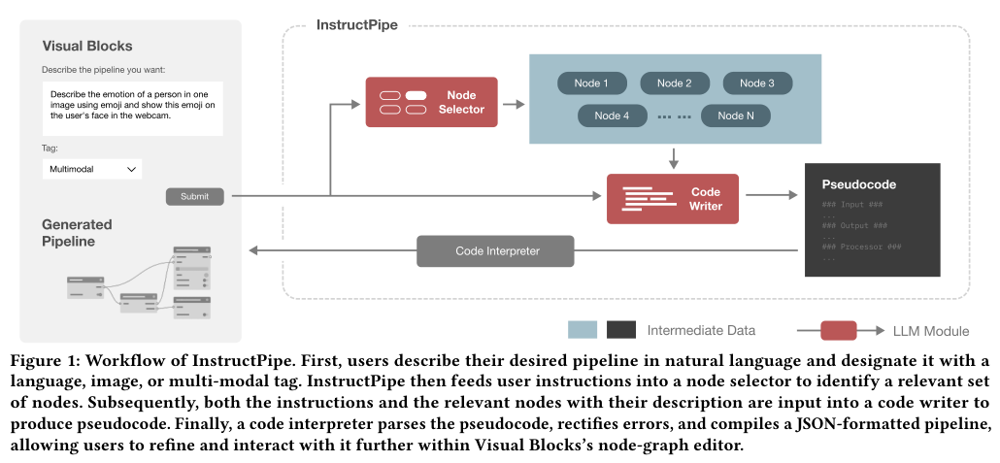

Leia o pedido à esquerda, o seletor, os candidatos, o escritor e o interpretador. Os módulos em vermelho usam LLMs; o interpretador é o componente que converte a representação para o editor. A instrução também chega ao escritor: a lista de nós, sozinha, não descreve a intenção completa. [Página original.](refs/3706598.3713905.pdf#page=1)

As setas representam etapas da construção do pipeline. Elas não são as mesmas conexões do programa final. **Pergunta:** qual componente decide candidatos, qual propõe relações e qual monta a representação do grafo?

### Figura 2 — interface e revisão humana · p. 4

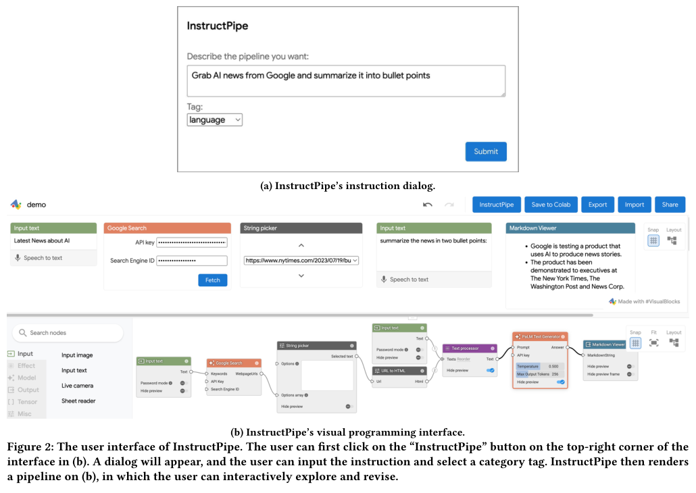

O painel (a) coleta a descrição e a categoria; (b) mostra o fluxo no ambiente editável. O sistema não entrega apenas uma resposta textual: devolve uma estrutura sobre a qual a pessoa pode agir. [Página original.](refs/3706598.3713905.pdf#page=4)

**O que observar:** o usuário sai de um pedido compacto para vários elementos distribuídos na tela. Essa transição é relevante para compreensão, mas a imagem, por si só, não demonstra que a pessoa entendeu o fluxo.

### Figura 3 — tipos de dados dos processadores · p. 4

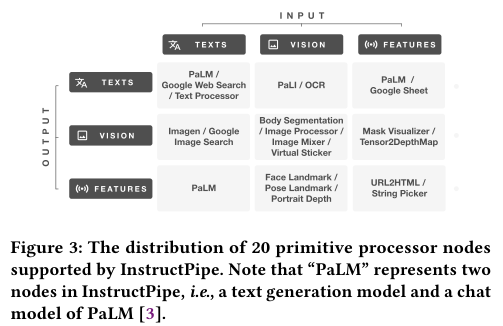

As colunas representam categorias de entrada e as linhas categorias de saída: texto, visão e `features`. Localize OCR na combinação entrada visual → saída textual. `Features` agrega representações intermediárias variadas, não apenas vetores numéricos. [Explicação nas pp. 4–5.](refs/3706598.3713905.pdf#page=4)

É um mapa de funções da biblioteca, não matriz de confusão ou resultado experimental. Os 20 processadores não são os 27 nós totais: faltam entradas e saídas. A legenda informa que PaLM representa dois nós.

### Figura 4 — um grafo e sua representação textual · p. 5

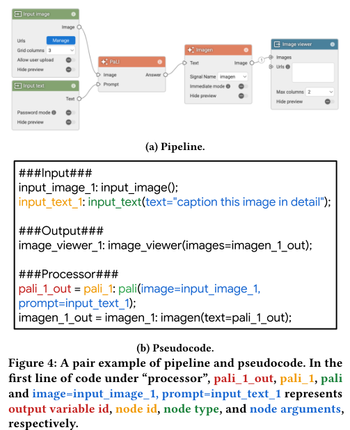

No painel (a), imagem e instrução entram em PaLI; o texto produzido alimenta Imagen e a imagem resultante segue para exibição. Em (b), IDs e argumentos representam essas relações. As cores destacam saída, ID, tipo e argumentos. [Página original.](refs/3706598.3713905.pdf#page=5)

A seção `Output` aparece antes de `Processor` no exemplo textual. Portanto, **ordem das categorias no papel não deve ser confundida com a ordem de execução do processamento**: as referências entre nós descrevem dependências. O artigo não detalha integralmente como resolve todas as referências adiantadas em sua implementação.

**Para sua DSL:** uma representação compacta pode descrever o mesmo comportamento que um diagrama, mas a legibilidade para o usuário deve ser avaliada separadamente.

### Figura 5 — prompt do seletor · p. 6

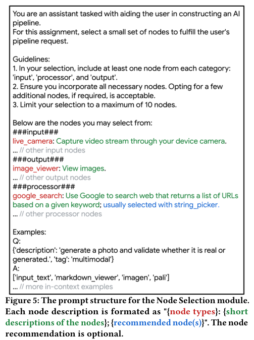

Mostra tarefa, diretrizes, descrições curtas e exemplos. Algumas descrições recomendam componentes que normalmente trabalham juntos. Uma diretriz pede limitar a seleção a dez nós. Isso descreve a orientação do seletor, não uma demonstração formal de que toda execução obedece ao limite. [Página original.](refs/3706598.3713905.pdf#page=6)

Esse texto é um **artefato do sistema estudado**, não uma instrução para quem lê o guia. A saída esperada dessa etapa é uma seleção de tipos, ainda sem todas as conexões.

### Figura 6 — prompt do escritor · p. 6

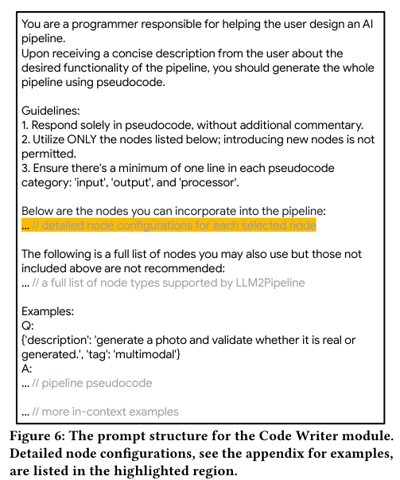

O escritor recebe uma documentação mais detalhada, orientações de formato, lista de nós suportados e exemplos. A região destacada varia conforme a seleção anterior. Há uma lista completa complementar porque os exemplos podem mencionar nós fora da seleção reduzida. [Artigo, pp. 6–7.](refs/3706598.3713905.pdf#page=6)

**Limite:** instruir o modelo a usar apenas nós existentes não elimina invenções; a seção 4.3 descreve uma verificação que descarta linhas com nós inexistentes. Não interpretar o prompt como garantia de correção.

### Figura 7 — fluxo do estudo com usuários · p. 8

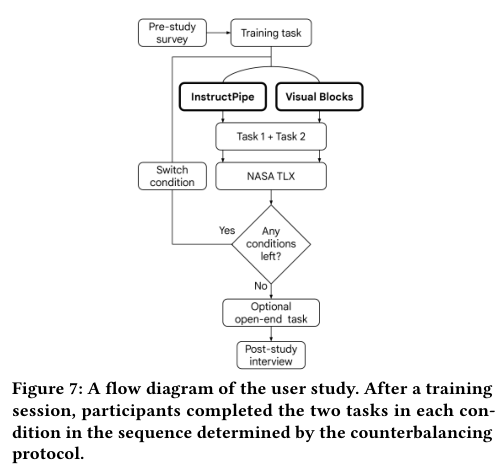

O participante recebe treinamento, realiza as duas tarefas em uma condição, responde ao instrumento de carga e repete na outra condição conforme a ordem planejada. Depois há entrevista e, quando possível, atividade aberta. [Página original.](refs/3706598.3713905.pdf#page=8)

Esse é um diagrama do **protocolo experimental**, não um pipeline de IA. Cada pessoa passa pelas duas condições; não são dois grupos independentes de oito pessoas.

### Figura 8 — carga percebida nas seis dimensões · p. 10

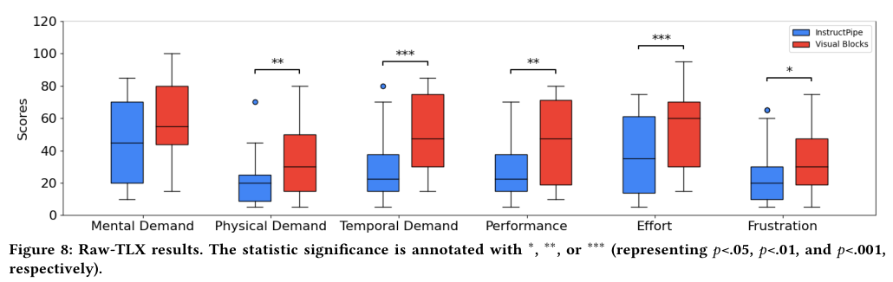

Azul representa InstructPipe; vermelho, Visual Blocks sem o assistente. O eixo horizontal apresenta demanda mental, física, temporal, desempenho percebido, esforço e frustração. O vertical mostra escores. A caixa resume dispersão e a linha interna marca a mediana; o guia não estima números exatos apenas pelo desenho. [Página original.](refs/3706598.3713905.pdf#page=10)

As anotações são: demanda física `**`, temporal `***`, desempenho `**`, esforço `***` e frustração `*`. Demanda mental não recebe indicação de diferença significativa. A legenda associa um, dois e três asteriscos a `p < 0,05`, `p < 0,01` e `p < 0,001`.

**Leitura central:** nas condições estudadas, o assistente não apresentou redução estatisticamente significativa de demanda mental. Isso não prova que os sistemas são equivalentes nessa dimensão. Também não se deve ler `Performance` como acurácia do modelo; é uma resposta subjetiva sobre desempenho na tarefa, cuja direção o artigo interpreta como menor carga.

### Figura 9 — o pedido altera a estrutura gerada · p. 12

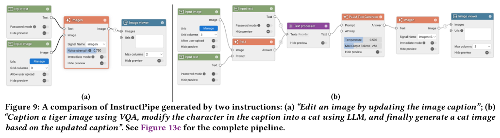

O pedido genérico de editar uma imagem pela legenda produz uma estrutura diferente daquela obtida com a descrição das etapas: descrever um tigre, modificar o personagem para gato e gerar a nova imagem. A segunda estrutura fica mais próxima do objetivo, mas ainda exige ajuste. [Seção 7.3 e figura.](refs/3706598.3713905.pdf#page=12)

Não é prova de que prompts longos são sempre melhores. É um caso de ambiguidade, decomposição da tarefa e relação entre intenção e programa. Compare com a Figura 13c para ver o fluxo completo de referência.

### Figura 10 — documentação estruturada dos nós · p. 16

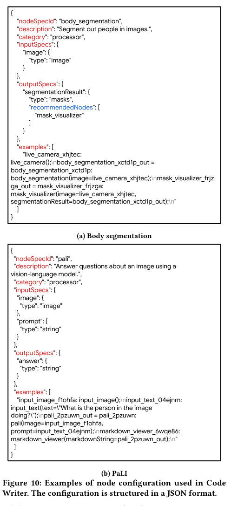

Dois exemplos mostram identificador do tipo, descrição, categoria, especificações de entrada/saída e exemplos. Segmentação recebe imagem e produz máscaras; PaLI recebe imagem e texto e produz uma resposta textual. [Apêndice B.1.2.](refs/3706598.3713905.pdf#page=16)

Isso é documentação de **tipos de componentes** fornecida ao escritor. Não confunda esse JSON com o JSON de um pipeline já instanciado. A distinção ajuda a separar “o que um bloco permite” de “como este bloco foi conectado neste programa”.

### Figura 11 — antes e depois do layout · p. 18

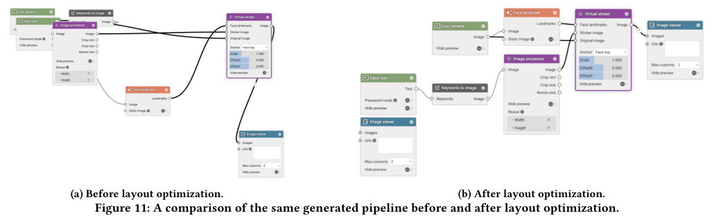

É a figura mais diretamente relacionada ao seu interesse espacial. Os painéis apresentam o mesmo fluxo antes e depois da reorganização. No segundo, os componentes aparecem distribuídos de maneira mais regular; um visualizador isolado continua separado do fluxo principal. [Figura e seção 4.4.](refs/3706598.3713905.pdf#page=18)

**O que muda:** posição e apresentação das conexões. **O que a legenda mantém:** o pipeline gerado. A seção 4.4 informa uso de BFS na reorganização; não apresenta uma avaliação isolada que compare a compreensão dos dois layouts.

Você pode usar a figura para explicar uma distinção: **reorganizar o espaço não corrige automaticamente uma dependência errada ou uma operação ausente**. Para afirmar que o novo layout ajuda usuários, seria preciso medir uma tarefa, como localizar a origem de uma saída ou identificar um erro.

### Figura 12 — estrutura interna do grafo · p. 18

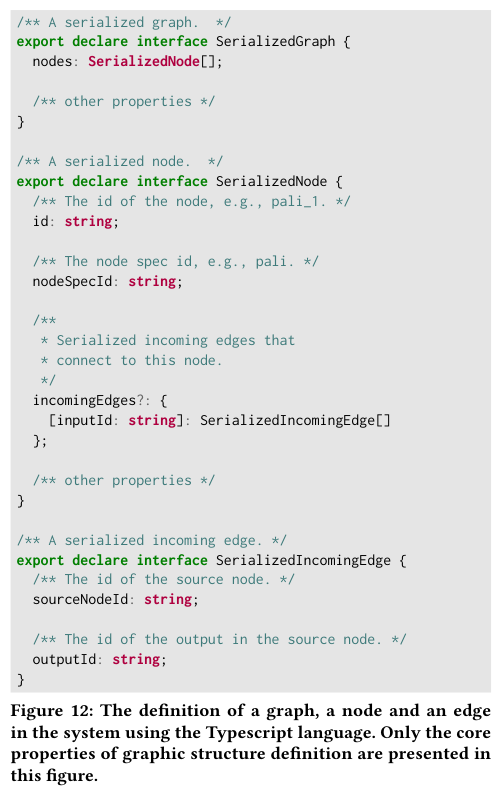

`SerializedGraph` contém nós. Cada `SerializedNode` tem um ID, o identificador de seu tipo e possíveis conexões de entrada. Uma `SerializedIncomingEdge` informa o nó de origem e a saída usada. [Apêndice B.2.](refs/3706598.3713905.pdf#page=18)

**Exemplo didático:** para conectar a saída textual de A à entrada de B, a descrição de B precisa apontar para A e para a porta de saída correta. As coordenadas visuais não substituem essas referências. A figura mostra apenas propriedades centrais, não o formato completo do sistema.

### Figura 13 — exemplos do workshop · p. 19

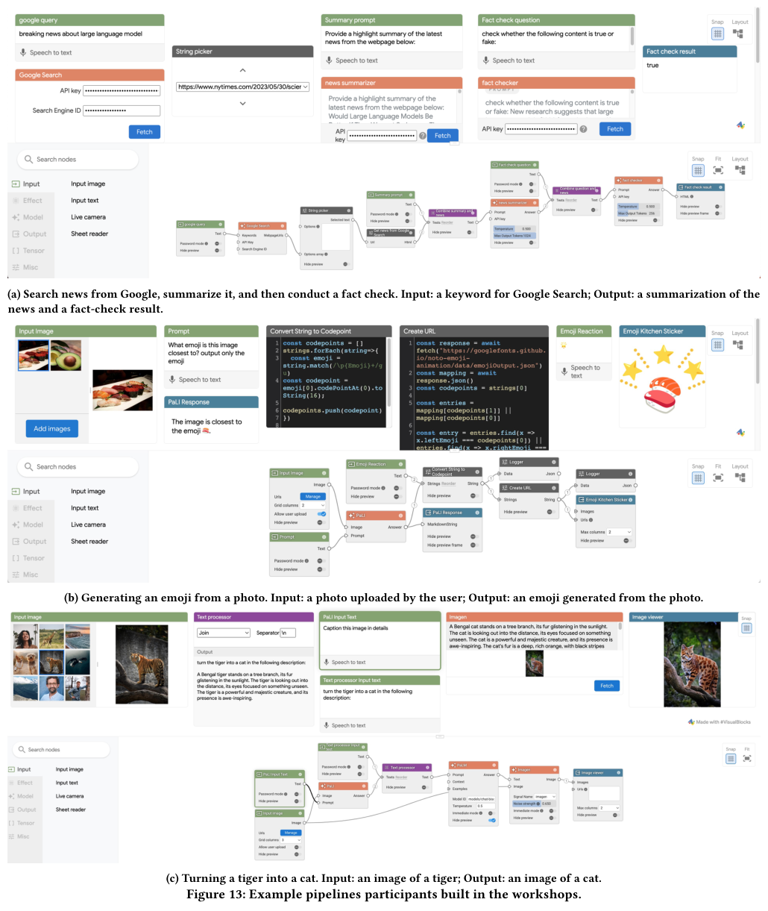

**(a)** busca notícias, resume e inclui uma etapa rotulada como checagem. **(b)** transforma uma foto em emoji com processamento que inclui código customizado. **(c)** usa descrição e geração para transformar uma imagem de tigre em gato. [Página original.](refs/3706598.3713905.pdf#page=19)

O painel (b) contém nó fora do catálogo de 27 e foi excluído do conjunto final da avaliação técnica. Logo, aparecer na figura do workshop não significa ter sido uma geração bem-sucedida do assistente. O nome “fact check” no painel (a) também não valida factualidade automaticamente: é preciso examinar como a operação verifica a informação.

### Figura 14 — tarefa de notícias · p. 21

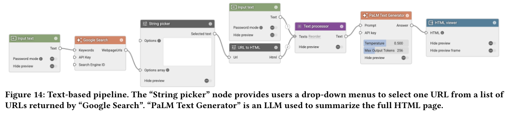

O fluxo distingue seleção de URL, obtenção de HTML, composição textual e geração do resumo. Tem oito nós e sete arestas, conforme a caracterização das tarefas. É um bom exercício para dizer o que cada conexão transporta. [Figura e D.2.](refs/3706598.3713905.pdf#page=21)

A razão técnica média de operações restantes para essa tarefa foi 27,8%, calculada com instruções dos autores na seleção das tarefas. Isso não é a medida de tempo dos participantes. Os erros discutidos envolvem omitir a leitura da página ou a geração de texto.

### Figura 15 — prova virtual de óculos · p. 21

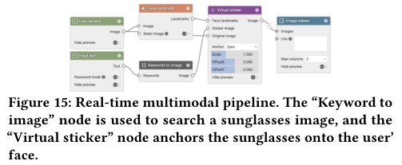

O fluxo combina câmera, detecção de pontos faciais, busca de imagem de óculos e sobreposição por adesivo virtual, exibindo o resultado. Tem seis nós e seis arestas. A razão técnica média de operações restantes foi 5,2%. [Figura e D.2.](refs/3706598.3713905.pdf#page=21)

Mesmo com a estrutura completa, usuários precisavam ajustar a busca pela imagem e trocar a âncora do adesivo de topo da face para olhos. Esse exemplo explica por que **zero edições estruturais não significa zero trabalho humano**. A métrica de tempo inclui aspectos que a contagem estrutural não captura.

## 7. As quatro tabelas explicadas

### Tabela 1 — razão de operações na avaliação técnica · p. 8

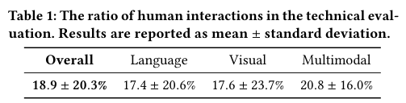

| Conjunto | Razão média restante | Desvio-padrão |
| --- | --- | --- |
| Geral | 18,9% | 20,3 pontos percentuais |
| Linguagem | 17,4% | 20,6 pontos percentuais |
| Visual | 17,6% | 23,7 pontos percentuais |
| Multimodal | 20,8% | 16,0 pontos percentuais |

Quanto menor a razão, menos operações estruturais estimadas faltam em relação a começar do zero. A média geral corresponde a uma redução complementar de `100 − 18,9 = 81,1%` nessa medida. [Tabela e seção 5.](refs/3706598.3713905.pdf#page=8)

**Não interpretar como:** 81,1% de redução no tempo, 81,1% de tarefas totalmente corretas ou 81,1% de redução em carga mental. O desvio-padrão expressa heterogeneidade, não margem de erro. Os subconjuntos têm tamanhos diferentes; não recalcule a média geral como média simples das três colunas nem infira diferença significativa entre modalidades sem teste reportado.

### Tabela 2 — medidas no estudo com pessoas · p. 9

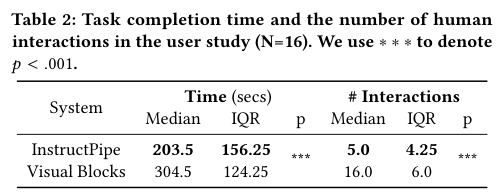

| Condição | Tempo: mediana | Tempo: IQR | Interações: mediana | Interações: IQR |
| --- | --- | --- | --- | --- |
| InstructPipe | 203,5 segundos | 156,25 segundos | 5,0 | 4,25 |
| Visual Blocks | 304,5 segundos | 124,25 segundos | 16,0 | 6,0 |

O artigo reporta `p < 0,001` nas duas medidas com o teste pareado de Wilcoxon. **Mediana não é média**. IQR é a distância entre o terceiro e o primeiro quartil; não é desvio-padrão nem intervalo de confiança. [Tabela e seção 6.5.1.](refs/3706598.3713905.pdf#page=9)

As diferenças entre as medianas são 101 segundos e 11 operações. Por cálculo descritivo, a mediana de tempo é cerca de 33,2% menor e a de operações cerca de 68,8% menor. **Essas razões entre medianas não são a redução individual média** e não substituem os dados pareados.

Os ganhos pertencem às duas tarefas, à amostra e ao protocolo com apoio. A tabela não permite atribuí-los exclusivamente à organização espacial.

### Tabela 3 — perfil dos 16 participantes · p. 21

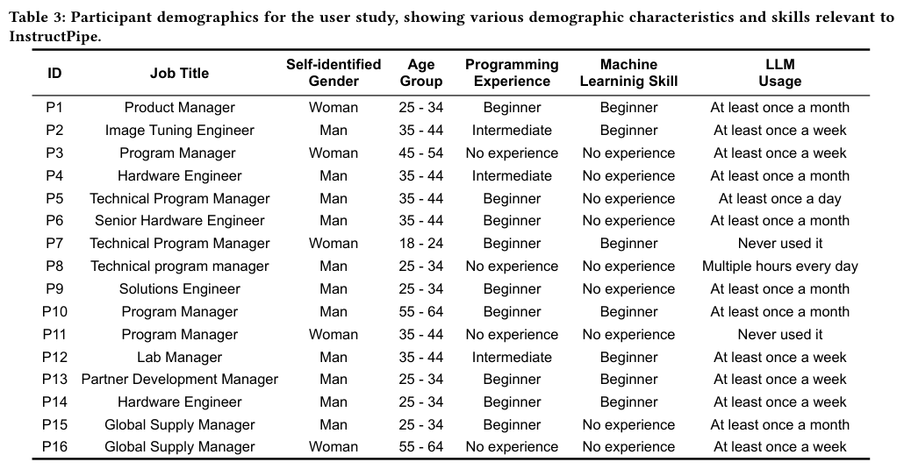

As colunas registram ocupação, gênero autoidentificado, faixa etária, experiência em programação/ML e frequência de uso de LLMs. A seleção exclui níveis superiores a intermediário em programação e ML. [Tabela e seção 6.3.](refs/3706598.3713905.pdf#page=21)

Uma contagem das linhas resulta em quatro sem experiência em programação, nove iniciantes e três intermediários; em ML, nove sem experiência e sete iniciantes. Duas pessoas nunca tinham usado LLMs. São contagens derivadas da tabela, úteis para não tratar “iniciante” como um perfil homogêneo.

A amostra vem de um cadastro interno de pesquisa de UX, e os participantes não estavam envolvidos no projeto. Isso não a torna representativa de toda a população de estudantes, crianças ou especialistas de domínio.

### Tabela 4 — ordem das condições e tarefas · p. 22

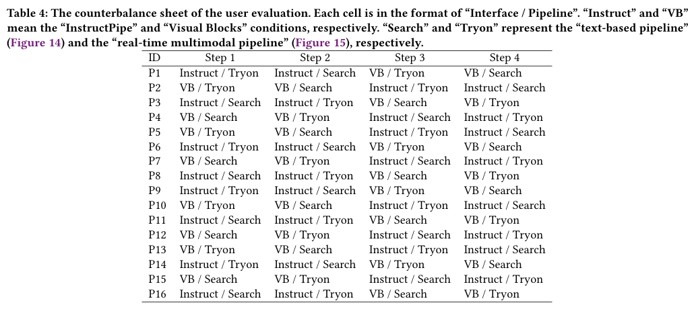

Cada célula combina interface e tarefa: `Instruct` ou `VB`, com `Search` ou `Tryon`. P1 começa com o assistente na tarefa de óculos, faz notícias e depois repete as tarefas sem o assistente; P2 começa sem o assistente. [Tabela e D.4.](refs/3706598.3713905.pdf#page=22)

Há quatro padrões de ordem, cada um aplicado a quatro pessoas. Todos realizam quatro combinações. O contrabalançamento procura distribuir efeitos de aprendizagem e ordem; não prova que eles desapareceram. A repetição da mesma tarefa em outra condição ainda merece atenção na interpretação.

## 8. O Algoritmo 1 explicado

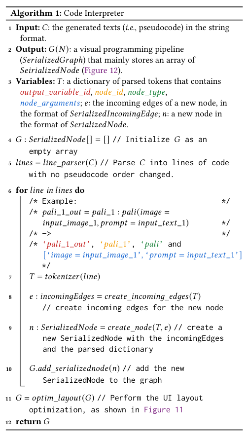

O algoritmo recebe o texto do pseudocódigo e devolve uma representação do pipeline. [Original, p. 17.](refs/3706598.3713905.pdf#page=17)

| Passo | Em palavras simples | Relação com sua DSL |
| --- | --- | --- |
| Inicializar `G` | Criar uma coleção vazia de nós. | O programa precisa de uma estrutura interna. |
| Separar linhas | Identificar declarações do texto gerado. | Reconhecer a sintaxe. |
| Extrair tokens | Identificar saída, ID, tipo e argumentos. | Distinguir nomes e papéis. |
| Criar arestas de entrada | Converter referências em dependências. | Preservar o significado das conexões. |
| Criar nó serializado | Registrar a instância e suas conexões. | Construir o modelo do fluxo. |
| Adicionar ao grafo | Acumular as operações declaradas. | Compor o programa completo. |
| Organizar layout | Reposicionar para apresentação na interface. | Separar estrutura lógica de disposição visual. |
| Retornar `G` | Entregar o grafo para o ambiente. | Permitir renderização e revisão. |

O algoritmo é um esboço de implementação. Ele não contém uma prova de correção semântica nem especifica todos os casos de erro. A existência de campos tipados na descrição dos nós não basta para afirmar que toda incompatibilidade é detectada ou que toda intenção é atendida.

## 9. Como interpretar métricas e resultados

### 9.1 A razão técnica, com um exemplo

```text
R = operações estruturais mínimas para completar o resultado gerado
    ----------------------------------------------------------------
    operações estruturais para construir a solução do zero
```

**Exemplo próprio:** uma solução exige seis nós e cinco conexões, totalizando onze adições. Se faltam um nó e duas conexões após a geração, são três operações: `R = 3/11 ≈ 27,3%`. Isso ignora parâmetros, leitura, diagnóstico e movimentação espacial dos blocos, conforme o recorte da métrica. [Artigo, seção 5.2 e C.2.](refs/3706598.3713905.pdf#page=20)

O artigo inspira a medida em distância de edição de grafos, mas aceita uma solução completa diferente da referência, desde que satisfaça a descrição. Logo, não é simplesmente uma comparação literal de nós contra um único desenho obrigatório.

**O custo de encontrar a correção importa:** saber que faltam três operações não informa quanto tempo um iniciante levará para descobrir quais são elas. Esse é um ponto para sua pergunta sobre compreender e corrigir.

### 9.2 Acerto completo versus menos operações

Sete pipelines ficaram completos em todas as seis tentativas; 38 ficaram completos em pelo menos uma. Esses números se referem aos 48 pipelines. `38/48 ≈ 79,2%` é a proporção com pelo menos um sucesso em seis tentativas, **não a taxa de sucesso por tentativa**. O artigo não permite obter essa última taxa apenas dessas duas contagens. [Artigo, seção 5.3, p. 8.](refs/3706598.3713905.pdf#page=8)

Uma geração pode exigir poucas edições sem estar integralmente correta. Esse é justamente o motivo para a métrica valorizar resultados parciais.

### 9.3 Tempo e operações medem aspectos diferentes

O tempo foi obtido por registros de início/fim das tarefas. A contagem mantém o recorte estrutural da seção 5.2; não deve ser descrita como todos os cliques, teclas ou ações. A seção 6.4.2 não esclarece completamente como operações redundantes foram tratadas no número reportado com usuários. Sem registros brutos, não convém inventar essa operacionalização. [Artigo, seção 6.4, p. 9.](refs/3706598.3713905.pdf#page=9)

O exemplo dos óculos mostra a diferença: o grafo pode estar completo, mas a pessoa ainda precisa escolher uma imagem adequada e mudar a âncora. Essas ações consomem tempo mesmo fora do cálculo estrutural.

### 9.4 O que é Raw-TLX?

É um instrumento de **percepção de carga**, não medição direta da atividade cerebral nem prova de aprendizagem. A família NASA-TLX considera seis dimensões: demanda mental, física e temporal, desempenho próprio, esforço e frustração. O artigo aplica Raw-TLX e mostra as subescalas separadamente. [NASA — TLX](https://www.nasa.gov/human-systems-integration-division/nasa-task-load-index-tlx/) · [Artigo, seção 6.4.3.](refs/3706598.3713905.pdf#page=9)

Não calcule uma “nota global” do artigo a partir de alturas estimadas dos boxplots. Em `Performance`, confira a direção dos rótulos: percepção de sucesso/fracasso não pode ser lida automaticamente como “mais é melhor” só pelo nome.

### 9.5 O que significa o teste de Wilcoxon?

O estudo compara condições realizadas pelas mesmas pessoas e reporta um teste de postos com sinais de Wilcoxon. Esse tipo de análise usa as diferenças pareadas e seus postos. [NIST — Signed Rank Test.](https://www.itl.nist.gov/div898/software/dataplot/refman1/auxillar/signrank.htm)

`p < 0,001` não significa “99,9% de chance de o sistema ser melhor” nem informa sozinho o tamanho prático do efeito. Na demanda mental, ausência de significância não demonstra igualdade. O guia relata os testes dos autores; não recalculou estatísticas sem os dados individuais.

## 10. O rumo para sua DSL visual

### 10.1 Formulação do rumo

> **Investigar como uma DSL visual pode representar um fluxo de IA gerado a partir da intenção do usuário, de modo que ele consiga compreender suas etapas, identificar erros e completar a solução.**

Essa é uma **formulação proposta para discussão**, apoiada nos problemas observados nas seções 6.5.5 e 7.2. Não é uma afirmação de novidade nem conclusão sobre a sua ferramenta. [Artigo, pp. 10–11.](refs/3706598.3713905.pdf#page=11)

### 10.2 Onde entra a organização espacial?

Ela pode ser uma parte da solução: agrupar etapas, alinhar dependências, tornar visíveis entradas/saídas e manter a posição dos blocos durante correções. Porém, uma interface bem distribuída não informa, por si só, o significado de uma porta ou a ausência de uma operação.

| Evidência do artigo | Pergunta possível para sua DSL | O que precisaria ser avaliado |
| --- | --- | --- |
| Pessoas param para interpretar a geração — seção 6.5.5. | Uma apresentação por etapas ajuda a compreender o fluxo? | Explicação correta e localização de dependências. |
| Depurar é difícil para iniciantes — seção 7.2.3. | Destacar incompatibilidades ajuda a corrigir erros? | Diagnóstico e correção correta, não apenas cliques. |
| Alternar texto e diagrama pode exigir esforço — seção 7.2.2. | Relacionar trechos do pedido aos blocos ajuda? | Identificar qual parte da intenção cada etapa realiza. |
| O layout é reorganizado automaticamente — Figura 11. | Agrupar por subobjetivo ajuda mais que apenas alinhar? | Comparação controlada mantendo nós e conexões. |
| Estrutura pronta ainda exige configuração — D.2. | Marcar parâmetros pendentes facilita completar o fluxo? | Conclusão funcional e erros de configuração. |

As perguntas e os recursos sugeridos são **propostas do guia**. O artigo não avaliou essas soluções isoladamente.

### 10.3 Um recorte viável para começar

**Pergunta candidata:** “Como o agrupamento de blocos por subobjetivo e a indicação de entradas/saídas afetam a compreensão e a correção de workflows de IA gerados automaticamente por estudantes iniciantes?”

Para começar com um experimento mais interpretável, escolha **uma mudança por vez**: por exemplo, comparar layout alinhado com layout agrupado por subobjetivo, mantendo os mesmos rótulos, nós, conexões, dados e erros. Se alterar layout e rótulos juntos, o resultado avaliará o conjunto, sem identificar qual recurso explica o efeito.

Tarefas possíveis: explicar o caminho de uma entrada, localizar um nó ausente, corrigir uma conexão e justificar se o fluxo atende ao pedido. Medidas: acertos de compreensão, correções corretas, tempo, ajuda necessária e carga percebida. O número de edições pode complementar essas medidas, mas não representar compreensão sozinho.

Essa proposta de experimento é didática. Público, tamanho de amostra, protocolo e novidade devem ser definidos após pesquisa de literatura e discussão com o orientador.

### 10.4 Como citar o rumo sem exagerar

Paráfrase sugerida, a adaptar e citar pelo artigo original:

> Zhou et al. (2025) investigam a geração de pipelines visuais a partir de instruções em linguagem natural. Embora a assistência tenha reduzido tempo e operações nas tarefas avaliadas, não foi observada redução estatisticamente significativa da demanda mental. Os relatos discutidos pelos autores apontam dificuldades na formulação de instruções, interpretação dos fluxos e depuração, motivando investigar formas de apoiar a compreensão e a revisão das estruturas geradas.

[Base: seções 6.5.1, 6.5.5 e 7.2.](refs/3706598.3713905.pdf#page=9) A motivação para **seu** estudo decorre desses resultados; a eficácia de uma nova representação espacial ainda precisa ser demonstrada.

## 11. Limites, dúvidas e inconsistências

### 11.1 O que não concluir

| Afirmação forte demais | Leitura sustentada |
| --- | --- |
| “A IA entendeu integralmente a intenção.” | Gerou uma estrutura que pode precisar de correções e configuração. |
| “O layout BFS reduziu o esforço mental.” | O layout faz parte do sistema; seu efeito não foi isolado e demanda mental não teve redução significativa. |
| “O sistema é cinco vezes mais rápido.” | A razão técnica restante foi 18,9% de operações estruturais estimadas; tempo tem outro resultado. |
| “Qualquer iniciante consegue usar sem ajuda.” | Houve treinamento e apoio durante o estudo com 16 pessoas. |
| “Menos operações prova maior compreensão.” | Montagem, interpretação e diagnóstico exigem medidas diferentes. |
| “A biblioteca representa qualquer aplicação de IA.” | O protótipo cobre 27 tipos de nós e exclui tarefas fora desse catálogo. |
| “Uso educacional foi validado com crianças.” | A possibilidade aparece em relatos, não em um estudo com crianças. |

Os autores também reconhecem necessidade de estudos prolongados e avaliação específica dos componentes. [Artigo, seção 8.](refs/3706598.3713905.pdf#page=12)

### 11.2 Assistência e seleção das tarefas

Pesquisadores deram mais pistas na condição sem o assistente para permitir a conclusão por iniciantes. Essa ajuda faz parte do contexto observado. Não é possível calcular seu efeito separadamente com os resultados agregados apresentados. [Artigo, seção 6.2 e D.3.](refs/3706598.3713905.pdf#page=20)

As duas tarefas foram escolhidas levando em conta desempenho e diversidade do sistema, com piloto. A condição de óculos era mais favorável à geração estrutural que a de notícias. Isso permite observar comportamentos diferentes, mas não equivale a amostrar aleatoriamente toda a classe de workflows.

### 11.3 Questões editoriais e de interpretação

- **D.2, p. 20:** há menção à Figura 15 também para o pipeline textual. Pelas imagens e legendas da p. 21, notícias é **Figura 14** e óculos é **Figura 15**. O guia segue as figuras.
- **Seção 5.1, p. 7:** declara 23 participantes no workshop, mas a lista de ocupações explicitadas soma 20. Não deduzimos as ocupações das três pessoas restantes.
- **Geração de parâmetros:** a exclusão geral convive com a exceção explícita de texto em `input_text`, descrita na p. 6.
- **Algoritmo e ordem:** o exemplo textual apresenta saídas antes de processadores; o pseudocódigo do interpretador é resumido. Não assumimos detalhes de resolução de referências ou execução não documentados.
- **Métrica em usuários:** o texto remete à definição estrutural, mas não explica completamente a contabilização de tentativas redundantes. Não a tratamos como total de ações físicas.
- **Dados históricos:** o estudo cita GPT-3.5-turbo e nós de serviços da época. Essas escolhas não demonstram o desempenho dos modelos atuais.

### 11.4 Dúvidas comuns

**“Pseudocódigo e JSON são a mesma coisa?”** Não. O pseudocódigo é a forma compacta gerada pelo módulo; JSON é a forma serializada produzida para o editor. O significado depende dos tipos de nós, portas e regras do sistema. [Seção 4.1.](refs/3706598.3713905.pdf#page=5)

**“O interpretador executa a IA?”** Nesta arquitetura, sua responsabilidade descrita é converter a especificação para o grafo e apresentá-lo no Visual Blocks. Não confunda essa etapa de construção com executar os modelos do pipeline. [Seção 4.4.](refs/3706598.3713905.pdf#page=7)

**“DAG impede vídeo ao vivo?”** Um DAG descreve as dependências dos nós, não obriga que a entrada seja um único valor estático. A tarefa de câmera ilustra processamento em tempo real sem exigir um ciclo desenhado no grafo. [Figuras 14–15 e D.2.](refs/3706598.3713905.pdf#page=21)

**“Devo criar outro gerador de fluxos?”** Não necessariamente. Uma interpretação possível para sua pesquisa é investigar a representação e revisão do fluxo já gerado. O artigo ajuda a motivar essa escolha; não determina que você precise implementar todos os módulos de um novo InstructPipe.

**“O arquivo suplementar foi executado?”** Não. O guia usa o PDF fornecido, suas figuras e apêndices. Não instalou o protótipo, não chamou modelos e não reproduziu os experimentos.

## 12. Exercícios, roteiro e fichamento

### 12.1 Exercícios

1. Explique a diferença entre Visual Blocks e InstructPipe.
2. Na Figura 1, diga o papel de cada um dos três módulos.
3. Leia a linha de PaLI na Figura 4 e identifique ID, tipo, entradas e saída.
4. Na Figura 14, explique por que uma URL não substitui o conteúdo de uma página.
5. Um fluxo exige dez operações para ser construído do zero e duas para completar a geração. Qual a razão restante? O que ela não mede?
6. Por que 18,9% não é uma taxa de acerto completo?
7. Explique o que permanece igual e o que muda na Figura 11.
8. Diferencie média, mediana, desvio-padrão e IQR nas Tabelas 1–2.
9. O que se pode concluir sobre demanda mental na Figura 8?
10. Descreva uma tarefa para testar compreensão de um fluxo sem confundi-la com rapidez de montagem.
11. Explique por que o estudo técnico e o estudo com usuários respondem perguntas diferentes.
12. Formule uma frase sobre sua DSL que conecte intenção, representação, correção e evidência.

**Respostas-chave:** na 5, `2/10 = 20%`; não mede diretamente tempo, carga mental, configurações ou esforço para descobrir a correção. Na 6, a medida avalia operações restantes e aceita gerações parciais. Na 7, a estrutura é a mesma e a disposição muda. Na 9, não houve redução estatisticamente significativa de demanda mental no protocolo; isso não prova equivalência. Na 11, o teste técnico estima distância estrutural até uma solução, enquanto o estudo com pessoas observa execução de tarefas e experiência sob condições controladas.

### 12.2 Roteiro para apresentar ao orientador

1. **Problema:** a pessoa conhece o objetivo, mas pode não saber escolher e conectar os blocos.
2. **Proposta:** explicar a Figura 1 e a colaboração entre geração e revisão humana.
3. **Linguagem:** usar a Figura 4 para explicar como dependências aparecem no pseudocódigo.
4. **Espaço visual:** apresentar a Figura 11, distinguindo estrutura e layout.
5. **Resultados:** separar Tabela 1, Tabela 2 e Figura 8.
6. **Ponto central:** menos operações e tempo não eliminaram a demanda mental.
7. **Seu rumo:** investigar como apoiar compreensão, correção e conclusão, com um recorte visual específico.
8. **Limites:** duas tarefas, 16 participantes, ajuda dos pesquisadores, biblioteca restrita e ausência de avaliação isolada de layout.

### 12.3 Fichamento iniciado

| Campo | Registro |
| --- | --- |
| Problema | Dificuldade de iniciar e estruturar pipelines em um editor visual. |
| Proposta | Transformar instruções em um grafo editável com assistência de LLMs. |
| Arquitetura | Node Selector → Code Writer → Code Interpreter. |
| Domínio implementado | Biblioteca de 27 nós de pipelines de ML. |
| Avaliação técnica | 48 pipelines, duas descrições e três gerações por descrição. |
| Avaliação com usuários | 16 participantes, duas tarefas em duas condições, com contrabalançamento. |
| Resultado técnico central | Razão média de operações restantes de 18,9%, DP de 20,3 pontos percentuais. |
| Resultado humano importante | Menor tempo e número de operações; redução significativa em cinco subescalas, não em demanda mental. |
| Figura central para espacialidade | Figura 11, antes/depois do layout. |
| Evidência para compreender/corrigir | Relatos das seções 6.5.5 e 7.2 sobre percepção e depuração. |
| Limite principal para sua hipótese | O efeito da organização espacial não foi isolado. |
| Próximo passo | Escolher uma mudança visual, uma tarefa de compreensão/correção e uma comparação que permita avaliá-la. |

**Você entendeu o essencial quando consegue explicar por que um fluxo quase pronto pode economizar operações e, ao mesmo tempo, continuar difícil de compreender e corrigir. Esse é o ponto de partida para o rumo escolhido.**
