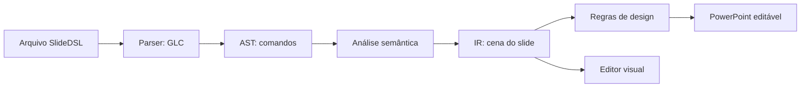

# SlideDSL
Compila português controlado para PowerPoint editável, com Lark LALR, AST/IR
Pydantic, geometria determinística, dez regras de design, editor React Flow,
adaptadores Ollama/OpenAI e benchmark com ablação. Projeto novo; código, asset e
deck escritos para a especificação de 8 de outubro de 2026, sem usar protótipos.

## Como o projeto funciona

O formulário principal usa **planejamento visual em duas chamadas locais**:
a SLM escolhe mensagens/representações e escreve o conteúdo; o compilador resolve
capa, diagramas, comparação, cards, etapas e conclusão com objetos editáveis.
Estilo é opcional; imagens automáticas escolhem o provedor quando habilitadas.
Veja [diagnóstico, capturas antes/depois e resultados reais](docs/EVOLUCAO_PLANEJAMENTO_VISUAL.md).

O fluxo visual/contextual acrescenta seis layouts com imagens, busca opcional em
APIs oficiais, referências TXT/MD/PDF locais e correção que preserva edições.
O formulário simples continua disponível; abra as opções de contexto quando
precisar de público, objetivo, fontes ou imagens. Veja
[arquitetura, uso, experimentos e limites atuais](docs/EVOLUCAO_VISUAL_CONTEXTUAL.md).

A evolução local acrescenta **planejamento sem coordenadas, IDs automáticos e
três layouts**, com reparos por campo. O editor agora permite escolher o modelo
Ollama, escrever um pedido e acompanhar a geração. Abra com
`.\.venv\Scripts\slidedsl.exe serve` e use **Gerar com IA local**.
Veja [execução, arquitetura e comparação A/B/C/D](docs/EVOLUCAO_SLM.md).
O editor também identifica requisitos, verifica a cena e permite correções com
controle de progresso. Há cards, sequências e fluxos determinísticos. Veja
[confiabilidade, novos comandos e resultados reais](docs/EVOLUCAO_CONFIABILIDADE.md).
Os modos e resultados históricos continuam disponíveis abaixo.

Atalho Windows: `powershell -NoProfile -ExecutionPolicy Bypass -File scripts/open_slm_editor_windows.ps1`.

A SlideDSL descreve apresentações por comandos em português controlado: cada
comando tem palavras e ordem definidas pela linguagem. Você pode escrever um
arquivo `.sld` ou pedir a um modelo local que produza esse código a partir de um
pedido em linguagem natural.



| Etapa | O que faz |
| --- | --- |
| Parser Lark/LALR | Confere a sintaxe pela GLC e identifica erros com linha e coluna. |
| AST (árvore de sintaxe abstrata) | Representa os comandos, seus argumentos e posições no código. |
| Análise semântica | Verifica IDs e referências, executa operações e resolve posições relativas e tokens do tema. |
| IR (representação intermediária) | Guarda a cena resultante: slides, textos, formas, imagens, coordenadas, grupos e camadas. |
| Regras de design | Avaliam a IR e emitem diagnósticos sobre limites, contraste, sobreposição e outros problemas geométricos. |
| Compilador PptxGenJS | Converte a IR validada em um `.pptx` com objetos editáveis. |
| Editor React Flow/FastAPI | Permite importar o código, visualizar e modificar a cena, revalidar e exportar DSL ou PPTX. |

Nos modos históricos A/B, o SLM gera um slide por solicitação, em código SlideDSL ou JSON com schema
restrito. O JSON é convertido deterministicamente em SlideDSL; os dois modos
passam pelo parser e pela análise semântica descritos acima. Se a validação falhar,
o modelo recebe os diagnósticos e pode tentar corrigir até duas vezes. Prompts,
respostas e erros ficam registrados em `outputs/`.

## Como é a GLC

**Onde encontrar o código da GLC:** abra
[src/slidedsl/grammar/slidedsl.lark](src/slidedsl/grammar/slidedsl.lark).
Esse arquivo contém a gramática completa que o sistema executa. A função
`grammar_parser()` em [src/slidedsl/parser.py](src/slidedsl/parser.py) carrega essa
gramática com Lark/LALR; o mesmo módulo transforma os comandos analisados em AST.
Para acompanhar as regras com explicações, consulte
[docs/GRAMATICA.md](docs/GRAMATICA.md).

A **gramática livre de contexto (GLC)** define quais sequências de símbolos
formam um programa SlideDSL. Cada produção tem um não terminal à esquerda e
uma sequência de símbolos à direita. Por exemplo, uma apresentação contém um
nome, um tema e um ou mais slides; cada slide contém um ou mais comandos.

Estas são produções do arquivo usado pelo parser,
[slidedsl.lark](src/slidedsl/grammar/slidedsl.lark):

```lark
start: apresentacao
apresentacao: "apresentacao" STRING "{" tema slide+ "}"
tema: "tema" TEMA
slide: "slide" INT "{" instrucao+ "}"

adicionar_retangulo: "adicionar" "retangulo" "id" ID "em" posicao "tamanho" dimensao "cor" cor papel?
adicionar_texto: "adicionar" "texto" "id" ID STRING "em" posicao "tamanho" dimensao "fonte" fonte "cor" cor papel? familia?

?posicao: ponto
        | "canto" "superior" "direito" -> canto_superior_direito
        | "abaixo" "de" ID "com" "margem" NUMERO -> abaixo_de
        | "a" "direita" "de" ID "com" "margem" NUMERO -> a_direita_de
ponto: "(" NUMERO "," NUMERO ")"
dimensao: "(" NUMERO "," NUMERO ")"
```

O trecho é um recorte; as alternativas de `instrucao` e os demais símbolos estão
na gramática completa. `+` significa uma ou mais ocorrências, `?` indica um trecho
opcional e `|` separa alternativas. Palavras entre aspas são terminais literais.
`STRING` é um texto entre aspas, `ID` é um identificador, `INT` é um inteiro e
`NUMERO` admite números decimais. As setas nomeiam alternativas para construir a
AST. Espaços e quebras de linha são ignorados; comandos não usam ponto e vírgula.

A linguagem também aceita elipses, imagens, movimentos, redimensionamento,
alinhamento, agrupamento, distribuição e alterações de camada. A sintaxe não
determina se um ID referenciado existe ou se um elemento cabe no slide: essas
verificações pertencem à semântica e às regras de design. Um erro de sintaxe gera
`P001`; o catálogo de comandos está em [GRAMATICA.md](docs/GRAMATICA.md).

## Exemplo completo

Este exemplo didático está em [examples/introducao.sld](examples/introducao.sld).
Ele cria um slide com título, texto e um retângulo decorativo:

```slidedsl
apresentacao "Minha primeira apresentação" {
  tema claro
  slide 1 {
    adicionar texto id titulo "Conheça a SlideDSL" em (80, 64) tamanho (1120, 100) fonte titulo cor texto papel titulo
    adicionar texto id corpo "Código controlado vira slides editáveis." em abaixo de titulo com margem 24 tamanho (1120, 100) fonte corpo cor texto papel corpo
    adicionar retangulo id faixa em (80, 340) tamanho (1120, 48) cor primaria papel decoracao
  }
}
```

O sistema usa uma área lógica de **1280 × 720**, com origem no canto superior
esquerdo. `em (80, 64)` define `(x, y)`; `tamanho (1120, 100)` define largura e
altura. O corpo fica 24 unidades abaixo do título: sua posição calculada é
`(80, 188)`, pois `64 + 100 + 24 = 188`. A AST preserva o comando relativo, enquanto
a IR guarda as coordenadas resolvidas e a relação entre os elementos.

`id titulo` identifica o objeto; `fonte titulo` escolhe o tamanho do tema e
`papel titulo` declara sua função no slide. No tema claro, `fonte titulo` vale 42,
`fonte corpo` vale 24 e `cor primaria` vale `#2563EB`, conforme
[themes.yaml](config/themes.yaml). As palavras dos comandos são escritas sem
acentos; os textos entre aspas podem conter acentos.

Depois do setup descrito abaixo, execute na pasta do projeto:

```powershell
.\.venv\Scripts\slidedsl.exe validate examples/introducao.sld --strict --json outputs/readme/validation.json
.\.venv\Scripts\slidedsl.exe ast examples/introducao.sld --out outputs/readme/ast.json
.\.venv\Scripts\slidedsl.exe ir examples/introducao.sld --out outputs/readme/ir.json
.\.venv\Scripts\slidedsl.exe compile examples/introducao.sld --strict --out outputs/readme/introducao.pptx
.\.venv\Scripts\slidedsl.exe inspect outputs/readme/introducao.pptx
```

Exemplo executado: validação estrita aprovada sem diagnósticos, AST e IR salvas,
PPTX gerado com um slide, dois textos e uma forma editáveis. Os artefatos locais
ficam em `outputs/readme/`.

Para modificar o exemplo visualmente, inicie o servidor com o comando `serve`
abaixo, abra http://127.0.0.1:8000 e importe `examples/introducao.sld`. O editor
permite editar o resultado e exportá-lo novamente.

## Demonstração real com SLM local

Na pasta do projeto, gere conteúdo/elementos por `qwen3:4b-instruct`, valide,
exporte PowerPoint editável e abra a apresentação no editor:

```powershell
powershell -NoProfile -ExecutionPolicy Bypass -File scripts/demo_slm_windows.ps1 -Strict
```

O comando usa uma nova pasta em outputs, preserva as respostas reais e abre o
editor com a apresentação gerada. `-Mode direct` pede SlideDSL diretamente;
o padrão `json` usa schema restrito, converte em SlideDSL e passa pelo mesmo parser
e semântica. `-Request 'Seu pedido de cinco slides'` recebe linguagem natural.
Não usa a apresentação manual como substituta quando o modelo falha.
[Contrato, execução e limites](docs/SLM_LOCAL_FUNCIONAL.md).
[Diagnóstico das falhas anteriores](docs/DIAGNOSTICO_OLLAMA.md).
[Demonstração executada e comparação dos três modelos](docs/RESULTADOS_INCREMENTAIS.md).

Os scripts abaixo continuam disponíveis para o gabarito manual e testes offline.

## Executar no Windows

Requisitos: Python 3.12, Node/npm e Git. O setup prepara Node 24 portátil se o
runtime global for outro. Não altera a política global de PowerShell. Usar caminhos
entre aspas; não precisa ativar a venv. Dependências diretas e transitivas estão
fixadas em requirements-lock.txt e nos dois package-lock.json.

```powershell
Set-Location "caminho com espaços\code\slidedsl"
powershell -NoProfile -ExecutionPolicy Bypass -File scripts/setup_windows.ps1
powershell -NoProfile -ExecutionPolicy Bypass -File scripts/test_windows.ps1
powershell -NoProfile -ExecutionPolicy Bypass -File scripts/demo_windows.ps1
.\.venv\Scripts\slidedsl.exe serve --host 127.0.0.1 --port 8000
```

Abra http://127.0.0.1:8000 e importe examples/cinco_slides.sld. A demonstração manual
(`demo_windows.ps1`), o editor e os testes offline funcionam após instalar as
dependências, sem exigir PowerPoint, Ollama, Google ou Canva. A demonstração com
SLM (`demo_slm_windows.ps1`) exige Ollama e o modelo local; o download inicial do
modelo requer rede. Testes de UI usam Chrome instalado ou SLIDEDSL_BROWSER; sem
navegador, o setup baixa Chromium via Playwright.

Instalação manual: `python -m venv .venv`, `.venv\Scripts\python.exe -m pip install
-r requirements-lock.txt`, `pip install --no-deps -e .` usando o mesmo Python,
`npm ci --prefix renderer` e `npm ci --prefix editor` com Node 24. Depois `npm run
build --prefix editor`; o script test_windows executa build, lint e testes completos.

## CLI

```powershell
.\.venv\Scripts\slidedsl.exe validate examples/cinco_slides.sld --json outputs/validation.json
.\.venv\Scripts\slidedsl.exe validate examples/cinco_slides.sld --strict
.\.venv\Scripts\slidedsl.exe ast examples/cinco_slides.sld --out outputs/ast.json
.\.venv\Scripts\slidedsl.exe ir examples/cinco_slides.sld --out outputs/deck.json
.\.venv\Scripts\slidedsl.exe compile examples/cinco_slides.sld --out outputs/apresentacao.pptx
.\.venv\Scripts\slidedsl.exe inspect outputs/apresentacao.pptx
```

`validate`/`compile` retornam 1 para erros; strict também falha para avisos selecionados.
Slide 2 da demo mostra baixo contraste intencional (D002): validação básica aceita,
strict falha. Demais slides não têm erro fatal. Grupos, relações, eixos, distribuição,
tokens de tema e camadas v1.1 estão implementados e testados. IR→DSL conserva cena
e relações, não o histórico de operações removidas.

## Modelos e benchmark

```powershell
ollama pull qwen3:0.6b
ollama pull qwen3:4b
.\.venv\Scripts\slidedsl.exe generate --provider ollama --model qwen3:4b --prompt-file benchmark/prompts/tarefa_cinco_slides.txt --out outputs/modelo.sld --repair-max 2
.\.venv\Scripts\slidedsl.exe benchmark --models qwen3:0.6b,qwen3:4b,gpt-4.1-mini,gpt-4.1 --repetitions 5 --out outputs/novo_experimento
```

OpenAI requer OPENAI_API_KEY no ambiente e acesso aos modelos/cota; não é requisito
offline. As saídas do modelo são preservadas sem edição. Mock existe só para testar
infraestrutura. Ollama 0.40.1 e os dois Qwen3 foram instalados na máquina; o
[experimento real](docs/RESULTADOS_OLLAMA.md) concluiu cinco repetições por modelo,
com 0/5 programas válidos inicialmente e após os reparos. OpenAI continua pendente
de chave. Relatório atual: outputs/reports_ollama_20261008/; o relatório inicial de
indisponibilidade continua preservado. [Instalação e reprodução](docs/OLLAMA_LOCAL.md).
`benchmark --resume` retoma repetições completas verificando prompts, hashes e
parâmetros; nunca sobrescreve silenciosamente uma repetição incompleta.

## Arquivos e resultados

- [Apresentação real](outputs/apresentacao.pptx), [programa fonte](examples/cinco_slides.sld).
- [Resultados executados](docs/RESULTADOS.md), [progresso por fase](docs/PROGRESSO.md), [roadmap](ROADMAP.md).
- [Gramática](docs/GRAMATICA.md), [semântica](docs/SEMANTICA.md), [IR](docs/METAMODELO.md), [regras](docs/REGRAS_DESIGN.md).
- [Pesquisa e matriz](docs/PESQUISA_FERRAMENTAS.md), [Texpace](docs/ANALISE_TEXPACE.md), [editor](docs/EDITOR.md), [defesa](docs/DEFESA_PROFESSOR.md).

Artefatos gerados ficam em outputs/ e são ignorados pelo Git. Os caminhos output/
e reports/ também são aceitos por --out para compatibilidade com o contrato, mas
scripts entregues usam outputs/. O backend oficial é PptxGenJS, criando novo deck
da IR; Canva/Google têm pesquisa e desenho de adaptadores. Preview COM opcional:
`slidedsl render-preview outputs/apresentacao.pptx --out outputs/powerpoint_preview`.
Não foi executado: PowerPoint COM não está instalado. Preview do editor é aproximação
geométrica e não prova fidelidade de fontes no aplicativo PowerPoint.
