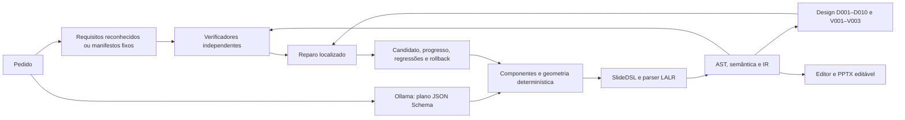

# Confiabilidade da geração local — 11/10/2026

Fontes registradas antes da documentação em [refs/FONTES.md](../refs/FONTES.md).
Snapshot solicitado: `c53bb4498a6aba2812e22014bd1cf66954abfd13`, enviado com sucesso
a `origin/dsl-visual` antes da implementação. Apenas arquivos apropriados da
SlideDSL foram incluídos; ambientes, resultados gerados e outros projetos ficaram
fora do commit. A gramática, AST/IR 1.1, editor e backend PptxGenJS foram preservados.

## Arquitetura



`requirements.py` define requisitos tipados e verificadores que inspecionam a cena
e os comandos. `reliability.py` implementa o fluxo de correção. O protocolo novo
é `reliability-v1`; o experimento é `reliability-paired-v1`. O protocolo A/B/C/D
anterior permanece acessível, e seus artefatos não foram modificados. Os layouts
e schemas atuais foram ampliados; reproduzir o código histórico exige os snapshots
registrados, em vez de presumir equivalência com a implementação atual.

O reconhecimento do pedido é determinístico e conservador: identifica número
de slides e padrões em português por seção `Slide 4` ou `quarto slide`; reconhece
formas, cores distintas, imagem local, camadas, grupos, colunas, rodapé e componentes.
Não interpreta arbitrariamente todo o português. A interface informa essa limitação;
um pedido sem padrões reconhecidos pode ter apenas quantidade e margens verificadas.
Não se afirma que esses dois critérios representam todos os requisitos do pedido.

Os requisitos são salvos **antes da chamada inicial**. No benchmark, o manifesto
declarado previamente substitui o reconhecedor; a SLM não recebe um campo em que
possa alterar a rubrica. Critérios têm IDs únicos, tipo, slide, mínimo, descrição
e parâmetros. A avaliação produz evidências e IDs de elementos, além de `R001`
com requisito e caminho do plano para cada pendência.

| Verificação | Evidência usada |
|---|---|
| Formas coloridas | Retângulos/elipses na IR, excluindo backgrounds; quantidade e cores resolvidas |
| Imagem local | Elemento image com `assets/imagem_demo.png` |
| Camadas | AST com back antes de front para a imagem; IR com z superior ao retângulo e interseção parcial |
| Grupos | Membros existentes, ao menos dois por grupo, separação de caixas de 64 px |
| Colunas/rodapé | Posição dos textos na IR |
| Conteúdo declarado | Proxy lexical sobre texto realmente emitido |
| Componentes | Painéis/textos e geometria emitida; fluxo exige setas entre nós |
| Pedido complexo | Os 17 verificadores históricos de `benchmark/rubric.yaml`, sem reduzir a rubrica |

Declarar uma imagem ou escrever “duas formas” no texto não atende a esses requisitos.
Fatos, clareza, qualidade didática e beleza continuam dependendo de revisão humana.

## Correção e preservação

O fluxo D novo tenta primeiro uma solução determinística autorizada por um requisito
ausente. Pode acrescentar formas, imagem local e operações back/front para a imagem
existente. Formas sem tipo especificado usam o padrão documentado retângulo;
cores usam tokens do tema e slots existentes. Não cria um elemento para resolver
uma referência inexistente quando o pedido não exige esse objeto.

Cada tentativa registra `before.json`, validação anterior, `candidate.json`,
validação do candidato, `after.json`, método, caminhos, decisão e motivo. O limite
padrão é dois, configurável de zero a dez, contando tentativas determinísticas e
com SLM. Uma tentativa que falha também consome orçamento.

O candidato deve reduzir bloqueios ou aumentar requisitos atendidos; não pode
introduzir novos bloqueios nem perder um requisito já atendido. Candidatos repetidos
ou iguais ao estado atual encerram o ciclo. Rejeitar um candidato determinístico
impede repeti-lo na rodada seguinte: D pode então tentar um patch da SLM. Sem
caminho seguro ou orçamento, encerra com pendências e preserva o estado anterior.

Patches da SLM usam o schema existente de `edits: [{path, value}]`; apenas caminhos
diagnosticados são autorizados. Arrays de decorações ausentes admitem acréscimos,
preservando os objetos anteriores. Reparos de colunas não podem substituir textos
e cabeçalhos anteriores; relações válidas são preservadas quando se acrescentam
ações ausentes. Outros slides e campos ficam iguais. Alterações passam novamente
pelo parser, semântica, geometria e requisitos antes da aceitação.

A preservação conservadora pode impedir soluções que precisariam reescrever
conteúdo correto. Requisitos de assunto não têm reparo determinístico: a SLM deve
propor conteúdo, sujeito às mesmas verificações. Um plano inicial ilegível fica
registrado sem regeneração completa nesse novo fluxo; o D histórico mantém seu
comportamento anterior de reparo estrutural.

`valid` descreve a estrutura; `faithful` exige estrutura válida e todos os critérios
medidos. Um PPTX estruturalmente válido pode ter requisitos pendentes. A exportação
não declara fidelidade ou qualidade estética, e um resultado inválido não é
substituído por uma apresentação manual.

## Componentes e validação visual

Os três layouts `title_content`, `two_columns` e `comparison` continuam disponíveis.
Foram acrescentados `cards`, `sequence` e `flow`, usando uma coluna de até quatro
itens. Cards distribuem painéis em duas colunas; sequência numera etapas; fluxo
usa nós verticais e relações `next`, com reference indicando o nó anterior e target
o seguinte. As setas são textos nativos `↓`: a linguagem ainda não tem conectores
vetoriais com roteamento. Cabeçalhos, itens, grupos e texto completo são preservados.

O compilador calcula IDs, posições e dimensões no canvas 1280×720. Quando o conteúdo
não cabe na faixa decorativa original, reserva slots compactos no rodapé da cena;
continua a emitir L004 se isso não bastar. Texto não é cortado nem apagado para caber.

D001–D010 continuam verificando canvas, contraste, relações, grupos, densidade,
oclusão e overflow estimado. V001 detecta caixas de título/corpo sobrepostas;
V002 exige espaçamento de oito pixels entre elas; V003 avisa sobre fontes de corpo
e título abaixo de 18 pt, com exceção do rodapé reconhecido. Backgrounds e setas
decorativas não são confundidos com pares de textos relevantes. São verificações
por caixas retangulares e aproximações de texto, não medições dos glifos.

O relatório distingue sintaxe, semântica, geometria, requisitos e qualidade visual.
Geometria não alcançada é explicitada. O painel exibe essas fases e solicita revisão
visual humana. A máquina retornou COM não registrado para PowerPoint; não foi
possível renderizar PPTX pelo Office nesta etapa. O comando existente
`render-preview` usa Presentation.Export quando PowerPoint está instalado.
Capturas do editor são previews geométricos. Evidência:
`outputs/reliability/rendering_availability.json`.

## Utilização

Na pasta `code/slidedsl`, com Ollama e dependências instaladas:

```powershell
powershell -NoProfile -ExecutionPolicy Bypass -File scripts/open_slm_editor_windows.ps1
.\.venv\Scripts\slidedsl.exe generate-planned --reliability --strategy D --repair-max 2 --model qwen3:4b-instruct --prompt-file benchmark/prompts/arquitetura_software.txt --out outputs/reliability/nova_geracao
.\.venv\Scripts\slidedsl.exe evaluate-reliability --repetitions 2 --repair-max 2 --out outputs/reliability/novo_experimento
.\.venv\Scripts\python.exe scripts/audit_reliability.py outputs/reliability/experiment_20261011_final
```

O editor em http://127.0.0.1:8000 usa o fluxo novo em C/D; a CLI exige
`--reliability` para preservar o comando experimental anterior. A/B continuam como
baselines históricos. A API aceita `reliability`, `repair_max` e, para nova correção,
`plan` e requisitos congelados. `POST /api/requirements/validate` verifica a IR
atual, com AST da fonte quando fornecida, sem chamada à SLM.

Na interface, escreva o pedido, gere e consulte requisitos atendidos/pendentes e
elementos associados. **Corrigir pendências** inicia um trabalho sobre o plano atual,
sem regenerar o deck. **Revalidar requisitos** usa a cena editada. Depois de edição
manual, o plano e a IR podem divergir: o botão de reparo do plano fica desabilitado
para preservar a edição. Revalidação e exportação continuam disponíveis. Mudanças
de IDs/camadas após edição também podem exigir reimportar uma fonte atualizada;
as ações AST de camadas dependem da fonte, enquanto geometria e conteúdo usam a IR.

Evidências são persistidas em `outputs/generation_jobs/<id>/`; correções criam novos
trabalhos. Não há dependência obrigatória de API paga ou download automático de modelos.

## Experimento real

Manifesto: [benchmark/reliability_requests.json](../benchmark/reliability_requests.json).
Quatro pedidos: complexo original, integração de equipe com componentes, formas e
camadas, arquitetura de software. Duas repetições, seeds 42–43, qwen3:4b-instruct,
temperatura 0,1, contexto 8192, saída máxima 4096, validação estrita. Modelo/digest:
`0edcdef34593eac1aa2be9c7d06c432dcf81945adca5eca2f27662c18f168ba0`.

Cada repetição gera um plano uma única vez e o reutiliza nas quatro condições.
Não se depende de determinismo das seeds: a igualdade dos planos é conferida por
hash e conteúdo. Critérios são fixos e avaliados em todas as condições. Baseline e
validator deixam a cena igual; a condição validator demonstra diagnóstico, sem
alegar que medir o requisito corrige a apresentação. Deterministic permite apenas
reparo local; slm permite esse mesmo reparo e patches com modelo.

Dados: [evaluation.json](../outputs/reliability/experiment_20261011_final/evaluation.json),
[CSV](../outputs/reliability/experiment_20261011_final/evaluation.csv) e
[auditoria](../outputs/reliability/experiment_20261011_final/audit.json).

| Condição | PPTX estrito /8 | Estrutura e requisitos /8 | Requisitos /68 | Tentativas | Aceitas | Rejeitadas |
|---|---:|---:|---:|---:|---:|---:|
| Baseline sem reparos | 7 | 4 | 60 | 0 | 0 | 0 |
| Validador sem reparos | 7 | 4 | 60 | 0 | 0 | 0 |
| Reparos determinísticos | 8 | 8 | 68 | 4 | 4 | 0 |
| Determinísticos + SLM | 8 | 8 | 68 | 4 | 4 | 0 |

**32 avaliações, oito planos iniciais, 8 chamadas HTTP reais, 4.285 tokens de
saída e 30 PPTX das condições avaliadas.** Auditoria conferiu bytes brutos contra respostas HTTP, schema,
seeds/parâmetros, critérios imutáveis, snapshots, escopo dos patches/rollbacks e
textos nativos de cada PPTX. Tokens de entrada estão preservados nas respostas.
As linhas CSV atribuem tempo/tokens da chamada inicial compartilhada a cada
condição; não se deve somar essas linhas como custo total do experimento.
PPTX auxiliares da geração inicial ficam fora da contagem de exportações por condição.

| Pedido | Antes dos reparos | Depois determinístico | Depois com SLM |
|---|---|---|---|
| Complexo, repetição 1 | 15/17, PPTX | 17/17, PPTX | 17/17, PPTX |
| Complexo, repetição 2 | 15/17, PPTX | 17/17, PPTX | 17/17, PPTX |
| Integração, ambas | 5/5, PPTX | 5/5, PPTX | 5/5, PPTX |
| Formas/camadas, repetição 1 | 3/5, sem PPTX | 5/5, PPTX | 5/5, PPTX |
| Formas/camadas, repetição 2 | 3/5, PPTX | 5/5, PPTX | 5/5, PPTX |
| Arquitetura, ambas | 7/7, PPTX | 7/7, PPTX | 7/7, PPTX |

No complexo, acrescentar as formas e corrigir ações da imagem resolveu os critérios
ausentes, preservando os campos anteriores. O caso formas/camadas também exigiu
corrigir um layout de duas colunas com apenas uma coluna de conteúdo, sem inventar
textos quando não havia requisito de duas colunas. Todos os planos finais cumpriram
os critérios após reparos determinísticos. Não houve chamada adicional à SLM para
reparar: a condição que permite SLM coincidiu com a determinística. Isso não
demonstra benefício do reparo com modelo. Cabeçalhos passaram a ter sua altura
calculada; o corpo foi deslocado sem reescrever conteúdo. As condições sem reparos
mantiveram um bloqueio de layout e oito requisitos pendentes agregados.

A execução exploratória anterior `outputs/reliability/experiment_20261010/`
foi preservada: 32 avaliações e 14 chamadas. Ela revelou direção de next invertida,
reconhecimento indevido de “informativos” como “forma” e repetição de reparo
determinístico rejeitado. O manifesto e código foram corrigidos antes da segunda
execução, em nova pasta. Não se misturam taxas das duas versões.

A segunda execução, `outputs/reliability/experiment_20261011_v2/`, também foi
preservada e auditada: 32 avaliações, 11 chamadas e 21 PPTX. Ela mostrou patches
aceitos, dois patches sem progresso rejeitados e overflow persistente nos
cabeçalhos. A execução final calculou suas alturas e corrigiu layouts incoerentes,
em nova pasta. São novas respostas reais; as diferenças entre versões não são
usadas como estimativa causal do efeito do ajuste dos cabeçalhos.

Os snapshots finais antecedem o ajuste posterior de negações simples,
como `sem imagem` e `sem rodapé`, encontrado no teste real da interface. O manifesto
final não contém essas negações. Não se alteraram os resultados; a auditoria também
reavaliou os critérios com o código atual e conferiu os hashes executados.
O harness atual também salva automaticamente o snapshot antes das chamadas;
na execução entregue, os arquivos foram copiados e seus hashes conferidos.

## Testes, limites e continuidade

Ruff, ESLint, Prettier, TypeScript e build passaram. Regressão Python:
**160 testes passaram**, incluindo exportações PPTX reais nos
testes de componentes. Mantém-se o aviso transitivo AnyIO/Starlette. Testes
simulados de patch são evidência do mecanismo, separados das chamadas Ollama reais.
Dois testes Node e oito Playwright passaram; as evidências de rechecagem da demo
histórica foram gravadas em nova pasta, preservando seus artefatos originais.
O teste real do navegador confirmou geração, requisitos, correção sobre o plano,
edição, revalidação da IR modificada e exportação; evidência em
`outputs/reliability/ui_generation.json`, com captura e PPTX editado.
Geração real de cinco slides: `outputs/reliability/ui_architecture.json`.
Editor de produção: `outputs/reliability/production_editor_check.json` e PNG,
sem erros JavaScript, usando a fonte real da geração entregue.

O primeiro teste de navegador falhou porque reutilizou o servidor antigo sem os
novos endpoints. Esse processo foi identificado e reiniciado; a repetição passou.
As falhas encontradas nos testes de etapa (encoding do próprio teste e altura da
seta), overflow de cabeçalho e interpretação positiva de “sem rodapé” foram
corrigidas. O teste adicional declara o layout desejado explicitamente; os pedidos
do benchmark foram preservados. A regressão final e os resultados detalhados ficam em
`outputs/tests/reliability-final.xml` e `outputs/ui-tests/results.json`.

A amostra é exploratória: dois planos por pedido não sustentam conclusão estatística
geral. A ablação identifica diferenças sobre os mesmos planos nesta implementação;
não isola qualidade de prompts, modelo, layout ou generalização. Não comparar suas
taxas diretamente com o experimento histórico de 40 execuções, que usou outros
schemas, chamadas e verificações.

Pendências para o TCC: ampliar pedidos/seeds com protocolo pré-definido; submeter
conteúdo/clareza/estética a avaliadores; medir texto e renderizar no PowerPoint;
ampliar interpretação de português e expor requisitos não reconhecidos; conectores
vetoriais, mais componentes e paginação; converter edições manuais para um plano
sem perda; reparos que consigam resolver overflow preservando conteúdo factual.
