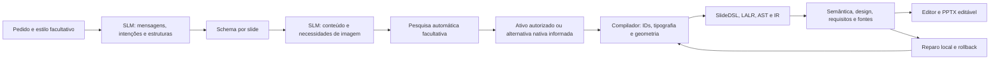

# Planejamento visual — 11/10/2026

Fontes registradas antes deste texto em [refs/FONTES.md](../refs/FONTES.md).
Base limpa `e44961ed3fb53f513ff6485533cba2b5f57fb975`, confirmada por push e
`ls-remote` em `origin/dsl-visual` antes de código. Não houve commit vazio,
force push ou inclusão de resultados, caches e arquivos de outros projetos.
A gramática, AST/IR 1.1, semântica, editor e backend PptxGenJS foram preservados.
Os experimentos históricos continuam separados.

## Causa observada

Reprodução do pedido exato do usuário com Qwen3 4B, em
`outputs/planning_visual/before_01/`: quatro slides `title_content`, uma comparação
textual, nenhum diagrama. Exportou PPTX estrito sem diagnóstico. O reconhecedor
mediu somente quantidade e margens: **2/2 não significava qualidade visual**.

O schema já admitia cards, sequência e fluxo; portanto, a causa não era sua
proibição. O prompt principal indicava `title_content`, `two_columns` e
`comparison`, mas não pedia intenção comunicativa, mensagem ou estrutura dos nós.
A geração simples da interface usava esse caminho; recursos contextuais dependiam
de abrir opções facultativas. Componentes existiam, mas a escolha não os utilizava
para esse conteúdo. Validação de sintaxe e geometria aceitava a apresentação básica.

## Percurso implementado



Protocolo `visual-planning-v1`. `visual_planning.py` solicita primeiro um plano
visual: intenção, mensagem, foco, justificativa, nomes das alternativas e estruturas
`stack`, `services` ou `cards`. A SLM escreve essas decisões; não há distribuição
aleatória ou roteiro obrigatório de cinco layouts para todos os pedidos.
Uma explicação conceitual que peça camadas/serviços recebe um diagrama, respeitando
a estrutura escolhida pelo modelo. Um pedido com nome técnico explícito de layout
continua sendo respeitado.

A segunda chamada recebe um schema condicionado a essas decisões. Componentes
usam nós com `label` e `detail`; a conversão para itens do plano concatena os
campos sem resumir ou apagar texto. Comparação fixa os dois nomes e suas estruturas
declarados pela SLM. Títulos são mensagens da primeira etapa. No modo restrito de
fontes, continuam sendo rótulos permitidos e os itens permanecem frases literais;
o formato de nós não substitui o contrato extrativo.

Ollama não aplicou corretamente `prefixItems` aos slides nas tentativas iniciais.
O decoder recebe objetos com campos fixos `slide_1` etc. e, na comparação,
`column_1`/`column_2`; a normalização recupera os arrays em ordem. São posições da
representação, sem IDs de elementos ou geometria. A saída bruta passa pelo schema
antes de defaults Pydantic. Respostas HTTP, bytes, prompts, schemas, normalização,
versões e snapshots anteriores às chamadas ficam registrados.

`composition.py` emite formas, textos e setas nativos. `layouts.py` calcula
geometria e um tamanho comum para os títulos do deck. `contextual.py` integra
fontes, imagens e reparos existentes; `media.py` escolhe provedores.
CLI/API/painel usam o novo caminho de forma aditiva. A/B e as CLIs históricas
mantêm seu percurso; a interface C/D ativa o planejamento visual por padrão.

## Componentes e regras

| Composição | Propósito |
|---|---|
| `visual_cover` | Mensagem de abertura, subtítulo e conceitos à direita. |
| `concept_map` | Conceitos próximos de suas explicações, em painéis. |
| `architecture_diagram` | Componentes e funções; setas para camadas, sem sequência artificial para serviços. |
| `comparison_visual` | Duas alternativas: camadas conectadas ou serviços separados. |
| `visual_sequence` | Etapas numeradas e conectadas. |
| `visual_flow` | Processo com nós e setas vetoriais. |
| `benefit_cards` | Vantagens distribuídas em cards. |
| `takeaway` | Mensagem principal em painel destacado e implicações. |

Intenção `image` reutiliza `text_image`; os outros layouts com imagem continuam
acessíveis. Nenhum diagrama de software exige foto. As setas são formas vetoriais
editáveis `downArrow`, ainda sem ancoragem e roteamento de conectores.

O canvas é 1280×720, com margem de 64 px, paleta do tema, sinalização por faixas
e espaços reservados entre cabeçalho e conteúdo. Corpo é reduzido somente até
18 pt quando necessário, preservando integralmente o texto; excesso gera L004.
Limites de dois/três nós e até quatro cards mantêm o espaço finito explícito.
O tamanho comum dos títulos é calculado considerando também a largura da capa.
Em `delivery_03`, foi 39 pt: D003 registrou a diferença em relação aos 42 pt do
tema. Os cinco avisos permanecem visíveis; não bloqueiam os strict_codes atuais.

| Fundamentação | Aplicação e limite |
|---|---|
| Mayer/Fiorella: coerência | Preferir elementos ligados ao assunto, evitar fotografia decorativa; o sistema não comprova compreensão. |
| Contiguidade espacial | Função junto do componente, cabeçalho próximo da alternativa. |
| Sinalização | Título em frase, painéis, faixas e setas indicam organização. |
| Alley: Assertion–Evidence | Mensagens em títulos sustentadas por representações do conteúdo. Não é verificação factual da mensagem. |
| Engenharia deste projeto | Grid, paleta, pontos tipográficos, limites de nós, encaixe e associação entre intenção e componente. |

As fontes de Mayer foram consultadas pelo resumo do capítulo; não se afirma
leitura integral do material pago. O guia primário de Alley/Penn State orienta
mensagens completas e evidência visual. Não se transfere uma conclusão de estudos
educacionais para os resultados desta implementação sem avaliação própria.

## Imagens e formulário

O formulário principal apresenta pedido, modelo local, estilo facultativo,
**Imagens automáticas** e geração. Estratégias, validação, orçamento de reparos,
provedores, consultas manuais, cache e anexos continuam disponíveis em áreas
recolhidas. Editar, revalidar, consultar créditos e exportar permanecem disponíveis.

Com pesquisa habilitada e necessidade real de imagem, o sistema escolhe os
provedores. Assuntos espaciais tentam NASA, depois Openverse/Commons; outros
começam por Openverse. Seleção automática exige licença elegível, correspondência
lexical integral, largura ≥600 e altura ≥300. NASA mantém revisão individual
obrigatória; não é baixada automaticamente apenas por ser NASA.
Disponibilidade e falhas são registradas. O filtro não verifica relevância visual
ou direitos de terceiros independentemente dos metadados do provedor.

Expressões genéricas como `real photo` são retiradas da busca, conservando consulta
original e efetiva no registro; nomes que contenham `Real` não são removidos por
essa regra. Não há tradução arbitrária de todo o português. Consulta ruim ainda
pode produzir nenhum candidato. Sem ativo elegível, o conteúdo e as legendas são
preservados em painéis nativos, com aviso de imagem indisponível. Não se usa a
imagem demo ou uma imagem irrelevante para simular sucesso.

Pesquisa continua desabilitada inicialmente. Documentos só autorizam consultas
derivadas para serviços externos com `share_queries`; o compilador não acessa rede.
Validações de HTTPS, DNS público fixado, redirecionamentos, bytes/MIME/decodificação,
cache e licença do fluxo anterior continuam sendo usadas.

Verificação real separada: `automatic_image_probe/` pesquisou `moon`, tentou NASA
e Openverse e baixou imagem CC BY 2.0, 1024×768. `photo_delivery_03/` mostrou um
fallback real quando `Moon real photo` não teve candidato elegível; exportou
os textos preservados com aviso. Após normalização dessa expressão,
`photo_delivery_04/` executou duas chamadas Qwen3 reais, escolheu a imagem **Moon**
automaticamente e exportou PPTX estrito com **uma imagem e quatro textos nativos**,
sem reparos ou fallback. Foram 275 tokens de saída e 2.263 de entrada.
Licença, autor, página e crédito estão nas evidências e notas do slide.

## Pedido real, comparação e capturas

[Manifesto do caso](../benchmark/visual_planning_request.json): contém o pedido e
os dez critérios fornecidos pelo usuário. Aplicam-se a este caso, sem serem
convertidos em exigência universal de capa/diagrama/cards/conclusão.

| Evidência | Antes `before_01` | Depois `delivery_03` |
|---|---:|---:|
| PPTX estrito | Sim | Sim |
| Chamadas reais | 1 | 2 |
| Tokens de saída / entrada | 735 / 1.452 | 1.490 / 2.503 |
| Reparos | 0 | 0 |
| Textos nativos / formas nativas | 26 / 1 | 24 / 41 |
| Setas vetoriais nativas | 0 | 4 |
| Menor fonte de corpo | 24 pt | 18 pt |
| Erros / avisos | 0 / 0 | 0 / 5 D003 |
| V001–V006 | Nenhum diagnóstico | Nenhum diagnóstico |
| Requisitos genéricos reconhecidos | 2/2 | 2/2 |

Modelo único Qwen3:4b-instruct, digest
`0edcdef34593eac1aa2be9c7d06c432dcf81945adca5eca2f27662c18f168ba0`,
Ollama 0.40.2, temperatura 0,1, seed 42, contexto 8192 e saída máxima 4096 por
chamada. Todas essas respostas terminaram com `stop`. A auditoria conferiu bytes
HTTP, schemas, normalização, 61 hashes do snapshot posterior e textos do plano/IR
em objetos nativos do PPTX. A reprodução anterior não tinha snapshot próprio;
seu código corresponde à base sincronizada, sem atribuir a ela essa contagem.

| Slide | Antes | Depois |
|---|---|---|
| 1 | Título e texto | Capa com composição lateral distinta |
| 2 | Lista de componentes | Interface → Negócio → Dados em objetos editáveis |
| 3 | Duas listas | Camadas conectadas versus serviços Pedidos/Pagamentos/Estoque separados |
| 4 | Lista de benefícios | Cards de manutenção, escala e testabilidade |
| 5 | Texto de conclusão | Mensagem central destacada |

Capturas no build de produção, sem erro JavaScript e com fonte exibida igual à
gerada. A borda de seleção foi ocultada apenas na captura; conteúdo não foi editado.

| Slide | Antes | Depois |
|---|---|---|
| 1 | [Capa](../outputs/planning_visual/captures_delivery/before_1.png) | [Capa](../outputs/planning_visual/captures_delivery/after_1.png) |
| 2 | [Componentes](../outputs/planning_visual/captures_delivery/before_2.png) | [Diagrama](../outputs/planning_visual/captures_delivery/after_2.png) |
| 3 | [Comparação](../outputs/planning_visual/captures_delivery/before_3.png) | [Representações](../outputs/planning_visual/captures_delivery/after_3.png) |
| 4 | [Benefícios](../outputs/planning_visual/captures_delivery/before_4.png) | [Cards](../outputs/planning_visual/captures_delivery/after_4.png) |
| 5 | [Conclusão](../outputs/planning_visual/captures_delivery/before_5.png) | [Destaque](../outputs/planning_visual/captures_delivery/after_5.png) |

[Comparação lado a lado](../outputs/planning_visual/captures_delivery/comparison.html),
[auditoria](../outputs/planning_visual/audit.json) e
[PPTX posterior](../outputs/planning_visual/delivery_03/presentation.pptx).
São artefatos locais ignorados pelo Git; esses links exigem as pastas de execução.

Inspeção do agente das dez capturas observou os componentes, textos legíveis no
preview e espaços sem sobreposição. A geometria sustenta somente as aproximações
de fonte/caixas; **não se atribui nota estética ou aprovação factual 10/10**.
Textos do plano foram preservados na compilação e as cinco seções estão presentes.
A conclusão ainda simplifica a escolha para “projetos simples/complexos”; precisa
de revisão de conteúdo. Algumas funções são genéricas e a capa repete uma mensagem.
Não se afirma que o modelo compreendeu todas as nuances da arquitetura.

PowerPoint COM e LibreOffice foram consultados e estão indisponíveis: relatórios
`rendering_before/` e `rendering_delivery/` têm `engine=geometric`, `rendered=false`.
Capturas de navegador não são renderização Office nem medição real de glifos.
Não houve participantes, notas inventadas ou estimativa causal de melhoria estética,
velocidade e aprendizagem. Antes/depois diferem em prompts, schema e chamadas.

## Falhas preservadas e testes

Pilotos e pastas chamadas `after_final_01/02` não foram apagados nem tratados como
sucesso final. Houve HTTP 400 para um fragmento de schema não aceito, `prefixItems`
ignorado pelo decoder, overflow, cabeçalho de comparação vazio e frases truncadas
por limites estreitos de strings. A inspeção, além do parser, identificou esses
problemas; os limites foram relaxados, conteúdo ganhou campos de entidade/função
e títulos passaram a ter tamanho comum calculado.

Os primeiros pilotos de fotografia também foram preservados: consulta ampla,
fallback com cabeçalho insuficiente e uma falha de referência de schema na nova
representação de imagem. Foram corrigidos antes de `photo_delivery_04` em pasta
nova. Nenhuma resposta antiga foi reescrita. Os snapshots antecedem as chamadas;
ajustes posteriores de imagem não reescrevem o snapshot de `delivery_03`.

Regressão final: **224 Python**, **dois Node** e **onze Playwright** passaram.
Após os ajustes de imagem, a suíte Python completa passou novamente e os **três
Playwright de contexto/imagens** foram repetidos com sucesso. Ruff, ESLint,
Prettier, TypeScript e build passaram. Permanece o aviso transitivo AnyIO/Starlette.
Testes simulados são separados das respostas Ollama e buscas HTTP reais.

Evidências em `outputs/planning_visual/python-validated-decoder.xml`,
`ui-tests-final/results.json` e `ui-image-delivery/results.json`. O formulário real
gerou as cinco composições, editou título e exportou DSL/PPTX; registro em
`ui_architecture.json`. O teste contextual confirmou imagem/fontes, edição e
reparo preservando o título; `ui_contextual_delivery.json`. A demo histórica foi
rechecada em nova pasta, sem alterar seus resultados originais.

## Reproduzir e continuar

Na pasta `code/slidedsl`, com dependências e Qwen3 4B instalados e Ollama ativo:

```powershell
powershell -NoProfile -ExecutionPolicy Bypass -File scripts/open_slm_editor_windows.ps1
.\.venv\Scripts\slidedsl.exe generate-contextual --visual-planning --model qwen3:4b-instruct --strategy D --prompt-file outputs/planning_visual/request.txt --out outputs/planning_visual/nova_execucao
.\.venv\Scripts\python.exe scripts/audit_visual_planning.py outputs/planning_visual/before_01 outputs/planning_visual/delivery_03 outputs/planning_visual/audit_novo.json
.\outputs\runtime\node.exe scripts/capture_visual_comparison.mjs outputs/planning_visual/before_01 outputs/planning_visual/delivery_03 outputs/planning_visual/novas_capturas
```

O pedido para um checkout novo está em `benchmark/visual_planning_request.json`;
copie o campo `request` para um TXT UTF-8 ou use o formulário. Sempre use nova pasta
de execução. Para fotografias, habilite imagens automáticas; na CLI, passe um
`GenerationContext` com `research=auto`, `provider=auto` e `selection=auto`.

Continuam os limites de doze slides, layouts finitos e recuperação lexical de
fontes. Sem layout arbitrário, conectores ancorados, paginação, OCR ou prova
automática de verdade. Algumas composições incompatíveis com grupos/decorações
produzem diagnóstico, em vez de perder elementos silenciosamente. Edições manuais
usam a mesclagem conservadora anterior, com conflitos por ID.
Próximos passos: avaliação factual/estética com pessoas, renderização real,
mais pedidos/seeds, mensagens menos repetitivas e conectores com relações explícitas.
