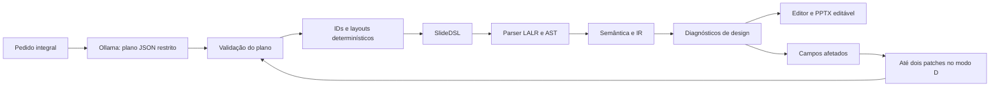

# Evolução da geração local — 10/10/2026

Fontes registradas antes desta etapa em [refs/FONTES.md](../refs/FONTES.md).
O projeto existente foi estendido. A gramática, o parser LALR, os arquivos `.sld`,
a AST, a IR 1.1, a semântica, as regras D001–D010, o editor e o backend PptxGenJS
continuam sendo usados. Não há dependência de API paga nem substituição de saída
inválida por uma apresentação manual.

## Arquitetura anterior e atual

Antes: uma solicitação por slide; o modelo produzia SlideDSL ou JSON Schema
incluindo IDs, referências, coordenadas e dimensões. A saída passava pelo parser,
semântica e design. Os reparos existentes regeneravam o slide afetado inteiro.
Esses modos e os experimentos históricos continuam disponíveis.

Agora, os modos C/D usam duas etapas: o modelo interpreta o pedido integral e
escreve um plano de conteúdo; o compilador de planos gera comandos SlideDSL com
IDs e geometria calculados. Cada apresentação é planejada em uma chamada, com
até 12 slides. O modo D permite até duas chamadas adicionais de correção.



## Alterações implementadas

| Arquivo | Responsabilidade |
|---|---|
| `planning.py` | Schema do plano: títulos, colunas, itens, decoração, relações e rodapé; sem coordenadas/IDs livres. |
| `layouts.py` | Compilador de planos: título e conteúdo, duas colunas e comparação com cabeçalhos destacados. |
| `evolution.py` | Estratégias A/B/C/D, validação, requisitos e patches limitados aos caminhos diagnosticados. |
| `evolution_experiment.py` | Seeds pareadas, pedidos declarados, execução sequencial, JSON/CSV e retomada sem sobrescrever. |
| `generation_jobs.py` e `server.py` | Modelos instalados, fila local, progresso, respostas finais e evidências persistidas. |
| `GenerationPanel.tsx` | Formulário no editor existente, modelo/pedido/estratégia, acompanhamento e carregamento do resultado. |

IDs são derivados da posição estrutural: `s1_titulo`, `s1_c1_i1`, `s1_d1` etc.
Renumerar o texto do título não muda o ID. Relações apontam para nomes lógicos
como `c1_i1` ou `d2`; o compilador só resolve referências existentes no slide.
Uma referência inválida gera L002 e impede a compilação, sem criar elementos
fictícios. O modelo não pode inserir IDs duplicados no plano.

Layouts usam canvas 1280×720, margem 64, largura 1152 para uma coluna e duas
colunas de 544 separadas por 64. A altura usa a mesma aproximação de caracteres
das regras existentes. Corpo pode diminuir de 24 até 18pt para caber; o texto
nunca é cortado. Conteúdo que excede o espaço reservado gera L004. O plano e o
mapeamento elemento → campo ficam registrados, além de DSL/AST/IR.

L001 verifica quantidade de colunas; L003 detecta item vazio; L005 exige ao menos
dois itens para um grupo. Imagens usam o asset local existente. Slots decorativos
reservam uma região abaixo do texto; o slot overlay permite o exemplo de camadas.
Operações explícitas front/back e alinhamentos continuam passando pela semântica.

## Correção localizada

D valida o plano e o programa produzido. Cada diagnóstico inclui o caminho do
campo correspondente. O schema da resposta de reparo autoriza exclusivamente
`edits: [{path, value}]` nesses caminhos. A aplicação é feita em uma cópia do plano;
caminhos não autorizados e duplicados são rejeitados. Os demais slides/elementos
permanecem iguais. Toda alteração volta ao parser, à semântica e ao design.

Se o JSON inicial for ilegível ou a estrutura não puder ser localizada, D pode
pedir a estrutura completa novamente, registrando escopo `plan`. Isso também
consome o limite de dois reparos. Se houver um plano analisável mas nenhum campo
seguro para corrigir, o fluxo encerra com pendências. Não há reparos ilimitados.

## Usar a interface local

Na pasta `code/slidedsl`, com as dependências já instaladas e Ollama em execução:

```powershell
.\.venv\Scripts\slidedsl.exe serve --host 127.0.0.1 --port 8000
```

Atalho Windows para construir o editor, iniciar Ollama/API e abrir o navegador:
`powershell -NoProfile -ExecutionPolicy Bypass -File scripts/open_slm_editor_windows.ps1`.
`-NoBrowser` apenas inicia os serviços; `-Port 8001` permite usar outra porta.

Abra http://127.0.0.1:8000. Em **Gerar com IA local**, selecione o modelo instalado,
escreva o pedido e use D para planejamento/layouts/reparos. A validação estrita
vem habilitada. O painel mostra planejamento, validação e correções; os diagnósticos
completos aparecem na área já existente. Após gerar, selecione/edite os elementos,
valide e use **Gerar PPTX**. Uma execução com pendências não carrega um exemplo
manual no lugar do resultado. Evidências ficam em `outputs/generation_jobs/<id>/run/`.

Se o modelo não aparecer, instale-o com `ollama pull qwen3:4b-instruct` e use
**Atualizar modelos**. O backend consulta o serviço local; não baixa modelos
automaticamente pelo formulário. Há um trabalhador e no máximo duas solicitações
ativas/em fila. Após reiniciar o servidor, uma tarefa parcial permanece registrada
e deve ser repetida em uma nova execução.

Também é possível usar a CLI:

```powershell
.\.venv\Scripts\slidedsl.exe generate-planned --model qwen3:4b-instruct --strategy D --prompt-file benchmark/prompts/arquitetura_software.txt --out outputs/evolution/nova_demo
.\.venv\Scripts\slidedsl.exe compile-plan outputs/evolution/nova_demo/plan.json --strict --out outputs/evolution/nova_demo/recompilado.pptx
```

O número de slides é inferido de `cinco slides`, `3 slides` etc.; na CLI pode ser
declarado com `--slides`. Pedidos sem número usam cinco. `compile-plan` funciona
sem IA. `--allow-warnings` opta pela validação básica na nova geração; as CLIs antigas
mantêm o comportamento anterior de `--strict`.

## Experimento A/B/C/D

| Estratégia | Saída do modelo | Layout | Reparos |
|---|---|---|---|
| A | SlideDSL direta, um slide por chamada | Coordenadas do modelo | 0 |
| B | JSON Schema de elementos, um slide por chamada | Coordenadas do modelo | 0 |
| C | Plano JSON Schema do deck | Determinístico | 0 |
| D | Mesmo plano/schema/prompt inicial de C | Determinístico | Até 2 patches |

Ollama local aceita JSON Schema no campo `format`. A API pública `chat` documentada
não recebe diretamente uma gramática Lark. B usa restrição de representação JSON,
convertida em SlideDSL e reconhecida pela GLC existente. Não se afirma que o decoder
está sendo restringido pela GLC da SlideDSL.

`benchmark/evolution_requests.json` declara dois pedidos: o exemplo de arquitetura
solicitado e o pedido complexo original de design. Também declara, antes das
execuções, os critérios estruturais/lexicais por slide. No pedido complexo, a
rubrica histórica de 17 itens é registrada separadamente. Não é substituída pelo
checklist básico de cinco itens nem usada como avaliação de beleza/verdade factual.

```powershell
.\.venv\Scripts\slidedsl.exe evaluate-strategies --model qwen3:4b-instruct --requests-file benchmark/evolution_requests.json --repetitions 5 --out outputs/evolution/novo_experimento
.\.venv\Scripts\python.exe scripts/audit_evolution.py outputs/evolution/novo_experimento
```

Parâmetros: temperatura 0,1, contexto 8192, saída máxima 4096 por chamada, seeds
42–46. Cada repetição usa o mesmo pedido e seed em todas as estratégias; a ordem
é rotacionada. Modelo/digest, versão, hashes de código, prompts, schemas, pedidos,
respostas HTTP e bytes brutos são preservados. `--resume` exige configuração/código
idênticos e reutiliza apenas execuções terminadas; pastas parciais não são apagadas.

Saídas: `evaluation.json`, `evaluation.csv`, configuração e artefatos por pedido,
repetição e estratégia. Registra apresentações respondidas/compiladas, erros de
sintaxe/schema, semântica e geometria, avisos, cobertura de requisitos, correções
e duração. `audit.json`/`audit.csv` recontam design por slide efetivamente alcançado
e conferem textos nativos do PPTX. Zero erros em uma fase não alcançada não significa
aprovação: a auditoria explicita o denominador alcançado/potencial.

## Resultados executados

O piloto real `outputs/evolution/pilot_architecture_01/` gerou cinco slides com
qwen3:4b-instruct em D, zero reparos/diagnósticos, validação estrita e PPTX.
O plano também foi recompilado offline. Esses resultados são piloto e não entram
nas taxas do experimento final.

O teste de navegador executou a geração pelo formulário, carregou os cinco slides,
comparou a fonte exibida com a fonte gerada, editou um título, revalidou e exportou
DSL/PPTX. Não houve erro JavaScript. Evidência em `outputs/evolution/ui_generation.json`
e na pasta de execução indicada ali, incluindo capturas dos cinco slides.
Regressão final: **141 testes Python, dois Node e sete Playwright passaram**.
A suíte integrada passou com 140 Python/2 Node/7 Playwright; após o ajuste do título
do draft rejeitado, a suíte Python completa passou com 141. O teste adicional da
interface verifica a exibição de duas tentativas/caminhos usando transporte
simulado; não é contado como geração real. Ruff, ESLint, Prettier, TypeScript e
build também passaram. O aviso transitivo de depreciação AnyIO/Starlette permanece.
Evidências: `outputs/tests/evolution-final.xml` e `outputs/ui-tests/results.json`.
O atalho Windows iniciou o servidor; a interface de produção carregou os cinco
slides reais sem erro JavaScript, com captura/checagem em
`outputs/evolution/production_editor_check.json` e `production_editor.png`.

**Experimento concluído:** 2 pedidos × 4 estratégias × 5 repetições = **40 execuções**,
com **122 respostas reais**, todas finalizadas com `stop`, sem falhas de transporte.
Modelo/digest único: qwen3:4b-instruct / `0edcdef34593eac1aa2be9c7d06c432dcf81945adca5eca2f27662c18f168ba0`.
Auditoria conferiu bytes brutos contra conteúdo HTTP, prompts integrais, seeds,
parâmetros, plano convertido, patches restritos e textos nativos dos 19 PPTX.

Dados: [JSON das execuções](../outputs/evolution/experiment_20261010/evaluation.json),
[CSV](../outputs/evolution/experiment_20261010/evaluation.csv),
[JSON auditado](../outputs/evolution/experiment_20261010/audit.json) e
[CSV auditado](../outputs/evolution/experiment_20261010/audit.csv).

| Estratégia | Respostas completas /10 | PPTX estrito /10 | Erros sintaxe/schema | Erros semânticos | Erros geométricos | Avisos design | Slides com design alcançado /50 | Correções | Duração total (s) |
|---|---:|---:|---:|---:|---:|---:|---:|---:|---:|
| A | 10 | 0 | 4 | 6 | 13 | 83 | 43 | 0 | 231,07 |
| B | 10 | 0 | 0 | 0 | 0 | 62 | 50 | 0 | 347,30 |
| C | 10 | 10 | 0 | 0 | 0 | 7 | 50 | 0 | 112,85 |
| D | 10 | 9 | 0 | 1 | 0 | 7 | 50 | 2 | 112,75 |

Erros/avisos são diagnósticos das últimas rodadas; uma apresentação pode ter vários.
Design é contado somente nos slides alcançados. Resposta completa de API não é
programa correto. B teve sintaxe/semântica válidas, mas **a validação estrita bloqueou
a exportação por avisos selecionados**, especialmente overflow/contraste. Não se
afirma que B falhou no parser nem que esses 0/10 se aplicam à validação básica.
Os avisos D005 nos modos C/D não são bloqueados pelos strict_codes existentes.

| Pedido | A PPTX /5 | B PPTX /5 | C PPTX /5 | D PPTX /5 |
|---|---:|---:|---:|---:|
| Arquitetura de software | 0 | 0 | 5 | 5 |
| Design complexo original | 0 | 0 | 5 | 4 |

Na arquitetura, C/D cumpriram os **10/10 proxies declarados** em cada uma das cinco
repetições. No pedido complexo, o checklist reduzido marcou 9/9 em C/D, inclusive
no caso sem exportação, mas a rubrica completa mostrou requisitos ausentes:

| Repetição | C rubrica original /17 | D rubrica original /17 | D compilou? |
|---|---:|---:|---|
| 1 | 16 | 16 | Sim |
| 2 | 16 | 16 | Sim |
| 3 | 16 | 14 | Não |
| 4 | 14 | 16 | Sim |
| 5 | 16 | 16 | Sim |

**Nenhum resultado complexo atingiu 17/17.** Faltaram as duas formas coloridas no
slide de contraste. Em C/repetição 4 também faltaram as operações e a composição
final de camadas. Em D/repetição 3, `d2` foi usado sem criar a segunda decoração;
L002 foi localizado em `slides.3.relations.0`. As duas respostas de patch repetiram
o alvo inexistente. O sistema preservou os demais campos, encerrou no limite e
não exportou PPTX. A rubrica capturou a ausência da imagem/camadas.

Não houve ganho observado dos reparos nessa amostra. Apesar de prompts, schemas,
modelo, parâmetros e seeds iguais, somente **1/10 pares C/D teve resposta inicial
idêntica em bytes**. Portanto, a diferença 10/10 versus 9/10 não demonstra efeito
causal negativo ou positivo do reparo. Esse limite foi observado e registrado em
`audit.json/paired_initial`, em vez de presumir determinismo do serviço.

A auditoria corrigiu a agregação de geometria de A: o relatório inicial do harness
ocultava erros dos slides alcançados quando outro slide falhava na semântica.
`audit.json/audit.csv` registram 13 erros em 43/50 slides; a implementação futura
também passou a manter esse denominador. O wrapper de drafts rejeitados A/B foi
ajustado para manter o título da primeira resposta, como a montagem aceita.
Sem alterar arquivos/respostas originais, a auditoria registra os campos
`canonical_draft_title` e `canonical_rubric_met`; em B, a rubrica passa de 9–10/17
registrados originalmente para 10–11/17 sob essa normalização. Nenhum PPTX nem
resultado C/D muda. Os campos originais continuam disponíveis para comparação.

As versões executadas estão preservadas em `sources_snapshot/`, com hashes
conferidos pela auditoria. Os ajustes posteriores de agregação/título não alteraram
prompts ou respostas. Para reproduzir com o código atual, use nova pasta; a
retomada da pasta histórica é recusada se os hashes divergirem. Os experimentos
históricos de 08/10 usavam validação básica e reparos em A/B; suas taxas não devem
ser comparadas diretamente com esse novo protocolo estrito sem reparos em A/B.

## Limitações e continuidade

Os schemas e os limites de espaço não garantem cumprimento do pedido. Os textos
podem conter simplificações/inexatidões. A interface mostra critérios estruturais
básicos; os critérios específicos da tarefa são declarados no arquivo experimental.
Revisão humana continua necessária. O preview é geométrico; não houve renderização
pelo aplicativo PowerPoint COM nem avaliação com participantes.

Há três layouts e slots decorativos finitos, sem layout arbitrário otimizado,
paginação automática de texto, geração de imagens, importação de PPTX ou animações.
O limite de 12 slides e o orçamento por chamada tornam pedidos extensos suscetíveis
a truncamento. JSON inválido pode exigir nova estrutura inteira; L004 exige reduzir
conteúdo ou alterar o plano, pois não são apagadas frases silenciosamente.

A/B e C/D têm prompts, schemas e número de chamadas diferentes. A comparação B/C
inclui planejamento, IDs e layouts, além da mudança de representação; não isola
o efeito causal da GLC. C/D usam o mesmo prompt/schema inicial e diferem pela
permissão de reparo; as respostas iniciais observadas não foram iguais na maioria
dos pares. Cinco seeds pareadas não sustentam uma conclusão estatística geral.
Durações incluem cache/carregamento e compilação, e não são usadas para afirmar
superioridade causal de velocidade.

Próximos passos: ampliar pedidos/seeds com protocolo pré-definido; medir qualidade
factual e clareza com avaliação humana; medir fontes no PowerPoint; aperfeiçoar
grupos/camadas e reparos de requisitos sem regenerar elementos já corretos.
