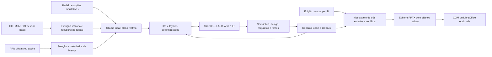

# Evolução visual e contextual — 11/10/2026

Fontes oficiais e evidências registradas em [refs/FONTES.md](../refs/FONTES.md).
A base estava limpa no projeto: `9b6a8edf80ce4b76c54c13bcbb7fc0e768aab847`,
confirmada em `origin/dsl-visual` antes de editar. Não foi criado commit vazio.
Os resultados históricos foram preservados. Esta etapa acrescenta imagens,
contexto opcional, fontes locais e preservação de edições ao compilador existente.

Antes, a geração local produzia planos de texto/formas com componentes finitos,
e edições manuais desabilitavam o reparo do plano. Agora o mesmo percurso formal
recebe ativos selecionados e fragmentos locais; reparos podem preservar a cena
editada por uma mesclagem conservadora, sem regenerar a apresentação inteira.

## Arquitetura e módulos



| Módulo | Responsabilidade |
|---|---|
| `media.py` | Openverse, Commons e NASA; seleção, segurança de rede, cache e registro de licença. |
| `documents.py` | Documentos locais, extração textual limitada, fragmentos e recuperação lexical. |
| `contextual.py` | Contexto, schema específico, vínculos de imagens, auditoria das fontes e evidências. |
| `planning.py`, `layouts.py` | Plano sem coordenadas e seis layouts novos com imagens proporcionais. |
| `edits.py`, `generation_jobs.py` | Correção do plano atual e preservação conservadora da IR editada. |
| `visual_validation.py`, `preview.py` | Diagnósticos geométricos e renderização externa opcional. |
| `resources.py`, `contextual_experiment.py` | Recursos observados e experimentos separados por hipótese. |
| `ContextPanel.tsx`, `GenerationPanel.tsx` | Opções recolhidas, anexos, seleção de imagens e resultados. |

O protocolo é `visual-contextual-v1`. A geração simples e os comandos anteriores
continuam disponíveis. O contexto usa somente Ollama em loopback; não envia anexos
para uma API remota. A saída bruta é validada pelo JSON Schema antes dos defaults
Pydantic, depois pela cadeia SlideDSL. Saída inválida permanece como falha registrada.

## Imagens, cache e layouts

Pesquisa usa as APIs oficiais, sem scraping ou chave paga. O catálogo registra
consulta, título, autor, página original, URL, licença, atribuição, dimensões,
data e hashes. Openverse/Commons admitem licenças CC reconhecidas. NASA exige
revisão individual dos termos antes do download. As informações de licença são
as declaradas pelo provedor; sua presença não comprova direitos sobre todo o conteúdo.

HTTPS, DNS público conferido e fixado na conexão, revalidação de redirecionamentos,
limites de tempo/bytes e rejeição de endereços privados reduzem o risco de SSRF.
PNG/JPEG são conferidos por MIME, assinatura e decodificação; imagens animadas,
muito pequenas ou acima de 20 milhões de pixels são rejeitadas. A cópia PNG local
remove metadados embutidos. Busca limita oito candidatos e consultas repetidas;
seleção automática exige correspondência lexical integral, largura mínima de 600
pixels e licença elegível. Esse filtro não mede relevância visual ou factual.

`research=off` impede pesquisa automática durante a geração. `on` e `auto`
permitem pesquisar slots ainda sem imagem; ambos dependem de consultas que o
plano efetivamente contenha. O botão de busca manual é uma ação online explícita.
Com documentos, consultas derivadas só saem mediante `share_queries=true`.
Busca offline consulta apenas o cache. Imagens selecionadas já locais funcionam
sem pesquisar novamente. O compilador nunca acessa a rede.

| Layout | Composição |
|---|---|
| `text_image` / `image_text` | Texto e imagem lado a lado, em ordens opostas. |
| `image_caption` | Imagem ampla, legenda e conteúdo abaixo. |
| `image_comparison` | Duas imagens com textos em duas colunas. |
| `image_cards` | Até quatro cartões com imagem e texto. |
| `hero_image` | Imagem ampla em posição de destaque e texto abaixo. |

O canvas continua 1280×720. Dimensões e IDs são calculados pelo compilador;
imagens usam contain, sem corte nem distorção. Texto excedente gera L004;
imagem ausente gera M001, referência inválida M002 e ativo não autorizado M003.
Layouts visuais recusam decorações/relações incompatíveis com L007 e quantidade
incorreta de imagens com L008. Não há substituição silenciosa pela imagem demo.
Créditos completos ficam nas notas do slide; legendas e objetos são editáveis.

**Importar imagem própria · offline** aceita PNG/JPEG de até dois MiB, sem rede,
com autor/crédito e licença/permissão declarados pelo usuário. Confirmação dos
direitos é obrigatória; não constitui verificação independente. A importação
usa as mesmas verificações de assinatura, dimensões e reencodificação e fica
disponível para seleção por slot e exclusão no catálogo.

O comando aditivo `adicionar seta` gera `ShapeType.downArrow`, uma forma vetorial
nativa. O fluxo novo a utiliza; o fluxo histórico de texto `↓` permanece legível.
Ainda não há conectores ancorados com roteamento. AST/IR mantêm a versão 1.1,
com o novo tipo `arrow`; leitores antigos precisam ser atualizados para esse tipo.

## Opções e referências locais

**Configurações avançadas, imagens e fontes (opcional)** permite tema, público, objetivo, slides,
detalhe, estilo visual, tom, componentes, pesquisa, provedor, imagens e anexos.
Os campos são facultativos; estilo e tom orientam a SLM dentro dos layouts finitos.
O modelo não recebe liberdade de inserir IDs ou coordenadas.

Até oito TXT/MD/PDF, dois MiB por arquivo, são processados localmente. PDFs devem
ter texto, até 50 páginas; extração roda em processo separado com orçamento de
tempo e memória. Não há OCR. Fragmentos têm ID, documento, página quando existe,
origem e data. Recuperação lexical seleciona até oito fragmentos/6.000 caracteres;
não utiliza embeddings. Arquivos e metadados são dados não confiáveis no prompt.

| Modo | Comportamento |
|---|---|
| `free` | Geração livre; anexos não são usados. |
| `grounded` | Usa fragmentos recuperados; complementação exige opção explícita. |
| `restricted` | Corpo seleciona frases literais de até 180 caracteres das fontes ou declara ausência de informação. |

No restrito, o decoder restringe frases, títulos e IDs de fontes; a auditoria
confere texto literal e vínculos existentes. F001/F002 bloqueiam exportação
automática quando houver conflito. A verificação não mede implicação semântica,
verdade do documento nem se todas as informações necessárias foram recuperadas.
O modo grounded depende de revisão humana quanto à fidelidade das afirmações.

Excluir um documento remove seu arquivo e índice local. Fragmentos já usados
permanecem nas evidências do trabalho até excluir também esse trabalho.
Excluir um trabalho não remove imagens compartilhadas; o catálogo tem exclusão
própria. Arquivos pessoais, caches e resultados ficam fora do versionamento.

## Edições, validação e renderização

**Corrigir pendências** usa o plano atual e os requisitos congelados. A mesclagem
compara IR original, IR editada e candidato por ID. Preserva texto, imagem,
posição, tamanho, Z, remoções e adições manuais. Colisões e mudanças incompatíveis
geram conflito; candidatos inválidos preservam a cena atual. Instruções anteriores
back/front que ainda apontam para objetos existentes são mantidas, restaurando
depois a ordem Z final. O relatório guarda estados e decisões.
Fases e diagnósticos após mesclagem são recalculados sobre a cena entregue;
o relatório do candidato fica preservado separadamente.

Um seletor por slot permite vincular outra imagem do catálogo ao plano, sem
regenerar o deck. Não há sincronização bidirecional completa: renomear IDs e
reestruturar a cena pode exigir resolução manual. Afirmações adicionadas no editor
não recebem automaticamente uma nova prova de fonte. A exportação manual geral
verifica estrutura, sem garantir fidelidade ao documento.

V001–V003 continuam verificando textos. V004 detecta sobreposição de imagens com
título/corpo, V005 avisa inconsistência tipográfica dos títulos e V006 ampliação
acima de 150% dos pixels originais. Diagnósticos incluem caixa/elemento/caminho e
sugestão. Juntam-se às regras D001–D010 e aos verificadores de requisitos.
São aproximações por caixas, sem medição real de glifos ou garantia de beleza.

`render-optional` tenta PowerPoint COM ou LibreOffice headless, preservando erros.
Nesta máquina ambos estão indisponíveis: `engine=geometric`, `rendered=false`.
Capturas do navegador são previews geométricos. Renderização Office/LibreOffice
real e avaliação estética com participantes permanecem pendentes.

## Executar

Na pasta `code/slidedsl`, após instalar as dependências e iniciar Ollama:

```powershell
powershell -NoProfile -ExecutionPolicy Bypass -File scripts/open_slm_editor_windows.ps1
.\.venv\Scripts\slidedsl.exe generate-contextual --model qwen3:4b-instruct --strategy D --prompt-file benchmark/prompts/arquitetura_software.txt --out outputs/contextual/nova_geracao
.\.venv\Scripts\slidedsl.exe evaluate-contextual --requests-file benchmark/contextual_requests.json --out outputs/contextual/novo_experimento
.\.venv\Scripts\python.exe scripts/audit_contextual.py outputs/contextual/experiment_20261011_final
.\.venv\Scripts\slidedsl.exe render-optional outputs/contextual/nova_geracao/presentation.pptx --out outputs/contextual/nova_renderizacao
```

`--context-file` recebe JSON `GenerationContext`, por exemplo
`{"audience":"estudantes","objective":"explicar conceitos","research":"off","grounding":"free"}`.
IDs de documentos/imagens são os retornados pelo cadastro local. A interface em
http://127.0.0.1:8000 permite anexar, selecionar, gerar, consultar fontes, corrigir,
editar, revalidar e exportar. `/api/images/*`, `/api/documents` e
`/api/generations/{id}` também expõem cadastro/cache/exclusão. POSTs limitam
corpo e origem; desenvolvimento aceita apenas o Vite local esperado.

## Experimento executado e auditoria

Manifesto: [benchmark/contextual_requests.json](../benchmark/contextual_requests.json).
Uma repetição, seed 42, cinco domínios novos, dois slides por pedido.
qwen3:4b-instruct/Ollama 0.40.2, digest
`0edcdef34593eac1aa2be9c7d06c432dcf81945adca5eca2f27662c18f168ba0`,
temperatura 0,1, contexto 8192, máximo de saída 4096 por chamada.
Critérios congelados: quantidade, margens e dois proxies lexicais por pedido.

Dados: [evaluation.json](../outputs/contextual/experiment_20261011_final/evaluation.json),
[CSV](../outputs/contextual/experiment_20261011_final/evaluation.csv) e
[auditoria](../outputs/contextual/experiment_20261011_final/audit.json).

| Condição estrutural | PPTX estrito /5 | Critérios em decks completos /20 | Tentativas |
|---|---:|---:|---:|
| SlideDSL direta A | 1 | 3 | 0 |
| Plano sem reparos | 5 | 20 | 0 |
| Plano com validador | 5 | 20 | 0 |
| Plano com reparo determinístico permitido | 5 | 20 | 0 |

São **20 avaliações estruturais e 17 chamadas reais**, com **4.161 tokens de saída
e 20.915 de entrada**: dez chamadas A, cinco de planejamento e duas sobre fontes.
As três condições planejadas compartilham exatamente cada plano, conferido por
hash. Já estavam corretos nos critérios medidos, portanto não houve ganho observado
do validador ou dos reparos. A/C diferem em prompts, representação e número de
chamadas; a comparação não isola GLC. Os quatro decks A rejeitados contribuem zero
nessa contagem de requisitos de decks completos; isso não mede os requisitos em
slides parciais dos drafts. Respostas/diagnósticos desses drafts estão preservados.

A ablação de imagem, com plano fixo e sem SLM, compilou com ativo selecionado e
falhou com M001 sem ativo. V006 avisou sobre a imagem real de 240×187 pixels.
Não foi medida melhoria estética/relevância. O exemplo livre e o restrito sobre
`reference_aurora.txt` compilaram, uma chamada cada; restrito vinculou três
fragmentos reais do documento sintético. Avaliação factual humana está nula.

A auditoria conferiu 462 arquivos de snapshots, sete respostas com schema,
bytes brutos contra HTTP, parâmetros, critérios e textos/imagens nativos em 38
PPTX, incluindo cópias auxiliares. Exportações das condições estruturais são 16;
com imagem e duas fontes, 19. Não somar as cópias auxiliares como apresentações
independentes. Recursos registram RAM/CPU do Python/Ollama e CPU do sistema por
amostragem. GPU/VRAM não foram medidos. Durações incluem cache e carregamento,
sem alegação causal de velocidade ou extrapolação de consumo.

APIs reais: Openverse e NASA retornaram oito candidatos cada; Commons retornou
HTTP 403, registrado como indisponível. Download real Openverse, créditos e
consulta offline foram verificados em `outputs/contextual/api_probe/`.
Download NASA não foi demonstrado; sua revisão obrigatória foi testada em isolamento.

Os pilotos `pilot_visual_01`–`04` falharam por aridade, ativo omitido ou overflow;
o quinto gerou PPTX estrito com uma chamada/194 tokens. Foram preservados.
`experiment_20261011_01` preserva a primeira execução: restrito foi bloqueado por
paráfrases F002. O schema extrativo e a validação JSON anterior aos defaults foram
ajustados antes da execução final, em pasta nova. Não se misturam taxas entre versões.
Cada execução guarda código/versões anterior às chamadas. Ajustes posteriores de
mesclagem/UI e upload local não reescrevem snapshots; reprodução atual deve usar pasta nova.

## Testes e continuidade

Regressão: **209 Python, dois Node e onze Playwright**, com Ruff, ESLint, Prettier,
TypeScript e build. Python mantém um aviso transitivo AnyIO/Starlette.
Evidências: `outputs/tests/contextual-final.xml` e
`outputs/contextual/ui-tests-final/results.json`. Testes simulados de rede/modelo
são separados dos experimentos Ollama e das consultas HTTP reais.
O teste real de navegador gera com imagem e documento, edita título, corrige
preservando a edição e exporta DSL/PPTX; `outputs/contextual/ui_generation.json`
aponta para logs, captura e apresentação. A demo histórica foi rechecada em pasta
nova, sem alterar seus artefatos. O check de produção usa o build em 8000.
Evidência: `outputs/contextual/production_editor_check.json` e
`production_preview.png`; preview com imagem real e título manual preservado,
sem erro JavaScript. Upload local, autorização, formato e exclusão foram também
testados na API e no navegador, separadamente da pesquisa online.

Não houve recrutamento ou notas inventadas. O instrumento em
[AVALIACAO_HUMANA_CONTEXTUAL.md](AVALIACAO_HUMANA_CONTEXTUAL.md) está preparado.
Para o TCC: ampliar seeds/pedidos com protocolo pré-definido; avaliar conteúdo,
clareza, imagem e estética com pessoas; executar renderização real; medir GPU;
ampliar recuperação e interpretação; acrescentar conectores, paginação e
sincronização de plano/IR. Não há OCR, importação DOCX/PPTX, geração de imagens
ou layout arbitrário. Instalação inicial de modelos/dependências exige obtenção
prévia; geração local com ativos em cache dispensa pesquisa na internet.
