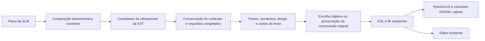

# Refinamento visual — 11/10/2026

Base inicial: `f05fc8a4021b5169342c8498772956f5ccbe0d34`, confirmada em
`origin/dsl-visual` por push e consulta ao remoto antes de editar. A SlideDSL
estava limpa; não havia alteração apropriada pendente nem motivo para commit vazio.
Outros projetos, resultados, ambientes e caches ficaram fora desta etapa.
Fontes foram registradas em [refs/FONTES.md](../refs/FONTES.md).

## Diagnóstico do PPTX recente

Foi inspecionado `outputs/planning_visual/delivery_03/presentation.pptx`, seu plano,
DSL e as cinco capturas. Capa e conclusão repetiam a mensagem do título no corpo.
Três benefícios ocupavam uma grade de quatro posições, deixando o último card
isolado. Os componentes tinham rótulo e descrição no mesmo tratamento tipográfico.
Os títulos estavam em 39 pt; o corpo variava entre 18, 20, 22, 24 e 30 pt.
Havia cinco avisos D003, sem erros visuais detectados pelo checker geométrico.

O diagrama já representava três camadas em ordem; a comparação já distinguia
camadas e serviços. As setas eram formas downArrow soltas. As descrições dos três
serviços eram idênticas, embora suas responsabilidades fossem diferentes.
As composições eram diferentes entre slides, mas repetiam painéis azuis sem
hierarquia interna suficiente. Áreas vazias incluíam a posição de um quarto card
inexistente e regiões da capa que não tinham uma função clara.

A conclusão histórica associava projetos simples a camadas e complexos a
microsserviços. Refinamento geométrico não corrige essa simplificação factual.
A comparação com conteúdo fixo conserva essas afirmações e as identifica para
revisão. Nenhuma quantidade de formas foi usada como indicador de qualidade.

## Motor e preservação



`refinement.py` atua depois da composição inicial do plano, antes da validação
e exportação definitivas. Produz comandos da linguagem existente. `layouts.py`
integra essa etapa; `contextual.py` habilita-a no planejamento visual e salva
`refinement.json`. O campo interno `DeckPlan.refinement` não faz parte do schema
oferecido ao modelo. Planos históricos sem esse campo mantêm a compilação anterior.
Não foram alteradas a gramática, a versão AST/IR 1.1 ou as funções de edição.

Para três cards, são comparadas uma linha de três painéis e uma grade com o último
painel centralizado. A escolha considera desvio do centro do conjunto de painéis
e variação de suas áreas. Fração de área ocupada também é registrada. Esses valores
são objetivos de engenharia, sem calibração estética. Não contam formas nem
premiam o preenchimento indiscriminado do slide. As demais composições têm um
candidato balanceado; não há busca por layout arbitrário.

Paleta e tema são preservados. Estilo minimalista remove os sinais decorativos;
estilo compacto prefere a grade quando ela passa pela validação. Preferências
mais amplas continuam orientando a SLM dentro dos componentes disponíveis.
O relatório registra custo de seleção e decisões. Sem candidato seguro, mantém
a composição original e seus diagnósticos; não corta texto nem reduz fontes no
refinamento para obter aprovação.

Slides com relações espaciais explícitas, grupos, decorações ou mídia não são
reorganizados. Nos diagramas elegíveis, a ordem stack/flow/sequence já declarada
no plano é mantida. Não são criadas conexões entre serviços independentes.

A conservação é conferida antes da aceitação. Títulos, subtítulos, descrições,
rodapés e itens devem continuar representados. A remoção de redundância é limitada
a mensagens repetidas no título e ao nome do componente repetido imediatamente
no começo da própria descrição, como `Interface: Interface recebe pedidos.`.
O relatório guarda campo, texto e elemento que preserva a informação. Não há
paráfrase ou resumo semântico determinístico. Modo restrito mantém os textos
literais e desabilita essas transformações.

Requisitos congelados são reavaliados sobre a apresentação candidata. Nenhum
critério já atendido pode ser perdido, inclusive um texto literal solicitado;
nesse caso o candidato é rejeitado. Depois da escolha, o fluxo de confiabilidade
volta a validar estrutura e requisitos. A proteção cobre os critérios declarados
ou reconhecidos, sem alegar compreensão integral do pedido em português.

## Tipografia e diagramas editáveis

| Função | Tratamento no refinamento |
|---|---|
| Título principal | 42 pt, altura calculada pelo texto |
| Subtítulo | 24 pt, separado da mensagem principal |
| Título de componente | 24 pt nos cards; 22 pt nos diagramas, em negrito |
| Explicação | 22 pt, caixa dimensionada sem truncamento |
| Legenda | Layouts com imagens conservam seus 16/12 pt e são excluídos da reorganização |
| Destaque | Mensagem principal da conclusão em 42 pt; implicações em painéis separados |

Rodapés permanecem em 12 pt. O aumento das fontes foi possível pela reorganização:
os cards usam uma linha equilibrada; a conclusão apresenta duas implicações lado
a lado; a comparação usa a largura inteira de cada caixa com rótulos em negrito
como runs nativos. O editor também mostra esses runs e as setas.

`connections.py` converte apenas cadeias espaciais explícitas
`retângulo → seta → retângulo` em `p:cxnSp`, com `a:stCxn` e `a:endCxn`
referenciando IDs reais do PPTX. O compilador Python aplica essa etapa após
PptxGenJS, antes da inspeção e publicação do arquivo. DSL/IR continuam usando
arrow e relações below; exportar/reimportar a DSL preserva a associação.
A chamada direta ao renderer Node conserva as formas downArrow anteriores.

São suportadas conexões verticais entre retângulos alinhados, sem roteamento
arbitrário. As camadas são encadeadas; os três serviços têm responsabilidades
distintas e nenhum vínculo inventado. As setas não pretendem documentar todos
os protocolos, chamadas ou dependências de um sistema real. O XML das âncoras
foi conferido; sua resposta ao mover formas no Office continua sem teste nesta
máquina. Renomear IDs reservados do refinamento pode remover o tratamento em
negrito; o editor ainda não oferece uma propriedade tipográfica independente.

## Comparações e geração real

O manifesto [refinement_request.json](../benchmark/refinement_request.json) foi
salvo antes das chamadas. São dois pares separados, ambos com conteúdo fixo:

- Histórico: `outputs/planning_visual/delivery_03` versus
  `outputs/refinement/fixed_07`. Mantém inclusive as simplificações antigas.
- Nova geração: `outputs/refinement/real_before` versus
  `outputs/refinement/delivery_04`. Usa exatamente o plano real de `real_02`;
  recompilação offline com o refinamento final, sem nova chamada ou conteúdo manual.

O Qwen3 4B local gerou cinco slides em `real_02`, com duas chamadas reais,
1.538 tokens de saída e 2.776 de entrada, finalizadas com `stop`, sem reparos.
Modelo: qwen3:4b-instruct, digest
`0edcdef34593eac1aa2be9c7d06c432dcf81945adca5eca2f27662c18f168ba0`.
Ollama 0.40.2, temperatura 0,1, seed 42, contexto 8192, limite de saída 4096.
Prompts, schemas, HTTP, bytes brutos e snapshots anteriores às chamadas foram
preservados. A recompilação final tem seu próprio snapshot, sem reescrever o inicial.

| Slide | Observação nas capturas finais e evidência estrutural |
|---|---|
| Capa | Mensagem aparece uma vez; bloco centralizado verticalmente e subtítulo separado. O espaço livre restante é intencional. |
| Camadas | Interface, Negócio e Dados em ordem, com rótulos em negrito e duas conexões ancoradas. |
| Comparação | Colunas Camadas/Microsserviços; cadeia somente à esquerda, responsabilidades distintas à direita. Pagamentos fica integralmente visível. |
| Benefícios | Três cards com mesma largura/altura, na mesma linha; títulos separados das explicações. |
| Conclusão | Mensagem principal uma vez; requisitos de desempenho e custos de manutenção, integração e monitoramento em dois painéis. Sem a regra simples/complexo. |

Nos dois pares finais, todos os cinco candidatos foram aceitos. Títulos passaram
de 39 para 42 pt; corpo passou de mínimo 18 para mínimo 22 pt, com componentes e
subtítulos em 24 pt. Os PPTX finais passaram pela validação estrita, com zero
diagnósticos D/V; contêm 29 caixas de texto nativas e quatro conexões ancoradas.
Os dois critérios automáticos reconhecidos, slides e margens, foram preservados
(2/2). Os oito aspectos do manifesto incluem julgamentos de leitura e composição;
não são reduzidos a uma taxa automática de beleza ou correção factual.

Capturas dos cinco slides:
[nova geração, antes/depois](../outputs/refinement/captures_verified/comparison.html)
e [mesmo conteúdo histórico](../outputs/refinement/fixed_captures_checked/comparison.html).
Cada pasta tem dez PNG, capturas do editor e `capture.json`, com fonte conferida
e zero erros JavaScript. As capturas foram inspecionadas pelo agente, sem
participantes ou notas estéticas inventadas. Auditorias ficam em
`fixed_07/audit.json` e `delivery_04/audit.json`.

A inspeção observou hierarquia explícita, cards proporcionais e ausência de corte
aparente nos previews finais. As caixas passaram pela verificação de sobreposição.
Isso não demonstra maior conforto de leitura ou superioridade estética em estudo
com pessoas. O conteúdo novo ainda requer revisão: por exemplo, atualizar sem
interromper o sistema e obter resiliência não são garantias universais de uma
arquitetura. O título da conclusão dá destaque a dados/escala; equipe, implantação
e outros critérios não receberam o mesmo detalhamento.
Uma captura histórica começou antes de o servidor reiniciado ficar disponível;
a repetição foi feita após conferir `/api/health`, em pasta nova.

## Renderização, falhas e testes

PowerPoint COM não está registrado. Não há soffice nos caminhos Windows, no PATH
ou no Ubuntu via WSL; as distribuições observadas foram Ubuntu e docker-desktop.
`render-optional` foi executado sobre os PPTX e registrou `rendered=false`,
`engine=geometric`. Não houve conversão real Office/LibreOffice. A variável
`SLIDEDSL_SOFFICE` permite indicar um executável local quando disponível.
Evidências: `outputs/refinement/rendering_investigation.json` e `rendering/`.

Foram preservados os candidatos intermediários `fixed_01`–`06`, `delivery_01`–`03`
e suas capturas. Uma alternativa estreitou demais “Pagamentos”, corte visto na
captura apesar de passar pela aproximação geométrica; foi substituída por runs
na mesma caixa. Houve rejeição de alternativas por overflow na comparação e
conclusão, antes da distribuição final.

`real_01` falhou: a palavra comum “cards” no pedido acionava um override global
de layout. O reconhecedor passou a exigir uma diretiva explícita para nomes
simples, mantendo os nomes técnicos e o comportamento de pedidos como
`Use title_content`. A falha, respostas e reparos permanecem registrados. `real_02`
é uma nova execução, e suas taxas não são combinadas com o piloto rejeitado.

Regressão final Python: **241 testes passaram**, incluindo conservação, rollback,
requisitos literais, estilos, restrição espacial, runs nativos, conexões e round trip.
Dois testes Node e onze Playwright passaram; os testes reais de navegador cobriram
geração de arquitetura, imagem/documento, reparo preservando edição e exportação.
Ruff, ESLint, Prettier, TypeScript, build e sintaxe do renderer passaram.
Mantém-se o aviso transitivo de depreciação AnyIO/Starlette.
Evidências: `outputs/tests/refinement-final-v4.xml`,
`outputs/refinement/ui-tests-verified/results.json` e os arquivos `ui_*_final.json`.
O ajuste final da comparação de duplicatas preserva símbolos como C++ e perguntas;
foi coberto pela última regressão Python e não altera a DSL das capturas conferidas.
Os testes de navegador e o piloto são adicionais ao caso principal de duas chamadas.

## Uso e continuidade

O formulário existente aplica o refinamento ao planejamento visual C/D. A CLI:

```powershell
.\.venv\Scripts\slidedsl.exe generate-contextual --visual-planning --model qwen3:4b-instruct --strategy D --prompt-file outputs/refinement/request.txt --out outputs/refinement/nova_execucao
.\.venv\Scripts\python.exe scripts/audit_refinement.py outputs/refinement/real_before outputs/refinement/delivery_04 --generation outputs/refinement/real_02
.\.venv\Scripts\slidedsl.exe render-optional outputs/refinement/delivery_04/presentation.pptx --out outputs/refinement/renderizacao_nova
```

O PPTX entregue está em
[delivery_04/presentation.pptx](../outputs/refinement/delivery_04/presentation.pptx).
Use pasta nova nas reproduções. Os hashes Git da base e entrega são informados
no resultado final; confirmação remota fica em `outputs/refinement/git_delivery.json`.

Continuam pendentes renderização real e teste de movimento das âncoras no Office,
avaliação humana de legibilidade/estética/fatos, medição dos glifos e ampliação
dos pedidos/seeds. Este é um estudo de caso; não isola o efeito do modelo, do prompt
ou da gramática. O motor não corrige fatos, não cria relações sem planejamento,
não otimiza layout arbitrário e não garante fonte mínima em composições rejeitadas.
